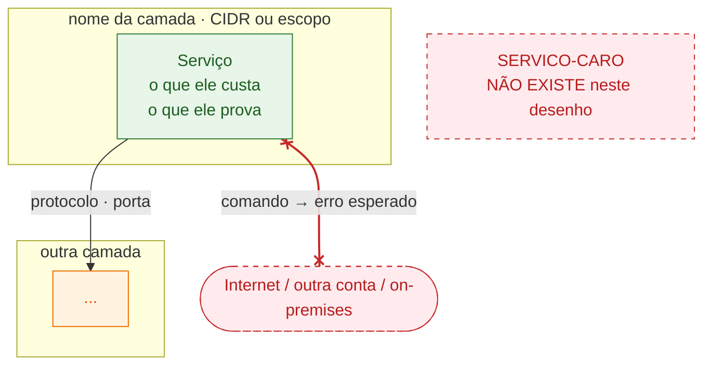

<!-- Copie este diretório para criar um lab novo:
     cp -r certifications/sap-c02/labs/_template certifications/sap-c02/labs/lab-NN-slug

     Este README é o produto do lab. O .tf só provisiona.
     Regra: um lab sem roteiro de verificação executável não serve para estudar.

     Preencha NA ORDEM em que as seções aparecem. Se você não consegue escrever a
     analogia e as perguntas ANTES do Terraform, o lab ainda não está pensado. -->

# Lab NN — Título do lab

> **Domínio** X.Y — Nome da task statement
> **Custo estimado** US$ X,XX/dia se ficar de pé · **Tempo** ~XX min
> **Pré-requisitos** guardrails aplicados · <outras dependências: outro lab, plugin, 2ª conta>

## Por que este lab existe

<!-- Uma ou duas frases. Que decisão de arquitetura ele treina e qual distrator do
     exame ele desmonta. Sem enrolação, sem repetir a documentação da AWS. -->

## A analogia

<!-- OBRIGATÓRIO em todo lab.

     Explique o mecanismo com algo do mundo físico ou do dia a dia de dev, sem
     jargão de AWS. O teste: se a analogia não sobrevive a uma pergunta "e se...",
     ela é decorativa — troque.

     Amarre a analogia ao vocabulário real logo em seguida, num mapeamento explícito,
     senão ela vira só uma história bonitinha. Exemplo de forma:

     > Pense em X como Y. Quando você faz A, é como se Z...

     | Na analogia | Na AWS |
     | --- | --- |
     | ... | ... |
     | ... | ... |

     E feche com o limite: "onde a analogia quebra: ..." — porque toda analogia
     quebra em algum ponto, e é justamente aí que mora a pegadinha do exame. -->

## Onde isso aparece no mundo real

<!-- OBRIGATÓRIO em todo lab. Um caso de uso concreto, não genérico.
     "Empresas usam para segurança" não serve. Descreva um cenário com nome,
     números e a restrição que força a decisão:

     - **Cenário**: <tipo de empresa/sistema, escala, restrição — regulatória,
       de custo, de latência, de janela de manutenção...>
     - **Sem isto**: <o que a equipe faria e por que dói — custo, risco, toil>
     - **Com isto**: <o que muda concretamente>
     - **Quem faz assim**: <padrão publicado, AWS Well-Architected, whitepaper,
       arquitetura de referência ou caso público — cite a fonte quando houver>

     Se você não consegue nomear um cenário real, o lab provavelmente está
     ensinando um serviço em vez de uma decisão. Reveja o recorte. -->

## Arquitetura

<!-- OBRIGATÓRIO em todo lab, e SEMPRE em Mermaid — não ASCII, não imagem.
     O GitHub renderiza bloco ```mermaid nativamente, e o diagrama continua
     versionável: um diff de arquitetura vira um diff de texto legível.

     Regras do diagrama:

     1. `flowchart TB`. Agrupe por camada (subnet, conta, região) com `subgraph`,
        não por serviço.
     2. Rotule o nó com o QUE ELE CUSTA e o QUE ELE PROVA, não só o nome do
        serviço. "Interface endpoints · 3 × 2 AZs × US$ 0,01/h" ensina; "VPC
        Endpoint" não ensina nada.
     3. Desenhe o que NÃO existe. O ponto do lab quase sempre é uma ausência —
        um nó tracejado "NAT Gateway NÃO EXISTE neste desenho" vale mais que
        três nós presentes.
     4. Desenhe o caminho que FALHA, em vermelho, com `x--x` e o comando que
        você roda no roteiro para provar (ex.: `curl example.com` → timeout).
     5. Use `classDef` com semântica de custo, as mesmas cores em todo lab:
        verde = grátis · laranja = pago por hora/AZ · vermelho tracejado =
        ausente ou bloqueado.
     6. Se a ordem das camadas sair errada, force com links invisíveis (`~~~`)
        entre um nó de cada camada. Lembre que eles CONTAM para o índice do
        `linkStyle` — coloque-os por último.
     7. NUNCA use `<` ou `>` dentro de um label, nem como placeholder. O label do
        Mermaid é HTML: `<Serviço caro>` vira uma tag desconhecida e o texto
        SOME do desenho, sem erro nenhum. Use `→`, `-` ou CAIXA-ALTA.
     8. Antes de commitar, confirme que renderiza — e OLHE o resultado, porque
        os problemas ruins (texto sumido, seta atravessando caixa) não dão erro:
        npx -y @mermaid-js/mermaid-cli@11 -i diagrama.mmd -o /tmp/d.png
        Erro de sintaxe no GitHub vira uma caixa vermelha no lugar do desenho.

     Veja o lab-01-vpc-base como referência de forma.
     Logo abaixo do diagrama, uma ou duas frases dizendo por onde LER o desenho —
     o que é diferente da arquitetura ingênua que a maioria desenharia. -->



### Como ler o desenho

<!-- OBRIGATÓRIO em todo lab. O diagrama sozinho NÃO se explica: quem abre o
     README daqui a seis semanas não sabe por onde começar a olhar, o que é
     fronteira e o que é recurso, nem qual seta importa. Sem este texto, o
     diagrama vira decoração.

     Escreva em parágrafos curtos, cada um começando por um **negrito** que
     funciona como manchete — dá para ler só os negritos e entender o desenho.
     Nesta ordem:

     1. **As convenções.** O que é fronteira (subgraph) e o que é recurso, o que
        significa a posição (ex.: camadas empilhadas da mais exposta à mais
        restrita) e o que significa a COR. Ninguém adivinha sua legenda.
     2. **Onde começar.** Aponte UMA caixa e diga por que ela é o personagem:
        "comece pela EC2 — tudo no desenho existe para responder à pergunta X".
        Este é o parágrafo que o leitor perdido procura.
     3. **Um parágrafo por caminho**, numerado, seguindo a seta do começo ao
        fim e dizendo o que se aprende nele. Inclua o SENTIDO da seta quando ele
        for o conteúdo (quem inicia a conexão, quem consulta quem).
     4. **O caminho que falha**, com o comando do roteiro que o prova e a razão
        de ele estar desenhado — a ausência de seta não prova nada.
     5. **O que está fora da fronteira** e por quê (serviço público da AWS,
        outra conta, on-premises).
     6. **O que ler pela ausência.** O recurso caro que a arquitetura ingênua
        teria e este lab não tem, com o valor economizado.
     7. **A conta.** Aponte onde o custo está escrito no próprio desenho e o
        trade-off que ele resume.

     Teste: dê o diagrama e este texto para alguém que nunca viu o lab. Se a
     pessoa não souber dizer por onde o tráfego entra e por onde ele NÃO entra,
     falta parágrafo.

     Veja o lab-01-vpc-base como referência de forma. -->

**As convenções primeiro.** — o que é fronteira, o que é recurso, o que a
posição e a cor significam.

**Onde começar: CAIXA-X.** — por que ela é o personagem do lab.

**1. NOME-DO-CAMINHO (cor, direção).** — de onde sai, por onde passa, onde
termina, e o que se aprende no sentido da seta.

**2. NOME-DO-CAMINHO.** — ...

**3. O caminho que falha (vermelho).** — o comando do roteiro, o erro esperado e
por quê.

**O que ler pela ausência.** — o recurso caro que não está aqui e quanto isso
economiza.

## Glossário

<!-- OBRIGATÓRIO em todo lab. Serve para duas coisas, nesta ordem:

     1. Você volta a este lab em 6 semanas, na revisão, e não lembra o que é
        `ssmmessages` nem por que ele estava aqui.
     2. Ele força você a admitir o que ainda não sabe explicar. Se você não
        consegue escrever a terceira coluna de um termo, você não entendeu o
        recurso — só copiou o Terraform.

     Regras:

     - **Todo termo do diagrama entra.** Se aparece no desenho e não está no
       glossário, ou o desenho tem ruído ou o glossário tem buraco.
     - **Três colunas, sempre**: Termo | Onde está | O que é e para que serve aqui.
     - A coluna "Onde está" aponta para o CÓDIGO — `aws_vpc_endpoint.interface`,
       um link `[main.tf:68](main.tf:68)`, ou o nome da variável. É o que
       transforma o glossário em índice navegável em vez de dicionário solto.
     - A terceira coluna termina em "**neste lab**", não na documentação da AWS.
       Errado: "Security group é um firewall virtual stateful."
       Certo:  "Firewall stateful na ENI. Stateful = a resposta a uma conexão de
                saída volta sozinha — é por isso que o SG daqui não tem ingress."
     - **Inclua o que NÃO existe no lab** (o NAT Gateway ausente, o bastion que
       você não criou). O distrator do exame precisa ter nome e definição, senão
       você não o reconhece na hora da prova.
     - Amarre ao roteiro quando der: "passo 7 desliga isto", "é o que o passo 3
       inspeciona". Termo sem verificação associada tende a ser decoreba.
     - Agrupe em subseções quando passar de ~12 linhas (ex.: Rede · Acesso e
       identidade · Computação e dados). Tabela de 25 linhas ninguém lê.

     Veja o lab-01-vpc-base como referência de forma. -->

### Grupo de termos (ex.: Rede)

| Termo             | Onde está                | O que é e para que serve aqui                                                         |
| ----------------- | ------------------------ | ------------------------------------------------------------------------------------- |
| **Nome do termo** | `tipo_do_recurso.nome`   | O que é, em uma frase — e a razão de ele estar **neste** lab, não a definição da AWS. |
| **Outro termo**   | [main.tf:NN](main.tf)    | ... — o que ele custa, ou o que quebra sem ele.                                       |
| **O que falta**   | **não existe neste lab** | O recurso que você deliberadamente não criou, e por que ele é o distrator da questão. |

## Executar

```bash
./scripts/tf.sh plan certifications/sap-c02/labs/lab-NN-slug
```

```bash
./scripts/tf.sh apply certifications/sap-c02/labs/lab-NN-slug
```

<!-- Se o lab exige algo além do apply (plugin local, confirmar e-mail de SNS,
     esperar propagação de DNS, popular dado), diga aqui — com o comando. -->

## O que observar

<!-- O VALOR DO LAB ESTÁ AQUI, não no apply.

     Cada item precisa ser executável por alguém que esqueceu tudo sobre o lab.
     Nada de "verifique a route table". Escreva:

       1. O comando exato (copiável) ou o caminho no console clique a clique
          (Console → serviço → aba → botão).
       2. O resultado esperado — literal. Se der para citar a saída, cite.
       3. O que isso prova. Uma frase ligando ao conceito do exame.

     Inclua pelo menos um item de FALHA CONTROLADA: quebre algo de propósito,
     observe o erro exato, conserte. Ver funcionar ensina metade; ver quebrar do
     jeito certo ensina a outra metade — e é o que a questão descreve.

     Sempre que o valor vier de um output do Terraform, mostre como obtê-lo:
     ./scripts/tf.sh output certifications/sap-c02/labs/lab-NN-slug -->

- [ ] **1. <Título curto da observação>**

  ```bash
  <comando exato>
  ```

  **Esperado:** <saída literal ou o que aparece na tela>
  **Se falhar:** <causa mais provável e como corrigir>
  **O que isso prova:** <a frase que você quer lembrar na hora da questão>

- [ ] **2. <Título curto da observação>**

  Console → SERVIÇO → SEÇÃO → BOTÃO.

  **Esperado:** <o que você deve ver>
  **O que isso prova:** <...>

- [ ] **3. Quebrar de propósito: O-QUE-DESLIGAR**

  ```bash
  <comando que quebra>
  ```

  **Esperado:** <o erro exato, com a mensagem>
  **Reverter:** `<comando que conserta>`
  **O que isso prova:** <por que essa dependência existe>

- [ ] **4. Custo.** Cost Explorer (D+1), agrupe por tag `Lab`. Anote o valor real
      no [`progresso.md`](../../progresso.md) — a estimativa do topo deste README
      é chute até você medir.

## Perguntas que o lab responde

<!-- Escreva no formato de questão de exame: cenário + restrição + escolha.
     Para CADA pergunta, três partes obrigatórias:

       **Resposta:**        o que você responderia na prova, direto.
       **Por quê:**         o raciocínio — e por que os distratores caem.
       **Onde o lab prova:** o item NUMERADO do roteiro acima que te mostrou isso
                             com os próprios olhos, e o que você viu.

     Se você não consegue apontar o item do roteiro, ou a pergunta não pertence a
     este lab, ou falta uma observação no roteiro. Nos dois casos, conserte agora —
     é exatamente esse elo que faz o lab virar memória de longo prazo. -->

### 1. <Pergunta em formato de cenário>

**Resposta:** <...>
**Por quê:** <...> Os distratores A e B falham porque <...>.
**Onde o lab prova:** item N do roteiro — <o que você observou>.

### 2. <Pergunta em formato de cenário>

**Resposta:** <...>
**Por quê:** <...>
**Onde o lab prova:** item N do roteiro — <o que você observou>.

## Variações que valem tentar

<!-- Opcional, mas é o que separa "rodei o lab" de "entendi o trade-off".
     Uma variável para mexer, o que muda no plan, e quanto custa a diferença. -->

```bash
<comando ou variável a alterar>
```

## Destruir

```bash
./scripts/tf.sh destroy certifications/sap-c02/labs/lab-NN-slug
```

<!-- Liste o que NÃO some no destroy: log group com retenção, snapshot, bucket com
     objetos, chave KMS em janela de exclusão, ENI órfã. Ao final: -->

```bash
./scripts/tf.sh orphans
```

Custo real observado: **\_\_\_\_** (preencha depois)

## Anotações

<!-- O que te surpreendeu, o que quebrou, o que você erraria numa questão. -->
