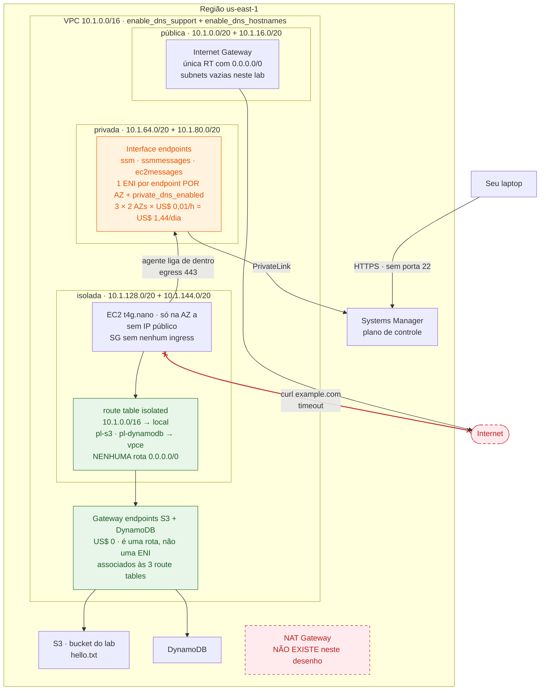

# Lab 01 — VPC 3-tier sem NAT, acesso por Session Manager

> **Domínio 1.1** — Arquitetar estratégias de conectividade de rede
> **Custo estimado** ~US$ 1,55/dia se ficar de pé · **Tempo** ~25 min
> **Pré-requisitos** guardrails aplicados · `session-manager-plugin` instalado ([setup-conta.md](../../../../docs/setup-conta.md#1-ferramentas-locais))

## Por que este lab existe

Metade das questões de acesso seguro do SAP-C02 tem "bastion host em subnet
pública" como distrator plausível. A resposta certa quase sempre é **Session
Manager + VPC endpoints**: sem porta 22 aberta, sem IP público, sem NAT Gateway.
Este lab te dá um shell numa instância que não tem nenhuma rota para a internet.

De quebra, mostra na prática a diferença entre **gateway endpoint** (grátis, via
route table) e **interface endpoint** (pago por hora e por AZ, via ENI + DNS
privado) — distinção que aparece tanto em questão de rede quanto de custo.

## A analogia

Pense na VPC como um **prédio corporativo** e nos serviços da AWS como
**fornecedores** espalhados pela cidade.

O jeito ingênuo de deixar um funcionário do 3º andar falar com um fornecedor é
mandá-lo **sair pela portaria** para a rua. A portaria é o NAT Gateway: ela
existe 24h (você paga o porteiro mesmo em domingo vazio), e cobra pedágio por
cada caixa que passa por ela. Pior: uma vez na rua, o funcionário pode ir a
qualquer lugar — inclusive onde você não queria.

O **gateway endpoint** é um corredor interno construído direto até o depósito do
fornecedor. Não passa pela rua. Você não paga nada por ele, mas precisa
**desenhá-lo na planta do prédio** — é literalmente uma linha a mais na route
table, e só quem está num andar ligado àquela planta enxerga o corredor.

O **interface endpoint** é diferente: você instala um **ramal telefônico do
fornecedor dentro do seu andar**. Ele ocupa um espaço físico (uma ENI, com IP
seu), e você paga **aluguel por ramal, por andar** — dois andares, dois ramais,
duas contas. Em troca, a **lista telefônica interna do prédio** (o DNS privado)
passa a responder o número do ramal quando alguém disca o nome do fornecedor.
Ninguém precisa saber que mudou nada.

O **Session Manager** inverte a visita do administrador. Em vez de você deixar
uma porta dos fundos destrancada para o suporte entrar (SSH, bastion, porta 22),
**o funcionário lá dentro é quem liga para a central e deixa a linha aberta**.
Não existe porta para alguém arrombar, porque não existe porta.

| Na analogia                         | Na AWS                                         |
| ----------------------------------- | ---------------------------------------------- |
| Prédio                              | VPC `10.1.0.0/16`                              |
| Andar sem acesso à rua              | Subnet isolada (route table sem `0.0.0.0/0`)   |
| Portaria com porteiro e pedágio     | NAT Gateway (~US$ 32/mês + US$ 0,045/GB)       |
| Corredor interno até o depósito     | Gateway endpoint (S3, DynamoDB) — grátis       |
| Linha na planta do prédio           | Rota com _prefix list_ na route table          |
| Ramal do fornecedor no seu andar    | Interface endpoint (ENI + PrivateLink)         |
| Aluguel por ramal, por andar        | ~US$ 0,01/hora **por endpoint, por AZ**        |
| Lista telefônica interna            | `private_dns_enabled` + `enable_dns_hostnames` |
| Porta dos fundos destrancada        | Bastion host com porta 22                      |
| Funcionário que liga para a central | Agente SSM abrindo conexão de dentro para fora |

**Onde a analogia quebra** — e é exatamente aqui que mora a pegadinha do exame:
o corredor interno (gateway endpoint) **só existe para quem está dentro do
prédio**. Ele não funciona a partir de outro prédio ligado ao seu — nada de
on-premises via Direct Connect/VPN, nem de uma VPC peered ou atrás de um Transit
Gateway. O ramal (interface endpoint), sim, atende chamadas de fora, porque tem
um IP privado alcançável. Se a questão disser "acesso ao S3 **a partir do
datacenter on-premises**", o gateway endpoint é distrator e a resposta é
interface endpoint.

## Onde isso aparece no mundo real

- **Cenário**: uma processadora de pagamentos roda ~40 instâncias em subnet
  privada que fazem duas coisas o dia inteiro — puxar imagem do ECR e gravar
  arquivo de liquidação no S3, uns 2 TB/mês. O escopo PCI-DSS exige provar que
  a carga de cardholder data **não tem caminho de saída para a internet**, e a
  auditoria pede evidência de rede, não de firewall de host.
- **Sem isto**: 3 NAT Gateways (um por AZ, para não ter SPOF) = ~US$ 97/mês só
  de hora, **mais** US$ 0,045/GB processado — os 2 TB viram ~US$ 92/mês em
  processamento de dados que existe unicamente porque o tráfego, que nunca sai
  da AWS, foi obrigado a passar pela portaria. E o auditor ainda vê uma rota
  `0.0.0.0/0` na planta, então a conversa sobre "não tem saída" começa perdida.
- **Com isto**: gateway endpoint de S3 elimina os ~US$ 92/mês de processamento
  (gateway endpoint não cobra nem hora nem GB) e tira a rota default do desenho.
  Os interface endpoints de ECR e SSM entram como custo fixo previsível. A
  evidência de auditoria vira um `describe-route-tables`: não existe rota para
  a internet, ponto.
- **Quem faz assim**: é o padrão do pilar de Segurança do AWS Well-Architected
  para cargas reguladas, e a razão de o S3 gateway endpoint ter sido o primeiro
  endpoint que a AWS lançou — o par "instância privada + bucket" é o caminho de
  dados mais comum que existe na plataforma.

## Arquitetura



Leia o desenho pelo que **não** tem: nenhum NAT Gateway, nenhuma rota `0.0.0.0/0`
saindo da subnet isolada, nenhuma regra de ingress na instância. Os dois caminhos
que a EC2 usa são o verde (rota, de graça) e o laranja (ENI, pago por AZ) — a
distinção que o lab inteiro existe para gravar.

## Glossário

Cada termo do diagrama, onde ele está no código e por que existe **neste** lab.

### Rede

| Termo                                   | Onde está                                                  | O que é e para que serve aqui                                                                                                                                                                     |
| --------------------------------------- | ---------------------------------------------------------- | ------------------------------------------------------------------------------------------------------------------------------------------------------------------------------------------------- |
| **VPC**                                 | `aws_vpc.this` ([módulo](../../../../modules/vpc/main.tf)) | Rede privada isolada dentro da região. Define o espaço de IPs (`10.1.0.0/16`) e é a fronteira dentro da qual gateway endpoint funciona.                                                           |
| **Subnet**                              | `aws_subnet.public/private/isolated`                       | Fatia do CIDR presa a **uma** AZ. Não é uma subnet que é pública ou privada — é a **route table** associada a ela que decide isso. Aqui são 3 camadas × 2 AZs = 6 subnets.                        |
| **Subnet isolada**                      | `aws_subnet.isolated`                                      | Camada mais restrita: route table sem rota default. É onde a EC2 do lab vive — sem caminho nenhum para a internet, nem de ida nem de volta.                                                       |
| **AZ (Availability Zone)**              | `az_count = 2`                                             | Datacenter independente dentro da região. Importa no custo: interface endpoint cobra **por AZ**, e é por isso que 3 endpoints viram 6 cobranças.                                                  |
| **Route table**                         | `aws_route_table.*`                                        | Tabela de rotas de uma subnet. É o objeto que o passo 3 inspeciona — provar que não há `0.0.0.0/0` nela é a evidência de "não existe saída".                                                      |
| **Internet Gateway (IGW)**              | `aws_internet_gateway.this`                                | Porta da VPC para a internet. Existe no lab mas só a route table pública aponta para ele — e nenhuma subnet pública tem recurso dentro.                                                           |
| **NAT Gateway**                         | `nat_strategy = "none"` em [main.tf:21](main.tf:21)        | Serviço gerenciado que dá saída à internet para quem não tem IP público. ~US$ 32/mês + US$ 0,045/GB. **O lab existe para provar que dá para não ter um.**                                         |
| **VPC endpoint**                        | `aws_vpc_endpoint.*`                                       | Caminho privado da VPC até um serviço da AWS, sem passar pela internet. Tem dois tipos, e a diferença entre eles é metade do conteúdo do lab.                                                     |
| **Gateway endpoint**                    | `gateway_endpoints = ["s3","dynamodb"]`                    | Tipo 1: uma **rota** na route table. Grátis, sem ENI, sem IP. Só S3 e DynamoDB oferecem. Só funciona de dentro da VPC — não atende Direct Connect, VPN, peering nem TGW.                          |
| **Interface endpoint**                  | `interface_endpoints = [...]` em [main.tf:28](main.tf:28)  | Tipo 2: uma **ENI com IP privado** na sua subnet, via PrivateLink. ~US$ 0,01/h por endpoint por AZ. Alcançável de fora da VPC, e é o que faz o Session Manager funcionar aqui.                    |
| **ENI (Elastic Network Interface)**     | criada pelo endpoint                                       | Placa de rede virtual com IP da sua subnet. É o que você "vê" no passo 6, quando o nome do serviço resolve para `10.1.64.x`.                                                                      |
| **PrivateLink**                         | tecnologia por trás do interface endpoint                  | Mecanismo que expõe um serviço como ENI na sua VPC. O tráfego nunca entra na rede pública.                                                                                                        |
| **Prefix list**                         | `data.aws_prefix_list.s3` / `.dynamodb`                    | Lista gerenciada pela AWS com todos os CIDRs públicos de um serviço numa região. Usada como destino de rota (`pl-xxxx`) e dentro do security group, para não hardcodar faixas que a AWS muda.     |
| **`enable_dns_support` / `_hostnames`** | `aws_vpc.this`                                             | Ligam o resolver da VPC. Sem os dois, `private_dns_enabled` nem pode ser ativado — é a cadeia de dependência que a pergunta 4 explora.                                                            |
| **`private_dns_enabled`**               | `aws_vpc_endpoint.interface`                               | Faz `ssm.us-east-1.amazonaws.com` resolver para o IP privado da ENI em vez do IP público. É o que permite SDK, CLI e agente funcionarem **sem nenhuma mudança de configuração**. Passo 7 desliga. |

### Acesso e identidade

| Termo                                   | Onde está                                                | O que é e para que serve aqui                                                                                                                                                 |
| --------------------------------------- | -------------------------------------------------------- | ----------------------------------------------------------------------------------------------------------------------------------------------------------------------------- |
| **Security group (SG)**                 | `aws_security_group.instance` ([main.tf:68](main.tf:68)) | Firewall **stateful** na ENI. Stateful = a resposta a uma conexão de saída volta sozinha, sem regra de ingress. É por isso que o SG do lab não tem um único bloco `ingress`.  |
| **Ingress / egress**                    | bloco `egress` em [main.tf:73](main.tf:73)               | Entrada / saída. Aqui só há egress, restrito a 443 para o CIDR da VPC e para as duas prefix lists — a segunda razão pela qual o `curl` do passo 5 falha.                      |
| **Bastion host**                        | **não existe neste lab**                                 | A alternativa clássica: instância em subnet pública com porta 22 aberta, usada para saltar até a rede privada. É o distrator que este lab desmonta.                           |
| **Session Manager**                     | `aws ssm start-session`                                  | Recurso do Systems Manager que abre shell sem porta aberta, sem chave SSH e sem IP público. A conexão parte de dentro.                                                        |
| **Agente SSM**                          | pré-instalado na AMI AL2023                              | Processo na instância que abre a conexão de saída para o Systems Manager e mantém o canal. Se ele não alcançar os 3 endpoints, a instância some do Fleet Manager.             |
| **`ssm`, `ssmmessages`, `ec2messages`** | `interface_endpoints`                                    | Os três endpoints obrigatórios: `ssm` é a API, `ssmmessages` é o canal da sessão interativa, `ec2messages` é o canal de comandos. Faltar **um** já quebra o acesso.           |
| **IAM role + instance profile**         | `aws_iam_role.instance`, `aws_iam_instance_profile`      | Credencial temporária que a instância assume, sem access key gravada em disco. O instance profile é o invólucro que liga a role à EC2.                                        |
| **`AmazonSSMManagedInstanceCore`**      | [main.tf:57](main.tf:57)                                 | Policy gerenciada com o mínimo para o Session Manager. Repare que **não tem nada de rede** — permissão e conectividade são problemas separados, e a questão costuma misturar. |
| **IMDSv2 (`http_tokens = required`)**   | [main.tf:108](main.tf:108)                               | Obriga token na consulta ao metadata service. Bloqueia o roubo de credencial da role via SSRF — controle de segurança que cai no exame.                                       |

### Computação, dados e observabilidade

| Termo                      | Onde está                           | O que é e para que serve aqui                                                                                                                                     |
| -------------------------- | ----------------------------------- | ----------------------------------------------------------------------------------------------------------------------------------------------------------------- |
| **`t4g.nano`**             | [main.tf:102](main.tf:102)          | Menor instância Graviton (ARM). ~US$ 0,10/dia — escolhida porque o lab é sobre rede, não sobre computação.                                                        |
| **AMI via SSM parameter**  | `data.aws_ssm_parameter.al2023`     | Busca o ID da AMI mais recente em vez de fixar um ID que expira e muda por região. Convenção do repositório.                                                      |
| **`force_destroy = true`** | `aws_s3_bucket.test`                | Deixa o `destroy` apagar o bucket mesmo com objetos dentro. Sem isso o lab não fecha limpo e o bucket fica cobrando.                                              |
| **Public access block**    | `aws_s3_bucket_public_access_block` | Quatro travas contra exposição acidental do bucket. Padrão obrigatório em qualquer bucket, mesmo de lab.                                                          |
| **VPC Flow Logs**          | `enable_flow_logs = true`           | Registro de metadados de cada fluxo (IP origem/destino, porta, ACCEPT/REJECT) no CloudWatch Logs. É a evidência de auditoria do passo 8 — retenção de 1 dia aqui. |
| **Prefixo de nome**        | `local.name_prefix`                 | `sap-c02-lab-01-vpc-base`, derivado de `<certification>-<lab>` pelo `tf.sh`. É o que os filtros `--filters "Name=tag:Name,..."` do roteiro usam.                  |

## Executar

```bash
./scripts/tf.sh plan certifications/sap-c02/labs/lab-01-vpc-base
```

```bash
./scripts/tf.sh apply certifications/sap-c02/labs/lab-01-vpc-base
```

Depois do apply, a instância leva ~1–2 min para registrar no SSM. Se o passo 2
falhar de primeira, espere e repita.

## O que observar

Todos os comandos abaixo assumem `us-east-1` e o prefixo de nome
`sap-c02-lab-01-vpc-base` (derivado de `<certification>-<lab>` pelo `tf.sh`).

- [ ] **1. Pegar os outputs.** Tudo que vem depois usa esses valores.

  ```bash
  ./scripts/tf.sh output certifications/sap-c02/labs/lab-01-vpc-base
  ```

  **Esperado:** `instance_id`, `test_bucket`, `session_manager_command` e
  `proof_command` já montados, prontos para copiar.

- [ ] **2. Abrir o shell sem bastion.** Copie o valor de `session_manager_command`:

  ```bash
  aws ssm start-session --target <instance_id> --region us-east-1
  ```

  **Esperado:** `Starting session with SessionId: ...` e um prompt `sh-5.2$`.
  **Se falhar** com `TargetNotConnected`: o agente ainda não registrou — espere
  2 min. Com `SessionManagerPlugin is not found`: instale o plugin.
  **O que isso prova:** você tem shell numa máquina **sem IP público, sem chave
  SSH e com security group sem nenhuma regra de ingress**. O acesso veio do
  agente ligando para fora, não de uma porta aberta. É por isso que bastion host
  é distrator.

- [ ] **3. Provar que não existe rota para a internet.** Numa aba fora da sessão:

  ```bash
  aws ec2 describe-route-tables \
    --filters "Name=tag:Name,Values=sap-c02-lab-01-vpc-base-isolated" \
    --query 'RouteTables[0].Routes[].[DestinationCidrBlock,DestinationPrefixListId,GatewayId]' \
    --output table --region us-east-1
  ```

  **Esperado:** exatamente 3 linhas — `10.1.0.0/16 → local` e duas com
  `pl-xxxxxxxx → vpce-xxxxxxxx` (S3 e DynamoDB). **Nenhuma linha `0.0.0.0/0`.**
  **O que isso prova:** o gateway endpoint é literalmente uma rota. Não é um
  serviço no meio do caminho, não tem ENI, não tem preço — é uma linha na planta.

- [ ] **4. Usar o corredor interno.** Dentro da sessão SSM, cole o `proof_command`:

  ```bash
  aws s3 cp s3://<test_bucket>/hello.txt - --region us-east-1
  ```

  **Esperado:** imprime `Se voce leu isto de dentro da subnet isolada, o gateway
endpoint funcionou.`
  **O que isso prova:** alcançar a API da AWS **não** exige saída para a internet.

- [ ] **5. Bater na parede.** Ainda dentro da sessão:

  ```bash
  curl -m 5 https://example.com
  ```

  **Esperado:** trava e retorna `curl: (28) Connection timed out after 5001
milliseconds`.
  **Atenção — o timeout tem duas causas somadas**, e saber separá-las é o ponto:
  a route table não tem `0.0.0.0/0` (passo 3) **e** o security group só libera
  egress para o CIDR da VPC e para as prefix lists. Qualquer uma das duas
  sozinha já bastaria. Numa questão, se removerem só o NAT e esquecerem o SG
  (ou vice-versa), o comportamento muda — leia o cenário inteiro antes de
  responder.
  **O que isso prova:** "sair para a AWS" e "sair para a internet" são caminhos
  diferentes. Essa frase vale uns 3 pontos de prova.

- [ ] **6. Ver a lista telefônica interna.** Ainda dentro da sessão:

  ```bash
  getent hosts ssm.us-east-1.amazonaws.com
  ```

  **Esperado:** um IP **privado**, `10.1.64.x` ou `10.1.80.x` — dentro do range
  das subnets privadas.
  **Compare:** rode o mesmo comando no seu laptop. Lá o mesmo nome resolve para
  um IP público da AWS.
  **O que isso prova:** `private_dns_enabled` reescreve a resolução do nome
  público do serviço para a ENI do endpoint. É por isso que o SDK, o CLI e o
  agente funcionam **sem nenhuma alteração de configuração** — eles continuam
  discando o mesmo nome.

- [ ] **7. Quebrar de propósito: desligar o DNS privado.** Isto é o passo mais
      valioso do lab. Fora da sessão:

  ```bash
  aws ec2 describe-vpc-endpoints \
    --filters "Name=tag:Name,Values=sap-c02-lab-01-vpc-base-ssm-endpoint" \
    --query 'VpcEndpoints[0].VpcEndpointId' --output text --region us-east-1
  ```

  ```bash
  aws ec2 modify-vpc-endpoint --vpc-endpoint-id <id> \
    --no-private-dns-enabled --region us-east-1
  ```

  **Esperado:** em 2–5 min o agente perde o registro. Uma sessão nova falha com
  `An error occurred (TargetNotConnected) when calling the StartSession
operation`. No Console → Systems Manager → Fleet Manager, a instância some ou
  aparece como `Connection lost`.
  **Reverter:**

  ```bash
  aws ec2 modify-vpc-endpoint --vpc-endpoint-id <id> \
    --private-dns-enabled --region us-east-1
  ```

  (também leva alguns minutos para o agente reconectar — tenha paciência antes
  de achar que quebrou de vez.)
  **O que isso prova:** sem o DNS privado, o nome `ssm.us-east-1.amazonaws.com`
  volta a resolver para o IP público — e aí a instância precisaria de rota para
  a internet, que ela não tem. O interface endpoint **existia** o tempo todo; o
  que quebrou foi só a resolução de nome. E o DNS privado depende de
  `enable_dns_support` + `enable_dns_hostnames` na VPC: com `enable_dns_hostnames
= false` você nem consegue ligar `private_dns_enabled`. Essa cadeia de
  dependência é uma questão inteira do exame.

- [ ] **8. Confirmar no flow log que nada atravessou o IGW.** Pegue o IP privado
      e leia os logs:

  ```bash
  aws ec2 describe-instances --instance-ids <instance_id> \
    --query 'Reservations[].Instances[].PrivateIpAddress' \
    --output text --region us-east-1
  ```

  ```bash
  aws logs filter-log-events \
    --log-group-name /aws/vpc/sap-c02-lab-01-vpc-base/flow-logs \
    --filter-pattern '"<ip-privado>"' --max-items 20 \
    --query 'events[].message' --output text --region us-east-1
  ```

  **Esperado:** linhas `ACCEPT` cujo `srcaddr` e `dstaddr` são **ambos** IPs
  `10.1.x.x`. Nenhum destino público.
  **Se vier vazio:** os logs agregam a cada 60s e demoram mais 1–2 min para
  entregar. Gere tráfego (repita o passo 4) e tente de novo.
  **O que isso prova:** a evidência de auditoria do cenário PCI lá de cima é
  esta consulta. O tráfego para o S3 é privado ponta a ponta.

- [ ] **9. Contar o custo.** Cost Explorer (D+1), agrupe por tag `Lab`, filtre
      `lab-01-vpc-base`. **Esperado:** os interface endpoints dominam a conta —
      a EC2 `t4g.nano` é ruído perto deles. Confira a matemática:
      3 endpoints × 2 AZs × US$ 0,01/h = **US$ 0,06/h = US$ 1,44/dia**, e a
      instância soma ~US$ 0,10/dia. Anote o real no
      [`progresso.md`](../../progresso.md).

## Perguntas que o lab responde

### 1. Uma instância em subnet privada precisa gravar objetos no S3, ~2 TB/mês. NAT Gateway, interface endpoint ou gateway endpoint?

**Resposta:** gateway endpoint.
**Por quê:** é o único dos três que custa **zero** — nem hora, nem GB. O NAT
Gateway cobraria ~US$ 32/mês por AZ **mais** US$ 0,045/GB, o que nos 2 TB vira
~US$ 92/mês de processamento por um tráfego que nunca sai da AWS. O interface
endpoint funcionaria, mas você pagaria aluguel por AZ sem necessidade — S3 e
DynamoDB são os dois únicos serviços com opção de gateway.
**Onde o lab prova:** passos 3 e 4 — a route table isolada não tem nada além de
`local` e duas prefix lists, e mesmo assim o `aws s3 cp` funcionou de dentro.

### 2. Mesma pergunta, mas o acesso vem do datacenter on-premises via Direct Connect.

**Resposta:** interface endpoint (ou S3 Access Point via PrivateLink).
**Por quê:** gateway endpoint é uma rota **dentro** da VPC. Tráfego que chega
via Direct Connect, VPN, peering ou Transit Gateway não consulta aquela route
table e por isso não enxerga o endpoint. O interface endpoint tem IP privado
alcançável de fora da VPC — por isso funciona.
**Onde o lab prova:** passo 3 mostra que o gateway endpoint **é** uma linha de
route table, e passo 6 mostra que o interface endpoint tem um IP `10.1.x.x`
próprio. A diferença entre "rota" e "IP" é a resposta inteira.

### 3. Por que Session Manager funciona com um security group sem nenhuma regra de _ingress_?

**Resposta:** porque o agente SSM abre a conexão **de dentro para fora** (egress
HTTPS) e mantém o canal aberto. Ninguém inicia conexão em direção à instância.
**Por quê:** security group é stateful — a resposta a uma conexão de saída entra
de volta sem precisar de regra de ingress. Por isso o bastion host, que exige
ingress na 22 e um IP alcançável, é sempre o distrator caro e inseguro.
**Onde o lab prova:** passo 2 — você abriu um shell e o SG da instância
([`main.tf`](main.tf)) não tem um único bloco `ingress`.

### 4. Você removeu o NAT Gateway e ligou os endpoints, mas as instâncias pararam de aparecer no Systems Manager. O que investigar primeiro?

**Resposta:** DNS. Confirme `enable_dns_support` e `enable_dns_hostnames` na VPC
e `private_dns_enabled` nos três endpoints (`ssm`, `ssmmessages`, `ec2messages`).
Depois, o security group **dos endpoints**, que precisa aceitar 443 da VPC.
**Por quê:** os endpoints podem existir e estar `available` enquanto o nome do
serviço continua resolvendo para IP público — e aí falta rota. O sintoma
(instância some do Fleet Manager) não aponta para DNS de forma óbvia, que é
justamente o que a questão explora. Faltar **um** dos três endpoints dá o mesmo
sintoma: os três são obrigatórios.
**Onde o lab prova:** passo 7 — você desligou só o DNS privado, sem tocar em
rede nem em IAM, e a instância caiu com `TargetNotConnected`. Passo 6 mostrou o
"antes", com o nome resolvendo para IP privado.

### 5. Uma VPC tem 3 NAT Gateways e 90% do tráfego de saída vai para S3 e ECR. Como reduzir custo sem perder disponibilidade?

**Resposta:** gateway endpoint para S3 (grátis) + interface endpoints para ECR
(`ecr.api`, `ecr.dkr`) e CloudWatch Logs, mantendo NAT só para os 10% restantes
— ou eliminando-o se esses 10% também tiverem endpoint.
**Por quê:** o ganho maior não é a hora do NAT, é o **US$ 0,045/GB de
processamento** que some junto com o tráfego redirecionado. Interface endpoint
cobra por AZ, então a conta é `nº de endpoints × nº de AZs`; compare com o
volume que você tiraria do NAT antes de decidir.
**Onde o lab prova:** passo 9 — a matemática US$ 0,01/h por endpoint **por AZ**
deixa claro que a economia depende de quantos serviços e quantas AZs, não só de
"tem endpoint, logo é mais barato".

### 6. Qual a implicação de disponibilidade de `nat_strategy = "single"` em vez de `"per_az"`?

**Resposta:** o NAT único vira SPOF de AZ. Se a AZ dele cair, **todas** as
subnets privadas perdem saída, inclusive as das AZs saudáveis.
**Por quê:** NAT Gateway é um recurso zonal. `per_az` custa `az_count × US$
32/mês` e mantém cada AZ independente — é o desenho de produção. `single` é
metade do preço com acoplamento entre AZs; aceitável em dev, errado numa questão
que fale em "resilient" ou "highly available".
**Onde o lab prova:** este lab roda com `nat_strategy = "none"`, então a prova é
por contraste — ver a seção abaixo.

## Variações que valem tentar

Edite `nat_strategy` no [`main.tf`](main.tf) e rode **só o plan** (não precisa
aplicar para aprender):

```bash
./scripts/tf.sh plan certifications/sap-c02/labs/lab-01-vpc-base
```

| Valor            | O que aparece no plan                                    | Custo/mês |
| ---------------- | -------------------------------------------------------- | --------- |
| `"none"` (atual) | nada                                                     | US$ 0     |
| `"single"`       | 1 EIP + 1 NAT GW + rota default em **uma** RT privada    | ~US$ 32   |
| `"per_az"`       | 2 EIPs + 2 NAT GWs + rota default em **cada** RT privada | ~US$ 65   |
| `"instance"`     | 1 EC2 `t4g.nano` com `source_dest_check = false`         | ~US$ 3    |

Repare em duas coisas: em `"per_az"` o Terraform passa a criar **uma route table
privada por AZ** (com `"single"` todas compartilham uma) — é essa mudança
estrutural que dá o isolamento de falha. E em `"instance"`, o
`source_dest_check = false` é obrigatório: sem isso a EC2 descarta todo pacote
cujo destino não seja ela mesma, que é exatamente o trabalho de um NAT.

## Destruir

```bash
./scripts/tf.sh destroy certifications/sap-c02/labs/lab-01-vpc-base
```

O bucket de teste tem `force_destroy = true`, então some com os objetos. O log
group de flow logs tem retenção de 1 dia e é destruído junto. Confirme que não
sobrou nada cobrando:

```bash
./scripts/tf.sh orphans
```

Custo real observado: **\_\_\_\_** (preencha depois)

## Anotações

<!-- O que te surpreendeu, o que quebrou, o que você erraria numa questão. -->
