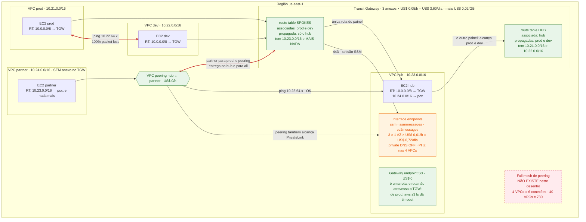

# Lab 02 — Transit Gateway com route tables segmentadas, e por que peering não é transitivo

> **Domínio 1.1** — Arquitetar estratégias de conectividade de rede
> **Custo estimado** ~US$ 4,70/dia se ficar de pé (~US$ 0,20/hora) · **Tempo** ~45 min
> **Pré-requisitos** guardrails aplicados · `session-manager-plugin` instalado ([setup-conta.md](../../../../docs/setup-conta.md#1-ferramentas-locais)) · [lab-01](../lab-01-vpc-base/) entendido (gateway vs. interface endpoint)

Este é o lab mais caro do Domínio 1. **Suba, rode o roteiro e destrua no mesmo dia** —
uma sessão de 2 horas custa ~US$ 0,40; esquecer de pé por uma semana custa ~US$ 33.

## Por que este lab existe

O SAP-C02 adora um cenário assim: "a VPC A tem peering com a B, a B está anexada a um
Transit Gateway junto com a C, e a aplicação em A precisa falar com a C". Metade dos
distratores resolve isso adicionando rota. Nenhuma rota resolve — **peering não é
transitivo, e nenhuma configuração muda isso**. Este lab te dá as duas topologias lado
a lado, na mesma conta, para você ver o pacote morrer.

A segunda metade do lab é onde a segmentação realmente mora. Prod e dev estão **os dois
anexados ao mesmo TGW**, com route table de VPC permissiva (`10.0.0.0/8` inteiro
apontando para o gateway) e security group permissivo — e mesmo assim não se enxergam.
O que separa os dois é uma linha que não existe na **route table do TGW**. Quem procura
segmentação no security group ou na NACL erra a questão.

De quebra, o lab monta o padrão de **endpoints centralizados**: um único conjunto de
interface endpoints na VPC hub atende as outras três, via TGW e via peering. É o
contraponto direto do lab 01 — o interface endpoint atravessa; o gateway endpoint, não.

## A analogia

Pense em cada VPC como um **condomínio fechado**.

O **VPC peering** é uma **passagem particular aberta no muro entre dois condomínios
vizinhos**. Foi construída pelos dois síndicos, para uso dos dois. Se o condomínio A
abriu passagem para o B, e o B abriu outra para o C, o morador de A **não** pode
atravessar o B para chegar ao C: a passagem do B para o C não foi feita para o trânsito
de A, e o síndico do B não vai virar empresa de logística. Não existe "estrada de
passagem" dentro de um muro particular. É por isso que peering não é transitivo — não é
uma limitação de configuração, é o que a coisa **é**.

O **Transit Gateway** é uma **rotatória municipal**. Cada condomínio paga uma **taxa
fixa pela alça de acesso** (US$ 0,05 por hora, por anexo, chova ou faça sol) e uma
**taxa por caminhão que passa** (US$ 0,02/GB). Quem entra na rotatória pode sair em
qualquer saída — desde que a saída esteja escrita no **painel de destinos daquela
entrada**.

E aqui está o detalhe que decide a questão: a rotatória **não tem um painel só**. Tem
vários, e cada alça de acesso é ligada a **exatamente um** painel (a _association_ —
é o painel que você lê ao **entrar**). O que aparece escrito em cada painel é decidido
por outro botão, independente (a _propagation_ — "publique o endereço deste condomínio
naquele painel"). Segmentar prod e dev é só isto: ligar as duas alças ao **mesmo painel
pobre**, onde só o endereço do condomínio de serviços foi publicado.

| Na analogia                                | Na AWS                                                    |
| ------------------------------------------ | --------------------------------------------------------- |
| Condomínio                                  | VPC                                                       |
| Passagem particular no muro                 | VPC peering — US$ 0/hora                                  |
| Rotatória municipal                         | Transit Gateway                                           |
| Alça de acesso, taxa fixa                   | Attachment (anexo) — US$ 0,05/hora **por anexo**          |
| Taxa por caminhão que passa                 | US$ 0,02 por GB processado                                |
| Painel de destinos                          | TGW route table                                           |
| A qual painel a alça está ligada            | **Association** — uma, e só uma, por anexo                |
| Publicar o endereço do condomínio no painel | **Propagation** — pode ser em vários painéis              |
| Escrever um destino à mão no painel         | Rota estática (`create-transit-gateway-route`)            |
| Endereço riscado do painel                  | Rota em estado `blackhole`                                |
| Portaria de serviços compartilhados         | VPC hub com os interface endpoints                        |

**Onde a analogia quebra** — e são três pontos, todos cobrados:

1. **O painel serve ida e volta.** Na rotatória de verdade cada sentido teria seu
   caminho; no TGW, prod e dev estão ligados ao **mesmo** painel, então a rota que você
   escreve para a ida também é a que o pacote de volta vai consultar. O passo 7 do
   roteiro é exatamente isso: você cria a rota, o ping continua falhando, e só funciona
   quando você escreve a volta também.
2. **A passagem no muro é grátis; a alça, não.** Para duas VPCs que só falam entre si,
   peering ganha de lavada: US$ 0/hora contra US$ 73/mês de dois anexos, e sem os
   US$ 0,02/GB. O TGW compensa pelo **número** de VPCs, não pela elegância.
3. **A passagem no muro carrega coisas que a rotatória não carrega.** Entre VPCs
   peered na mesma região você pode **referenciar um security group da outra VPC** numa
   regra. Por TGW, não dá — lá você só tem CIDR. Se a questão falar em "referenciar o
   security group da VPC vizinha", ela está falando de peering.

## Onde isso aparece no mundo real

- **Cenário**: uma seguradora com 12 contas e ~40 VPCs. Toda VPC precisa alcançar a
  VPC de serviços compartilhados (Active Directory, endpoints, coletor de log). A
  auditoria interna exige que **produção e desenvolvimento nunca tenham caminho de rede
  entre si** — e exige evidência de topologia, não de firewall, porque firewall alguém
  altera numa terça-feira.
- **Sem isto**: full mesh de peering. São `40 × 39 / 2` = **780 conexões**. Cada VPC
  fica com 39 rotas na route table (a cota padrão é 50 rotas por route table) e 39
  peerings (a cota padrão é 50 peerings por VPC) — os dois no limite. Cada VPC nova
  significa 39 conexões e 39 rotas espalhadas por 39 tabelas. E a separação prod/dev
  vira uma promessa: "ninguém criou esse peering" não é um controle, é um combinado.
- **Com isto**: 40 anexos no TGW (US$ 0,05/h ≈ US$ 36,50/mês cada, ~US$ 1.460/mês no
  total, mais US$ 0,02/GB) e **duas route tables**. VPC nova = 1 anexo + 1 rota
  `10.0.0.0/8` apontando para o gateway. A evidência de auditoria vira um
  `search-transit-gateway-routes`: a tabela dos spokes não tem rota para prod, ponto —
  e a mesma saída prova o controle para as 40 VPCs de uma vez.
- **Quem faz assim**: é a topologia hub-and-spoke do whitepaper
  [Building a Scalable and Secure Multi-VPC AWS Network Infrastructure](https://docs.aws.amazon.com/whitepapers/latest/building-scalable-secure-multi-vpc-network-infrastructure/welcome.html)
  — leitura obrigatória das semanas 1–2 do plano. O mesmo documento descreve o padrão
  de **endpoints centralizados** que este lab monta na VPC hub.

## Arquitetura



### Como ler o desenho

**As convenções primeiro.** As caixas amarelas são **fronteiras**, não recursos: a de
fora é a região, e dentro dela estão as quatro VPCs e o Transit Gateway. As caixas
coloridas são recursos, e **a cor é o custo**: verde não cobra nada, laranja cobra por
hora, vermelho tracejado é o que **não existe** neste desenho. Repare que as duas
caixas verdes dentro do TGW são _route tables_ — objetos de configuração, sem preço; o
preço do TGW está escrito no título da fronteira, e é cobrado **por anexo**, não por
tabela nem por rota.

**Onde começar: na caixa `route table SPOKES`.** Ela é o personagem do lab. Tudo
que funciona e tudo que falha neste desenho é decidido pelo conteúdo dela — e o
conteúdo é uma linha só: `10.23.0.0/16`, a VPC hub. As route tables das VPCs prod e
dev mandam `10.0.0.0/8` inteiro para o gateway, ou seja, **elas não filtram nada**; os
security groups liberam 10/8 inteiro, ou seja, **também não filtram nada**. A filtragem
inteira do lab mora naquela caixa.

**1. O caminho dos spokes (setas para dentro do TGW).** prod e dev entram na mesma
fronteira e consultam a **mesma** tabela, porque as duas alças estão _associadas_ a ela.
A tabela tem uma saída só, então as duas setas que saem dela vão para a VPC hub: uma
para a EC2 (o `ping` do passo 3) e outra para as ENIs dos interface endpoints (a sessão
SSM do passo 2, em 443). Note o sentido: quem inicia é sempre o spoke.

**2. O caminho do hub (seta subindo para `route table HUB`).** O hub está associado a
uma tabela **diferente**, e nela foram propagados prod e dev — por isso o hub alcança os
dois. Association e propagation são botões independentes, e é essa independência que
produz a assimetria: o hub fala com todo mundo, os spokes só falam com o hub.

**3. O caminho que falha entre prod e dev (vermelho, horizontal).** A seta com **x nas
duas pontas** é o passo 4: `ping` de prod para dev, 100% packet loss. Ela está desenhada
porque a ausência de seta não prova nada — o pacote **sai** de prod, **chega** no TGW e
morre lá, porque o painel que ele consulta não tem `10.22.0.0/16`. Não é firewall, não é
NACL, não é a route table da VPC: é a linha que não existe.

**4. O caminho que falha do partner (vermelho, subindo até o TGW).** A VPC partner não
tem anexo — ela chega ao hub pela **passagem no muro** (o losango do peering), e a seta
vermelha mostra que a passagem entrega no hub e **para ali**. É a não-transitividade, e
repare no detalhe: a route table do partner só consegue ter a rota `10.23.0.0/16`,
porque a AWS só aceita, como destino de uma rota que aponta para um peering, um CIDR
**dentro** da VPC vizinha. Não existe a rota que você gostaria de escrever.

**O que está fora das fronteiras de VPC.** O losango do peering e as duas route tables
do TGW não moram em VPC nenhuma: são objetos de interconexão. É por isso que o desenho
os coloca no meio — e é por isso que o peering aparece encostado nas duas VPCs que ele
liga, e em mais nenhuma.

**O que ler pela ausência.** A caixa tracejada embaixo é o **full mesh de peering** que
esta arquitetura não tem: 6 conexões para 4 VPCs, 780 para 40. Ela é o distrator da
pergunta 1. E dentro da VPC hub, repare que **nenhuma seta chega no gateway endpoint do
S3** vinda de fora: ele é grátis justamente porque é só uma rota, e rota não atravessa
o TGW — o passo 9 prova isso com um `aws s3 ls` que dá timeout em prod e funciona no
hub, com o mesmo comando e o mesmo security group.

**A conta está no desenho.** O título do TGW diz `3 anexos × US$ 0,05/h`: US$ 3,60/dia
que existem mesmo com zero tráfego. A caixa laranja dos endpoints diz US$ 0,72/dia — e
esse número é o argumento do padrão centralizado: se cada uma das 4 VPCs tivesse seus
três endpoints, seriam US$ 2,88/dia. O losango do peering diz US$ 0/hora, e é o
lembrete de que, para poucas VPCs, a rotatória não se paga.

## Glossário

Cada termo do diagrama, onde ele está no código e por que existe **neste** lab.

### Transit Gateway

| Termo                            | Onde está                                                     | O que é e para que serve aqui                                                                                                                                                                              |
| -------------------------------- | ------------------------------------------------------------- | ---------------------------------------------------------------------------------------------------------------------------------------------------------------------------------------------------------- |
| **Transit Gateway (TGW)**        | `aws_ec2_transit_gateway.this`                                | Roteador regional gerenciado que interliga VPCs, VPN e Direct Connect. Diferente do peering, é **transitivo**: quem entra pode sair em qualquer anexo que a route table permitir.                           |
| **Attachment (anexo)**           | `aws_ec2_transit_gateway_vpc_attachment.this`                 | A ligação entre uma VPC e o TGW. Cria uma ENI em cada subnet que você listar. **É a unidade de cobrança**: US$ 0,05/h cada, aqui 3 = US$ 3,60/dia. Fica de pé mesmo sem tráfego.                            |
| **TGW route table**              | `aws_ec2_transit_gateway_route_table.spokes` / `.hub`         | O "painel de destinos". Não custa nada e é onde mora a segmentação inteira do lab. Passo 5 lê as duas.                                                                                                      |
| **Association**                  | `aws_ec2_transit_gateway_route_table_association.*`           | Diz **qual tabela um anexo consulta ao entrar** no TGW. Cada anexo tem **exatamente uma**. Trocar a association do dev é a variação nº 1 no fim deste README.                                               |
| **Propagation**                  | `aws_ec2_transit_gateway_route_table_propagation.*`           | Diz **em quais tabelas o CIDR de um anexo é publicado**. Um anexo pode propagar para várias. Association e propagation são independentes — é essa independência que cria a assimetria hub/spoke.            |
| **Rota propagada vs. estática**  | passo 5 (campo `Type`) e passo 7                              | Propagada é escrita pelo TGW por causa de uma propagation; estática é a que você cria à mão com `create-transit-gateway-route`. Estática vence propagada quando o CIDR é o mesmo.                           |
| **Blackhole**                    | variação nº 2                                                 | Rota cujo alvo não existe mais (anexo removido) ou criada de propósito para descartar. Aparece com `"State": "blackhole"` no passo 5 — é o jeito explícito de bloquear um CIDR sem mexer em security group. |
| **`default_route_table_*`**      | `= "disable"` em [main.tf](main.tf)                           | Desligados de propósito. Com o padrão ligado, todo anexo novo entra numa tabela única e **enxerga todo mundo** — que é exatamente o oposto do que o lab quer mostrar.                                        |
| **`dns_support` do anexo**       | `aws_ec2_transit_gateway_vpc_attachment.this`                 | Permite que a resolução de DNS atravesse o TGW. É o que faz o nome do endpoint resolver para o IP privado do hub quando a consulta parte de prod (passo 2).                                                 |
| **`appliance_mode_support`**     | **não ligado neste lab**                                      | Quando ligado, o TGW mantém os dois sentidos de um mesmo fluxo na **mesma AZ** — obrigatório se houver firewall/NAT stateful no caminho. Aparece na questão como "o appliance vê só metade da conexão".     |
| **Cota de banda por anexo**      | —                                                             | ~100 Gbps por anexo. Peering não tem esse teto (usa a infraestrutura da VPC). É o argumento de desempenho a favor do peering em fluxo muito pesado.                                                         |

### Peering e roteamento de VPC

| Termo                        | Onde está                                             | O que é e para que serve aqui                                                                                                                                                        |
| ---------------------------- | ----------------------------------------------------- | ------------------------------------------------------------------------------------------------------------------------------------------------------------------------------------ |
| **VPC peering**              | `aws_vpc_peering_connection.hub_partner`              | Ligação ponto a ponto entre duas VPCs. Sem custo por hora, sem gargalo de banda — e **não transitiva**. Passo 8 mostra o que ela entrega e onde ela para.        |
| **Não-transitividade**       | passo 8                                               | Tráfego que chega por um peering **não** é reencaminhado para um terceiro destino (outro peering, TGW, VPN, Direct Connect, NAT ou gateway endpoint da VPC vizinha).                  |
| **Destino de rota via pcx**  | `aws_route.partner_to_hub`                            | A AWS só aceita, como destino, um CIDR **contido** na VPC vizinha. Você não consegue nem escrever `10.21.0.0/16 → pcx`: a rota que "resolveria" o problema não existe como opção.     |
| **Longest prefix match**     | `aws_route.hub_to_partner` vs. `aws_route.hub_to_tgw` | A route table do hub tem `10.0.0.0/8 → TGW` **e** `10.24.0.0/16 → pcx`. Ganha a mais específica, então o tráfego para o partner vai pelo peering. É a regra que decide todo empate.   |
| **Referência de SG cruzada** | **não usada neste lab**                               | Entre VPCs peered da mesma região dá para citar o SG da outra VPC numa regra. Por TGW, só CIDR. Enunciado que fala em referenciar security group da VPC vizinha está falando peering. |
| **Rota `local`**             | criada pela AWS                                       | A primeira linha de toda route table, com o CIDR da própria VPC. Não dá para remover nem sobrescrever — é o que faz o ping dentro da mesma VPC não depender de nada.                  |

### Endpoints centralizados e DNS

| Termo                                | Onde está                                  | O que é e para que serve aqui                                                                                                                                                                     |
| ------------------------------------ | ------------------------------------------ | --------------------------------------------------------------------------------------------------------------------------------------------------------------------------------------------- |
| **Interface endpoint**               | `aws_vpc_endpoint.interface`               | ENI com IP privado, via PrivateLink. Como tem IP, é alcançável **de outra VPC** por TGW ou peering — é isso que permite manter um conjunto só, no hub, e não três por VPC.                       |
| **Gateway endpoint**                 | `gateway_endpoints = ["s3"]` só no hub     | Uma **rota** na route table, grátis. Rota é local por definição: não atravessa TGW nem peering. Passo 9 prova pelo contraste — mesmo comando, mesmo SG, resultado diferente por VPC.             |
| **`private_dns_enabled = false`**    | `aws_vpc_endpoint.interface`               | Desligado **de propósito**: o DNS privado automático só vale dentro da VPC do endpoint. No padrão centralizado ele sai do caminho e quem resolve o nome é uma zona sua.                          |
| **Private hosted zone (PHZ)**        | `aws_route53_zone.endpoint`                | Uma zona por serviço (`ssm.us-east-1.amazonaws.com` etc.), associada às **4 VPCs**. É o que faz o nome público resolver para a ENI do hub em qualquer uma delas. US$ 0,50/mês por zona.          |
| **Registro ALIAS**                   | `aws_route53_record.endpoint`              | Aponta o ápice da zona para o nome regional do endpoint. Alias em vez de CNAME porque no ápice de uma zona não existe CNAME.                                                                     |
| **`ssm`, `ssmmessages`, `ec2messages`** | `local.endpoint_services`               | O trio obrigatório do Session Manager (API, canal da sessão, canal de comandos). Faltar um já derruba o acesso — igual ao lab 01, só que agora compartilhado por 4 VPCs.                        |
| **NAT Gateway**                      | **não existe neste lab**                   | Nenhuma das 4 VPCs tem saída para a internet. Continua valendo o lab 01: alcançar a API da AWS não exige NAT.                                                                                    |

### Computação e identidade

| Termo                        | Onde está                            | O que é e para que serve aqui                                                                                                                                       |
| ---------------------------- | ------------------------------------ | --------------------------------------------------------------------------------------------------------------------------------------------------------------- |
| **Security group permissivo** | `aws_security_group.instance`        | Libera ICMP e todo tráfego dentro de `10.0.0.0/8`, **de propósito**: se um ping falha neste lab, a causa é rota. Tirar o firewall da equação é o método do lab.   |
| **Prefix list do S3 no egress** | `aws_security_group.instance`      | Presente nas **4** VPCs, inclusive nas que não têm gateway endpoint. Garante que o timeout do passo 9 seja de roteamento, não de firewall.                        |
| **`t4g.nano`**               | `aws_instance.this`                  | 4 instâncias × ~US$ 0,10/dia. São só alvos de `ping` e origens de sessão — o lab é sobre rede.                                                                    |
| **IAM role compartilhada**   | `aws_iam_role.instance`              | Uma role para as 4 instâncias: `AmazonSSMManagedInstanceCore` mais `s3:ListAllMyBuckets` (usado no passo 9). Permissão idêntica nas 4 = a diferença é só rede.    |
| **`local.vpcs`**             | [main.tf](main.tf)                   | Mapa `prod / dev / hub / partner` que dá o `for_each` das instâncias, dos SGs e das rotas. É o índice para ler o resto do arquivo.                                |

## Executar

```bash
./scripts/tf.sh plan certifications/sap-c02/labs/lab-02-transit-gateway
```

```bash
./scripts/tf.sh apply certifications/sap-c02/labs/lab-02-transit-gateway
```

O apply leva ~5 min (anexo de TGW demora ~2 min para ficar `available`). Depois dele,
espere mais **2–3 min** antes do passo 2: as instâncias só aparecem no Session Manager
quando o agente resolve o nome pela private hosted zone e abre o canal.

## O que observar

### Antes de começar: como ler este roteiro

Os comandos rodam em **quatro contextos**, e confundi-los é o que mais atrapalha. Todo
passo começa dizendo onde ele roda:

| Marcador                       | Onde é                                   | Como saber que você está lá                            |
| ------------------------------ | ---------------------------------------- | ------------------------------------------------------ |
| 💻 **No seu laptop**           | Terminal normal, no diretório do repo    | O prompt de sempre (`➜ aws-certifications git:(main)`) |
| 🔒 **Sessão na prod**          | Shell na EC2 da VPC prod, via SSM        | `hostname` responde `ip-10-21-64-x`                    |
| 🔒 **Sessão no partner**       | Shell na EC2 da VPC partner, via SSM     | `hostname` responde `ip-10-24-64-x`                    |
| 🔒 **Sessão no hub**           | Shell na EC2 da VPC hub, via SSM         | `hostname` responde `ip-10-23-64-x`                    |

Duas coisas que facilitam a vida:

1. **Abra dois terminais.** Um fica com a sessão SSM aberta, o outro com os comandos 💻.
   Cada sessão nova custa tempo de registro do agente.
2. **Para sair de uma sessão**, `exit` ou `Ctrl-D`. Você volta ao prompt do laptop.

As saídas abaixo são **exemplos com IDs fictícios** — os seus vão ser outros. O que
importa é o **formato** e o campo apontado em cada "Como ler". Tudo assume `us-east-1` e
o prefixo `sap-c02-lab-02-transit-gateway`.

---

- [ ] **1. Pegar os valores que todo o resto usa**

  💻 **No seu laptop**, no diretório do repositório.
  **O que este passo faz:** lê o state e imprime os identificadores do apply. Os IPs
  privados são os alvos de todos os `ping` do roteiro; os IDs de route table do TGW são
  o que o passo 5 inspeciona.

  ```bash
  ./scripts/tf.sh output certifications/sap-c02/labs/lab-02-transit-gateway
  ```

  **Saída esperada:**

  ```text
  instances = {
    "dev" = {
      "id" = "i-0a1b2c3d4e5f60718"
      "private_ip" = "10.22.64.10"
    }
    "hub" = {
      "id" = "i-0b2c3d4e5f6071829"
      "private_ip" = "10.23.64.10"
    }
    "partner" = {
      "id" = "i-0c3d4e5f60718293a"
      "private_ip" = "10.24.64.10"
    }
    "prod" = {
      "id" = "i-0d4e5f60718293a4b"
      "private_ip" = "10.21.64.10"
    }
  }
  peering_connection_id = "pcx-0e5f60718293a4b5c"
  session_commands = {
    "dev" = "aws ssm start-session --target i-0a1b2c3d4e5f60718 --region us-east-1"
    "hub" = "aws ssm start-session --target i-0b2c3d4e5f6071829 --region us-east-1"
    "partner" = "aws ssm start-session --target i-0c3d4e5f60718293a --region us-east-1"
    "prod" = "aws ssm start-session --target i-0d4e5f60718293a4b --region us-east-1"
  }
  tgw_attachment_ids = {
    "dev" = "tgw-attach-0f60718293a4b5c6d"
    "hub" = "tgw-attach-00718293a4b5c6d7e"
    "prod" = "tgw-attach-08293a4b5c6d7e8f9"
  }
  tgw_route_table_hub = "tgw-rtb-093a4b5c6d7e8f901"
  tgw_route_table_spokes = "tgw-rtb-0a4b5c6d7e8f90123"
  transit_gateway_id = "tgw-0b5c6d7e8f9012345"
  vpc_route_table_ids = {
    "dev" = "rtb-0c6d7e8f901234567"
    "hub" = "rtb-0d7e8f9012345678a"
    "partner" = "rtb-0e8f9012345678abc"
    "prod" = "rtb-0f9012345678abcde"
  }
  ```

  **Como ler:** guarde os quatro `private_ip` (são os alvos dos pings) e os dois
  `tgw_route_table_*`. `session_commands` já vem montado por VPC.
  **Se falhar** com `No outputs found`: o apply não rodou. Confira com
  `./scripts/tf.sh list`.

- [ ] **2. Abrir um shell na prod usando endpoints que estão em OUTRA VPC**

  💻 **No seu laptop.** Cole `session_commands["prod"]` do passo 1.
  **O que este passo faz:** abre uma sessão do Session Manager na instância da VPC prod.
  A prod **não tem nenhum interface endpoint** — os três estão na VPC hub, a dois passos
  de distância (route table da VPC → TGW → hub). Se isto funcionar, o padrão de
  endpoints centralizados está de pé.

  ```bash
  aws ssm start-session --target i-0d4e5f60718293a4b --region us-east-1
  ```

  **Saída esperada:**

  ```text
  Starting session with SessionId: aws-labs-0f8a7b6c5d4e3f210
  sh-5.2$
  ```

  Confirme onde você está e para onde o nome do serviço resolve:

  ```bash
  hostname; getent hosts ssm.us-east-1.amazonaws.com
  ```

  ```text
  ip-10-21-64-10.ec2.internal
  10.23.64.37     ssm.us-east-1.amazonaws.com
  ```

  **Como ler:** o `hostname` é `10.21.x` (você está na **prod**) e o nome do Systems
  Manager resolveu para `10.23.x` — um IP da **VPC hub**. Nome público, IP privado, de
  outra VPC. Quem respondeu foi a private hosted zone associada às 4 VPCs, e o pacote
  atravessou o TGW.
  **Se falhar** com `TargetNotConnected`: espere 2–3 min depois do apply e repita — o
  agente ainda não registrou. Se persistir, confira no passo 5 se a tabela SPOKES tem a
  rota `10.23.0.0/16`: sem ela, o agente não alcança endpoint nenhum.
  **O que isso prova:** interface endpoint é alcançável de fora da própria VPC, porque
  é uma ENI com IP. Três endpoints atendem quatro VPCs — US$ 0,72/dia em vez de
  US$ 2,88/dia.

- [ ] **3. Provar que a prod alcança o hub**

  🔒 **Sessão na prod** (prompt `sh-5.2$`).
  **O que este passo faz:** ping no IP privado da instância do hub. O `-c 3` limita a 3
  pacotes e o `-W 2` espera no máximo 2 s por resposta — sem isso o comando fica rodando
  para sempre.

  ```bash
  ping -c 3 -W 2 10.23.64.10
  ```

  **Saída esperada:**

  ```text
  PING 10.23.64.10 (10.23.64.10) 56(84) bytes of data.
  64 bytes from 10.23.64.10: icmp_seq=1 ttl=63 time=1.42 ms
  64 bytes from 10.23.64.10: icmp_seq=2 ttl=63 time=0.89 ms
  64 bytes from 10.23.64.10: icmp_seq=3 ttl=63 time=0.91 ms

  --- 10.23.64.10 ping statistics ---
  3 packets transmitted, 3 received, 0% packet loss, time 2003ms
  ```

  **Como ler:** a linha que importa é a última — `0% packet loss`. O pacote saiu da VPC
  prod, entrou no TGW, consultou a tabela SPOKES, achou `10.23.0.0/16` e saiu pelo anexo
  do hub.
  **Se falhar:** confirme no passo 5 que a tabela SPOKES tem a rota do hub e que o
  estado do anexo é `available`.
  **O que isso prova:** o TGW **é** transitivo — o tráfego entra por um anexo e sai por
  outro. Guarde este resultado: o passo 4 é o mesmo comando, com um IP diferente.

- [ ] **4. Bater na parede: prod para dev**

  🔒 **Sessão na prod**, no mesmo prompt.
  **O que este passo faz:** o mesmo ping do passo 3, agora contra a instância da VPC dev.
  **O comando vai parecer travado por ~6 segundos — isso faz parte do resultado.**

  ```bash
  ping -c 3 -W 2 10.22.64.10
  ```

  **Saída esperada:**

  ```text
  PING 10.22.64.10 (10.22.64.10) 56(84) bytes of data.

  --- 10.22.64.10 ping statistics ---
  3 packets transmitted, 0 received, 100% packet loss, time 2051ms
  ```

  **Como ler:** `0 received`, e **nenhuma** linha `64 bytes from` no meio. Note o que
  **não** apareceu: nada de `Destination Host Unreachable` nem `Network is unreachable`.
  A instância tinha rota (`10.0.0.0/8 → TGW` cobre `10.22.0.0/16`), então ela mandou o
  pacote com confiança; quem descartou foi o TGW, silenciosamente.
  **Se você receber resposta:** a rota estática do passo 7 ficou para trás — apague-a.
  **O que isso prova:** a route table da VPC diz "manda para o TGW"; o TGW é que decide
  se entrega. Segmentação entre VPCs anexadas mora na **route table do TGW**, não na da
  VPC, não no security group (que aqui libera 10/8 inteiro) e não na NACL.

- [ ] **5. Ler os dois painéis: o que cada route table do TGW contém**

  💻 **No seu laptop** (no outro terminal — deixe a sessão aberta).
  **O que este passo faz:** lista as rotas das duas route tables do TGW. O `--filters` é
  obrigatório nesse comando; `Name=state,Values=active` traz as rotas em uso.

  ```bash
  aws ec2 search-transit-gateway-routes \
    --transit-gateway-route-table-id tgw-rtb-0a4b5c6d7e8f90123 \
    --filters "Name=state,Values=active" \
    --query 'Routes[].[DestinationCidrBlock,Type,State]' \
    --output table --region us-east-1
  ```

  **Saída esperada (tabela SPOKES):**

  ```text
  ------------------------------------------
  |       SearchTransitGatewayRoutes       |
  +----------------+-------------+---------+
  |  10.23.0.0/16  |  propagated |  active |
  +----------------+-------------+---------+
  ```

  Agora a outra tabela:

  ```bash
  aws ec2 search-transit-gateway-routes \
    --transit-gateway-route-table-id tgw-rtb-093a4b5c6d7e8f901 \
    --filters "Name=state,Values=active" \
    --query 'Routes[].[DestinationCidrBlock,Type,State]' \
    --output table --region us-east-1
  ```

  **Saída esperada (tabela HUB):**

  ```text
  ------------------------------------------
  |       SearchTransitGatewayRoutes       |
  +----------------+-------------+---------+
  |  10.21.0.0/16  |  propagated |  active |
  |  10.22.0.0/16  |  propagated |  active |
  +----------------+-------------+---------+
  ```

  **Como ler:** **o que você procura na primeira tabela é uma ausência** — não existe
  linha `10.21.0.0/16` nem `10.22.0.0/16`. Prod e dev consultam essa tabela e por isso
  não se enxergam, embora estejam anexados ao mesmo gateway. A segunda tabela tem as
  duas: por isso o hub alcança os dois lados. O campo `Type` diz `propagated` — nenhuma
  dessas rotas foi escrita à mão.
  **Se as tabelas vierem vazias:** as propagations não foram criadas; confirme com o
  comando de association/propagation abaixo.
  **O que isso prova:** assimetria de rede se constrói com association (qual tabela eu
  leio) e propagation (em qual tabela eu apareço), não com regra de firewall.

- [ ] **6. Ver quem está associado e quem propaga**

  💻 **No seu laptop.**
  **O que este passo faz:** mostra os dois botões separadamente para a tabela SPOKES —
  primeiro quem a consulta (association), depois quem publica nela (propagation).

  ```bash
  aws ec2 get-transit-gateway-route-table-associations \
    --transit-gateway-route-table-id tgw-rtb-0a4b5c6d7e8f90123 \
    --query 'Associations[].[TransitGatewayAttachmentId,ResourceId,State]' \
    --output table --region us-east-1
  ```

  ```text
  ---------------------------------------------------------------------------
  |                 GetTransitGatewayRouteTableAssociations                 |
  +------------------------------+-----------------------+------------------+
  |  tgw-attach-08293a4b5c6d7e8f9|  vpc-0a1b2c3d4e5f6071 |  associated      |
  |  tgw-attach-0f60718293a4b5c6d|  vpc-0b2c3d4e5f607182 |  associated      |
  +------------------------------+-----------------------+------------------+
  ```

  ```bash
  aws ec2 get-transit-gateway-route-table-propagations \
    --transit-gateway-route-table-id tgw-rtb-0a4b5c6d7e8f90123 \
    --query 'TransitGatewayRouteTablePropagations[].[TransitGatewayAttachmentId,ResourceId,State]' \
    --output table --region us-east-1
  ```

  ```text
  ---------------------------------------------------------------------------
  |                 GetTransitGatewayRouteTablePropagations                 |
  +------------------------------+-----------------------+------------------+
  |  tgw-attach-00718293a4b5c6d7e|  vpc-0c3d4e5f60718293 |  enabled         |
  +------------------------------+-----------------------+------------------+
  ```

  **Como ler:** **duas** associations (prod e dev) e **uma** propagation (só o hub).
  Compare com o passo 5: uma propagation, uma rota. É uma relação direta — cada
  propagation vira uma linha na tabela.
  **O que isso prova:** os dois botões respondem perguntas diferentes. Association é
  "qual painel eu leio ao entrar"; propagation é "em qual painel meu endereço aparece".
  Um anexo tem **uma** association e pode ter **várias** propagations.

- [ ] **7. Quebrar de propósito: abrir prod → dev à mão, em duas etapas**

  💻 **No seu laptop.** Este é o passo mais valioso do lab.
  **O que este passo faz:** cria uma rota **estática** na tabela SPOKES mandando
  `10.22.0.0/16` para o anexo do dev. Você não vai tocar em security group, NACL nem na
  route table de nenhuma VPC — só no painel do TGW.

  ```bash
  aws ec2 create-transit-gateway-route \
    --transit-gateway-route-table-id tgw-rtb-0a4b5c6d7e8f90123 \
    --destination-cidr-block 10.22.0.0/16 \
    --transit-gateway-attachment-id tgw-attach-0f60718293a4b5c6d \
    --region us-east-1
  ```

  ```text
  {
      "Route": {
          "DestinationCidrBlock": "10.22.0.0/16",
          "TransitGatewayAttachments": [
              {
                  "ResourceId": "vpc-0b2c3d4e5f607182",
                  "TransitGatewayAttachmentId": "tgw-attach-0f60718293a4b5c6d",
                  "ResourceType": "vpc"
              }
          ],
          "Type": "static",
          "State": "active"
      }
  }
  ```

  Agora repita o ping do passo 4, 🔒 **na sessão da prod**:

  ```bash
  ping -c 3 -W 2 10.22.64.10
  ```

  ```text
  3 packets transmitted, 0 received, 100% packet loss, time 2043ms
  ```

  **Ainda falha — e é esse o ponto.** O pacote de ida agora chega na instância do dev,
  que responde. Só que a resposta também entra no TGW, e o dev está associado à **mesma
  tabela SPOKES**, onde não existe rota para `10.21.0.0/16`. A volta morre. 💻 Escreva
  a volta:

  ```bash
  aws ec2 create-transit-gateway-route \
    --transit-gateway-route-table-id tgw-rtb-0a4b5c6d7e8f90123 \
    --destination-cidr-block 10.21.0.0/16 \
    --transit-gateway-attachment-id tgw-attach-08293a4b5c6d7e8f9 \
    --region us-east-1
  ```

  E repita o ping 🔒 **na prod**:

  ```text
  64 bytes from 10.22.64.10: icmp_seq=1 ttl=63 time=1.71 ms
  3 packets transmitted, 3 received, 0% packet loss, time 2004ms
  ```

  **Reverter** (💻 — faça isto antes de seguir, senão o passo 4 para de valer):

  ```bash
  aws ec2 delete-transit-gateway-route --transit-gateway-route-table-id tgw-rtb-0a4b5c6d7e8f90123 --destination-cidr-block 10.22.0.0/16 --region us-east-1
  ```

  ```bash
  aws ec2 delete-transit-gateway-route --transit-gateway-route-table-id tgw-rtb-0a4b5c6d7e8f90123 --destination-cidr-block 10.21.0.0/16 --region us-east-1
  ```

  **O que isso prova:** duas coisas. Primeiro, que a segmentação estava mesmo na tabela
  do TGW — bastou uma linha para furá-la, sem tocar em mais nada. Segundo, e mais
  cobrado: **conectividade é bidirecional**. Prod e dev compartilham a tabela, então a
  ida e a volta consultam o mesmo painel. Numa questão em que "o time adicionou a rota e
  continua sem funcionar", o caminho de retorno é a primeira coisa a checar.

- [ ] **8. O peering não é transitivo — e não existe rota que resolva**

  💻 **No seu laptop**, abra uma sessão no partner (`session_commands["partner"]`).
  Depois, 🔒 **na sessão do partner**, os dois pings:

  ```bash
  ping -c 3 -W 2 10.23.64.10
  ```

  ```text
  64 bytes from 10.23.64.10: icmp_seq=1 ttl=64 time=0.62 ms
  3 packets transmitted, 3 received, 0% packet loss, time 2002ms
  ```

  ```bash
  ping -c 3 -W 2 10.21.64.10
  ```

  ```text
  PING 10.21.64.10 (10.21.64.10) 56(84) bytes of data.
  From 10.24.64.10 icmp_seq=1 Destination Host Unreachable

  --- 10.21.64.10 ping statistics ---
  3 packets transmitted, 0 received, +3 errors, 100% packet loss, time 2039ms
  ```

  **Como ler:** o hub responde (o peering funciona), a prod não. E repare que o **erro
  é diferente do passo 4**: aqui a própria instância avisa `Destination Host
  Unreachable`, porque não existe rota nenhuma para `10.21.0.0/16` na route table dela —
  o pacote nem chega a sair. No passo 4 havia rota e o descarte foi lá no TGW.

  Confirme a route table do partner, 💻 **no laptop**:

  ```bash
  aws ec2 describe-route-tables --route-table-ids rtb-0e8f9012345678abc \
    --query 'RouteTables[0].Routes[].[DestinationCidrBlock,GatewayId,VpcPeeringConnectionId,TransitGatewayId]' \
    --output table --region us-east-1
  ```

  ```text
  -----------------------------------------------------------------------
  |                         DescribeRouteTables                         |
  +----------------+---------+------------------------------+-----------+
  |  10.24.0.0/16  |  local  |  None                        |  None     |
  |  10.23.0.0/16  |  None   |  pcx-0e5f60718293a4b5c       |  None     |
  +----------------+---------+------------------------------+-----------+
  ```

  **Como ler:** duas linhas, e a quarta coluna é `None` nas duas — **não existe rota
  para o Transit Gateway**, porque esta VPC não tem anexo. E a rota que você gostaria de
  criar (`10.21.0.0/16 → pcx`) não é uma opção: a AWS só aceita, como destino de rota
  apontando para um peering, um CIDR **contido na VPC vizinha** (aqui, `10.23.0.0/16`).
  **O que isso prova:** peering liga **dois** e só dois. Tráfego que chega por ele não é
  reencaminhado para um TGW, outro peering, VPN, Direct Connect ou NAT da VPC vizinha.
  Se a VPC partner precisar falar com prod, a resposta é **anexar a partner ao TGW** —
  não tem rota que substitua isso.

- [ ] **9. O contraste do lab 01: gateway endpoint não atravessa o TGW**

  🔒 **Sessão no hub** (`session_commands["hub"]`).
  **O que este passo faz:** lista os buckets da conta. `AWS_MAX_ATTEMPTS=1` desliga o
  retry do CLI (senão o erro demora 3× mais) e `--cli-connect-timeout 5` corta a espera
  em 5 s. A VPC hub tem gateway endpoint de S3.

  ```bash
  AWS_MAX_ATTEMPTS=1 aws s3 ls --cli-connect-timeout 5 --region us-east-1
  ```

  ```text
  2026-08-01 09:12:44 tfstate-aws-certifications-000011112222
  ```

  Agora **o mesmo comando** 🔒 **na sessão da prod**:

  ```text
  Connect timeout on endpoint URL: "https://s3.us-east-1.amazonaws.com/"
  ```

  **Como ler:** mesmo comando, mesma IAM role, mesmo security group (as 4 VPCs liberam
  a prefix list do S3 no egress) — só muda a VPC. A prod manda `10.0.0.0/8` para o TGW,
  mas o S3 não está em `10/8`: os IPs do S3 são públicos, e prod não tem rota para eles.
  O gateway endpoint que existe no hub é **uma linha na route table do hub** e não é
  alcançável de fora.
  **Se falhar no hub** com `AccessDenied`: é IAM, não rede — a role só tem
  `s3:ListAllMyBuckets`.
  **O que isso prova:** num desenho hub-and-spoke, interface endpoint você centraliza;
  gateway endpoint você **replica em cada VPC** — e tudo bem, porque ele é grátis. Essa
  é a razão de o lab dar gateway endpoint só ao hub: para você ver a falha.

- [ ] **10. Conferir a conta**

  🌐 **No navegador**, D+1. Console → **Billing and Cost Management** → **Cost
  Explorer** → filtro **Tag** → chave `Lab` → valor `lab-02-transit-gateway`, agrupando
  por **Service**.

  **Como ler:** _EC2 - Other_ (onde entram TGW e endpoints) domina; as 4 `t4g.nano` são
  ruído. Confira a matemática: 3 anexos × US$ 0,05/h = **US$ 3,60/dia**, mais 3
  endpoints × 1 AZ × US$ 0,01/h = **US$ 0,72/dia**. O peering não aparece em lugar
  nenhum — ele não tem custo por hora.
  **O que isso prova:** no TGW você paga **presença**, não uso: o anexo custa igual com
  ou sem tráfego. É a intuição da pergunta 6. Anote o valor real no
  [`progresso.md`](../../progresso.md).

## Perguntas que o lab responde

### 1. A VPC A tem peering com a B. A B está anexada a um TGW junto com a C. A aplicação em A precisa alcançar a C. Qual a mudança de menor esforço?

**Resposta:** anexar a VPC A ao Transit Gateway.
**Por quê:** peering não é transitivo — tráfego que chega em B por um peering não é
reencaminhado para o TGW, e não existe rota que mude isso (a AWS nem aceita, como
destino de uma rota apontando para o peering, um CIDR fora da VPC vizinha). Os
distratores costumam ser "adicionar rota na route table da B", "habilitar
`dns_resolution` no peering" ou "criar um segundo peering entre A e C" — o último até
funciona, mas não escala e é o começo do full mesh.
**Onde o lab prova:** passo 8 — do partner, o hub responde e a prod dá `Destination
Host Unreachable`, com a route table mostrando `None` na coluna do TGW.

### 2. Prod e dev precisam alcançar a VPC de serviços compartilhados, mas nunca um ao outro. Todas estão anexadas ao mesmo TGW. Como implementar?

**Resposta:** duas route tables no TGW. Associe prod e dev a uma tabela onde **só** o
anexo do hub propaga; associe o hub a outra, onde prod e dev propagam.
**Por quê:** a segmentação acontece no momento em que o pacote entra no TGW e consulta
a tabela associada ao anexo de origem. Security group e NACL não resolvem (não escalam
para dezenas de VPCs e são alteráveis sem deixar rastro de topologia); mexer na route
table da VPC também não, porque quem decide a entrega já é o TGW.
**Onde o lab prova:** passos 4 e 5 — a tabela SPOKES tem uma linha só, e o ping entre
prod e dev dá 100% de perda mesmo com SG liberando `10.0.0.0/8` inteiro.

### 3. Você criou a rota estática que liberava a comunicação, mas o tráfego continua sem passar. O que investigar?

**Resposta:** o caminho de **retorno**.
**Por quê:** a rota que você criou resolve a ida. Se os dois anexos estão associados à
mesma route table, a resposta consulta a mesma tabela e precisa da rota inversa; se
estão em tabelas diferentes, é na tabela do outro lado que falta a linha. Conectividade
só existe nos dois sentidos.
**Onde o lab prova:** passo 7 — depois da primeira rota o ping continuou em 100% de
perda, e só passou quando a rota de volta foi criada.

### 4. 30 VPCs anexadas a um TGW precisam de Session Manager sem NAT Gateway. Como evitar 90 interface endpoints?

**Resposta:** um conjunto único de `ssm`, `ssmmessages` e `ec2messages` na VPC de
serviços compartilhados, com `private_dns_enabled = false` e uma **private hosted zone**
por serviço, associada a todas as VPCs, apontando para as ENIs do endpoint.
**Por quê:** interface endpoint tem IP privado, e IP privado é alcançável por TGW. O
que não atravessa é o **DNS privado automático** do endpoint, que só vale dentro da VPC
dele — por isso ele é desligado e a resolução passa a ser sua. A conta: 3 endpoints × nº
de AZs, em vez de 90 × nº de AZs.
**Onde o lab prova:** passo 2 — a sessão abriu numa instância da prod, que não tem
endpoint nenhum, e `ssm.us-east-1.amazonaws.com` resolveu para um IP `10.23.x` da VPC
hub.

### 5. As mesmas 30 VPCs precisam gravar objetos no S3. Dá para usar o gateway endpoint da VPC compartilhada?

**Resposta:** não. Crie um gateway endpoint de S3 em **cada** VPC — é grátis.
**Por quê:** gateway endpoint é uma rota numa route table, e route table é local à VPC.
Quem chega por TGW, peering, VPN ou Direct Connect não consulta aquela tabela. A
alternativa para acesso vindo de fora da VPC é interface endpoint de S3 (pago) — que só
faz sentido quando a origem é on-premises.
**Onde o lab prova:** passo 9 — `aws s3 ls` funciona no hub e dá `Connect timeout` na
prod, com a mesma role e o mesmo security group.

### 6. Quatro VPCs que trocam ~50 TB/mês entre si, sem previsão de crescer. TGW ou peering?

**Resposta:** peering (6 conexões), a menos que apareça requisito de segmentação
centralizada, VPN/Direct Connect compartilhado ou crescimento do número de VPCs.
**Por quê:** faça a conta. TGW = 4 anexos × US$ 36,50/mês = US$ 146/mês **mais** US$
0,02/GB × 50 TB ≈ US$ 1.000/mês de processamento. Peering = US$ 0/hora e sem taxa de
processamento (paga-se só transferência entre AZs, quando houver). O TGW ganha por
**número de VPCs** e por operação — não por volume. Inverta o cenário para 40 VPCs com
tráfego leve e a resposta vira TGW.
**Onde o lab prova:** passo 10 — os US$ 3,60/dia dos anexos aparecem na fatura com o
lab praticamente sem tráfego, e o peering não aparece em linha nenhuma.

## Variações que valem tentar

Edite [`main.tf`](main.tf) e rode **só o plan** — dá para aprender sem aplicar:

```bash
./scripts/tf.sh plan certifications/sap-c02/labs/lab-02-transit-gateway
```

| Mudança                                                              | O que acontece                                                                                                                 | Custo       |
| -------------------------------------------------------------------- | ------------------------------------------------------------------------------------------------------------------------------ | ----------- |
| Associar o `dev` à route table `hub` em vez da `spokes`              | dev vira um segundo hub: passa a enxergar prod. Uma linha de Terraform muda a topologia inteira.                                | US$ 0       |
| `create-transit-gateway-route --blackhole` para `10.22.0.0/16`       | Bloqueia o CIDR explicitamente, mesmo com propagation ativa. Rota estática vence a propagada. Aparece como `blackhole` no passo 5. | US$ 0       |
| `az_count = 2` nos módulos de VPC                                    | Os interface endpoints dobram (3 × 2 AZs) e o anexo passa a ter ENI nas duas AZs — o desenho resiliente de verdade.             | +US$ 0,72/dia |
| Anexar a VPC `partner` ao TGW e apagar o peering                     | O passo 8 passa a funcionar. É a resposta da pergunta 1 aplicada.                                                               | +US$ 1,20/dia |

## Destruir

```bash
./scripts/tf.sh destroy certifications/sap-c02/labs/lab-02-transit-gateway
```

O destroy leva ~5 min: os anexos precisam sair antes do TGW, e as ENIs dos interface
endpoints demoram para liberar. Três coisas para conferir:

- **Rotas estáticas criadas à mão no passo 7** não estão no state do Terraform. Se você
  não apagou, o destroy do anexo pode falhar — apague com `delete-transit-gateway-route`.
- **Private hosted zones** custam US$ 0,50/mês por zona, mas a AWS não cobra zona
  deletada em menos de 12 h após a criação. Suba e destrua no mesmo dia.
- **Anexos órfãos** são a pegadinha cara: um anexo esquecido continua custando
  US$ 36,50/mês sozinho.

```bash
./scripts/tf.sh orphans
```

Custo real observado: **\_\_\_\_** (preencha depois)

## Anotações

<!-- O que te surpreendeu, o que quebrou, o que você erraria numa questão. -->
