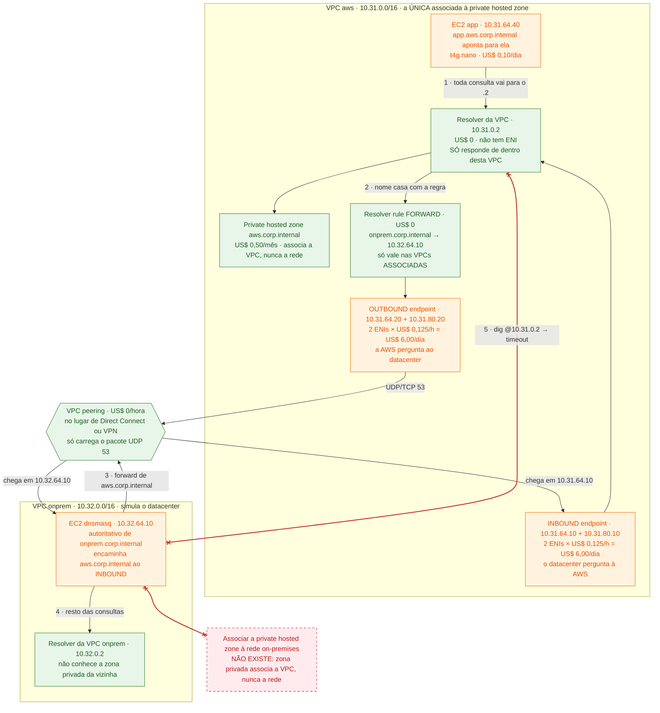

# Lab 03 — DNS híbrido: Route 53 Resolver nos dois sentidos

> **Domínio 1.1** — Arquitetar estratégias de conectividade de rede
> **Custo estimado** ~US$ 12,50/dia se ficar de pé · ~US$ 0,52/hora · **Tempo** ~45 min
> **Pré-requisitos** guardrails aplicados · `session-manager-plugin` instalado ([setup-conta.md](../../../../docs/setup-conta.md#1-ferramentas-locais))

> ⚠️ **Este é o lab mais caro por hora do repositório.** Resolver endpoint cobra
> **por ENI**, tenha tráfego ou não, e o mínimo são 2 ENIs por endpoint. Dois
> endpoints = 4 ENIs = **US$ 0,50/hora**. Uma sessão de 1h30 custa ~US$ 0,80;
> esquecer de pé um fim de semana custa ~US$ 25. Rode o `destroy` no mesmo dia.

## Por que este lab existe

DNS híbrido é a pergunta que mais aparece disfarçada no Domínio 1. O enunciado
quase nunca diz "DNS": ele diz "as instâncias novas não conseguem entrar no
domínio do Active Directory", ou "o monitoramento on-premises parou de achar o
endpoint do RDS". As alternativas então oferecem VPN, Direct Connect, peering e
private hosted zone — e **nenhuma dessas é a resposta**, porque o problema não é
de conectividade IP, é de resolução de nome.

O lab existe para gravar duas coisas na memória muscular:

1. **A direção define o recurso.** `INBOUND` deixa o on-premises _perguntar_ à
   AWS. `OUTBOUND` deixa a AWS _perguntar_ ao on-premises. Trocar os dois é o
   distrator mais comum da prova, e as duas palavras são lidas sempre do ponto
   de vista da VPC.
2. **O resolver da VPC (o `.2`) não atende de fora.** É por isso que "aponte o
   servidor DNS on-premises para 10.31.0.2" — que parece a solução óbvia e
   grátis — simplesmente não funciona. O passo 5 mostra o timeout.

De quebra, o lab desmonta um terceiro distrator: **não existe associar uma
private hosted zone a uma rede on-premises**. Zona privada associa a VPC.

## A analogia

Pense em cada rede como um **prédio com sua própria telefonista**.

A telefonista da AWS é o resolver da VPC, o famoso `.2`. Ela conhece a **lista
interna do prédio** (a private hosted zone) e atende qualquer ramal — mas ela só
atende **ligações que vêm de dentro do prédio**. Não existe número externo para
ela. Esse detalhe é de graça e é a origem de metade das questões.

O **outbound endpoint** é a **linha externa** que você instala para a telefonista
poder ligar para fora. A **forwarding rule** é a instrução escrita ao lado do
telefone: "nome terminado em `onprem.corp.internal`? disque para a telefonista do
prédio B". A instrução sozinha não faz nada — ela precisa estar **colada na mesa
daquela telefonista**, e é isso que a associação regra↔VPC significa. A mesma
folha pode ser fotocopiada e colada em várias mesas (é o que o RAM faz com a
regra em ambiente multi-conta).

O **inbound endpoint** é um **balcão de atendimento na portaria**, com dois
guichês em dois andares diferentes. Ele existe só para receber quem vem de fora,
anota a pergunta e leva até a telefonista de sempre. Você paga **aluguel por
guichê, por hora**, esteja alguém na fila ou não.

| Na analogia                                    | Na AWS                                                              |
| ---------------------------------------------- | ------------------------------------------------------------------- |
| Prédio A                                       | VPC `10.31.0.0/16`                                                  |
| Prédio B                                       | VPC `10.32.0.0/16`, no papel do datacenter                          |
| Telefonista, que só atende ramal interno       | Resolver da VPC · `10.31.0.2` (AmazonProvidedDNS) — US$ 0           |
| Lista telefônica interna do prédio             | Private hosted zone `aws.corp.internal`                             |
| Inscrever um prédio para receber a lista       | Associação da zona a uma **VPC** (`vpc { vpc_id = ... }`)           |
| Linha externa da telefonista                   | Outbound endpoint · 2 ENIs · US$ 0,125/h cada                       |
| Instrução colada ao lado do telefone           | Resolver rule `FORWARD` — US$ 0                                     |
| Colar a instrução na mesa de uma telefonista   | `aws_route53_resolver_rule_association` (uma por VPC)               |
| Fotocopiar a instrução para outras mesas       | Compartilhar a regra via **RAM** e associá-la a N VPCs / N contas   |
| Balcão na portaria, dois guichês, dois andares | Inbound endpoint · 2 IPs em 2 AZs · US$ 0,125/h cada                |
| Telefonista do prédio B                        | `dnsmasq` na EC2 `10.32.64.10`                                      |
| Corredor entre os dois prédios                 | VPC peering (no desenho real: Direct Connect ou Site-to-Site VPN)   |

**Onde a analogia quebra** — e é aqui que mora a pegadinha: o balcão da portaria
**não é uma segunda telefonista**. Ele não tem lista própria, não decide nada e
não substitui o `.2`: ele só repassa a pergunta para a mesma telefonista de
sempre. Consequência prática que cai na prova: **o inbound endpoint enxerga
exatamente o que o resolver daquela VPC enxerga** — as private hosted zones
associadas àquela VPC, e mais nada. Se a zona estiver associada só à VPC do lado,
pôr um inbound endpoint aqui não resolve; o que faltava era a **associação da
zona**, não o endpoint. Corolário do outro lado: a linha externa (outbound) e a
instrução (rule) também são coisas separadas, e você paga a linha mesmo com a
instrução descolada — o passo 7 mostra isso custando dinheiro e não resolvendo
nada.

## Onde isso aparece no mundo real

- **Cenário**: uma seguradora está no ano 2 de uma migração. O Active Directory
  continua no datacenter, autoritativo de `corp.interno`, e ~200 EC2 novas
  precisam entrar no domínio — o que exige resolver os registros `SRV` do AD
  antes de qualquer coisa. Na direção oposta, a equipe de monitoramento
  on-premises coleta métricas de 40 instâncias Aurora cujos endpoints vivem numa
  private hosted zone `db.aws.interno`. Já existe um Direct Connect de 1 Gbps
  ligando os dois lados: **conectividade IP não é o problema**.
- **Sem isto**: o time cai no caminho artesanal — um arquivo `/etc/hosts` gerado
  por script em cada instância nova, e um par de servidores BIND em EC2 fazendo
  forward manual, mantidos por uma pessoa que vai sair da empresa. Cada endpoint
  de Aurora que muda vira um chamado. Pior: quando alguém tenta o atalho óbvio e
  aponta o AD on-premises para o `10.x.0.2` da VPC, nada responde, e o time perde
  dois dias achando que é a ACL do Direct Connect.
- **Com isto**: um **outbound endpoint** com uma forwarding rule para
  `corp.interno` faz as 200 instâncias resolverem o AD sem nenhuma configuração
  dentro da máquina — elas continuam perguntando ao `.2` de sempre. Um **inbound
  endpoint** dá ao monitoramento um par de IPs para onde encaminhar
  `db.aws.interno`. As duas mudanças são de plataforma, não de host.
- **Quem faz assim**: é o desenho de referência do whitepaper [Building a
  Scalable and Secure Multi-VPC AWS Network
  Infrastructure](https://docs.aws.amazon.com/whitepapers/latest/building-scalable-secure-multi-vpc-network-infrastructure/centralized-dns-management.html),
  na seção de DNS centralizado: **um par de endpoints numa VPC de shared
  services**, com as regras compartilhadas por RAM e associadas às VPCs das
  outras contas. A conta explica a arquitetura: um par de endpoints por VPC, em
  12 VPCs, custaria 12 × 4 ENIs × US$ 0,125/h ≈ **US$ 4.380/mês**. Centralizado,
  são as mesmas 4 ENIs ≈ **US$ 365/mês**.

## Arquitetura



### Como ler o desenho

**As convenções primeiro.** As duas caixas amarelas são **fronteiras de VPC**,
não recursos: em cima a VPC `aws`, embaixo a VPC `onprem` que faz o papel do
datacenter. Tudo que está dentro delas é recurso. A **cor é o custo**: verde não
cobra nada (o resolver `.2`, a regra, o peering), laranja cobra por hora (as ENIs
dos endpoints, as EC2), vermelho tracejado é o que **não existe ou não
funciona**. O hexágono do peering fica fora das duas fronteiras de propósito: ele
não pertence a nenhuma das VPCs, é a costura entre elas.

**Onde começar: no `Resolver da VPC · 10.31.0.2`.** Ele é o personagem do lab.
Repare que **cinco setas tocam essa caixa** e nenhum outro nó tem tanto. Todo o
desenho responde a uma pergunta só: "quem pode falar com essa telefonista, e o
que ela sabe?". A resposta curta é que qualquer um de dentro da VPC fala com ela
direto e de graça, e qualquer um de fora precisa de um balcão pago.

**1. A consulta comum (laranja → verde, seta 1).** A EC2 `app` manda **toda**
consulta para o `.2`. Ela não sabe que existe endpoint, regra ou datacenter — e
esse é o ponto do desenho inteiro: DNS híbrido é uma mudança de plataforma, não
de host. Do `.2` sai a seta para a private hosted zone, que é onde
`app.aws.corp.internal` está escrito.

**2. AWS → on-premises (setas 2 e 3, descendo).** Quando o nome casa com o
domínio da regra, o `.2` consulta a `Resolver rule FORWARD` e despacha a pergunta
pelo `OUTBOUND endpoint`. Repare que a regra e o endpoint são **duas caixas
separadas**: a regra diz _para onde_, o endpoint é _por onde_. Do endpoint o
pacote UDP/53 atravessa o peering e chega ao dnsmasq — e é o **IP do ENI do
outbound** (`10.31.64.20`) que aparece como origem no log do datacenter, nunca o
IP da EC2. O passo 4 do roteiro lê esse log.

**3. On-premises → AWS (seta 3 de volta, subindo pelo INBOUND).** O sentido é o
que muda tudo. Agora quem inicia é o dnsmasq: ele tem a instrução de encaminhar
`aws.corp.internal` para os dois IPs do `INBOUND endpoint`, que entrega a
pergunta ao mesmo `.2` de sempre. Note que a seta termina em `R2`, não numa
lista própria — o balcão não sabe nada, ele só repassa.

**4. O caminho que falha (vermelho, seta 5).** A seta com **x nas duas pontas**
liga o dnsmasq direto ao `.2` da VPC vizinha e é o passo 5 do roteiro:
`dig @10.31.0.2` dá **timeout**. Ela está desenhada porque a ausência de seta não
prova nada — e porque essa é a tentativa que todo mundo faz primeiro, já que o
peering está lá e o pacote _deveria_ chegar. Ele chega; o `.2` é que não responde
a quem não está na VPC dele. Esse timeout é a razão de existir o inbound
endpoint, e é a razão de ele ser pago.

**O que ler pela ausência.** A caixa vermelha tracejada não é um recurso que
faltou criar: é uma operação que **não existe na AWS**. Você não associa uma
private hosted zone a uma rede on-premises — o bloco `vpc` da zona só aceita VPC.
Ela está no desenho porque é a alternativa mais plausível de todas as questões
sobre este assunto, e você precisa reconhecê-la pelo nome para descartá-la em
dois segundos.

**A conta está escrita nas caixas laranja.** `2 ENIs × US$ 0,125/h` aparece duas
vezes, uma por endpoint: US$ 6,00/dia cada, US$ 12,00/dia somados. Compare com o
`US$ 0` da caixa do `.2` e com o `US$ 0` da regra: **o que custa é o ENI, não o
DNS**. É por isso que a arquitetura de referência põe um par de endpoints numa
VPC de shared services e compartilha as regras por RAM, em vez de repetir o par
em cada VPC — a regra replicada é de graça, o endpoint replicado não.

## Glossário

Cada termo do diagrama, onde ele está no código e por que existe **neste** lab.

### Resolução de nomes

| Termo                                | Onde está                                                  | O que é e para que serve aqui                                                                                                                                                                             |
| ------------------------------------ | ---------------------------------------------------------- | ----------------------------------------------------------------------------------------------------------------------------------------------------------------------------------------------------------- |
| **Resolver da VPC (`.2`)**           | `local.aws_vpc_resolver_ip`                                | O DNS embutido em toda VPC, sempre no segundo IP do CIDR (`10.31.0.2`), também alcançável em `169.254.169.253`. Grátis, sem ENI, sem HA para configurar — e **só responde a quem está dentro da VPC dele**. |
| **Private hosted zone (PHZ)**        | `aws_route53_zone.aws_private` ([main.tf:115](main.tf:115)) | Zona DNS que só existe para as VPCs associadas a ela. Aqui está associada a **uma** VPC, e é isso que faz o passo 5 dar NXDOMAIN quando perguntado do outro lado.                                          |
| **Associação de zona ↔ VPC**         | bloco `vpc { }` em [main.tf:119](main.tf:119)              | O que "entrega a lista telefônica" a uma VPC. É o parâmetro que a maioria das questões esquece — e o único jeito de mais uma VPC enxergar a zona. Não aceita rede on-premises.                             |
| **Inbound endpoint**                 | `aws_route53_resolver_endpoint.inbound` ([main.tf:209](main.tf:209)) | Par de ENIs com IP da sua subnet que **recebe** consultas vindas de fora e as entrega ao `.2`. É o que dá ao datacenter um endereço para onde encaminhar. US$ 0,125/h por ENI.                    |
| **Outbound endpoint**                | `aws_route53_resolver_endpoint.outbound` ([main.tf:227](main.tf:227)) | Par de ENIs por onde o `.2` **envia** consultas para um servidor DNS externo. Sem ele não existe forwarding rule — a regra exige um endpoint. US$ 0,125/h por ENI.                                |
| **Os dois IPs obrigatórios**         | dois blocos `ip_address` por endpoint                      | Resolver endpoint exige no mínimo dois IPs, em duas AZs. Não é opcional, e é por isso que a unidade de custo real é "2 ENIs", nunca uma.                                                                   |
| **Resolver rule `FORWARD`**          | `aws_route53_resolver_rule.onprem` ([main.tf:258](main.tf:258)) | "Nome que termina em `onprem.corp.internal` vai para `10.32.64.10:53` por este outbound endpoint." Custa zero e, sozinha, não faz efeito nenhum.                                                     |
| **Associação regra ↔ VPC**           | `aws_route53_resolver_rule_association.onprem` ([main.tf:272](main.tf:272)) | O objeto que faz a regra valer para uma VPC. Uma regra, N associações. O passo 7 apaga esta linha e mostra o NXDOMAIN aparecer com o endpoint intacto.                               |
| **Regra `SYSTEM` / `RECURSIVE`**     | **não existem neste lab**                                  | Os outros dois tipos: `RECURSIVE` é o comportamento padrão (o `.2` resolve sozinho) e `SYSTEM` **cancela** um forward herdado para um subdomínio. `SYSTEM` é a resposta de "encaminhe tudo menos X".      |
| **Conditional forwarding**           | [`assets/dnsmasq-user-data.sh.tftpl`](assets/dnsmasq-user-data.sh.tftpl) | O espelho da resolver rule, do lado de lá: `server=/aws.corp.internal/10.31.64.10`. Só este domínio sai para a AWS; o resto continua indo para o resolver local.                     |
| **NXDOMAIN vs. SERVFAIL**            | passos 7 e 8                                               | `NXDOMAIN` = alguém respondeu com autoridade "esse nome não existe" (falta regra/zona). `SERVFAIL` = havia para onde perguntar e ninguém respondeu (alvo caído, SG bloqueando). Diagnósticos opostos.     |
| **RAM (Resource Access Manager)**    | **não existe neste lab** (exige 2ª conta)                  | Compartilha a **regra** com outras contas, que a associam às VPCs delas. É o que torna o par de endpoints centralizado viável — e a resposta da pergunta 5.                                               |

### Rede e acesso

| Termo                          | Onde está                                            | O que é e para que serve aqui                                                                                                                                                             |
| ------------------------------ | ---------------------------------------------------- | ------------------------------------------------------------------------------------------------------------------------------------------------------------------------------------------- |
| **VPC peering**                | `aws_vpc_peering_connection.this` ([main.tf:87](main.tf:87)) | Liga as duas VPCs sem custo por hora. Está **no lugar** de um Direct Connect ou VPN: para o DNS híbrido, o transporte é indiferente — ele só precisa entregar o pacote UDP/53.       |
| **SG do inbound endpoint**     | `aws_security_group.resolver_inbound` ([main.tf:142](main.tf:142)) | Precisa de **ingress** 53 UDP **e** TCP vindo da rede de fora. Errar isto dá um endpoint `OPERATIONAL` que não resolve nada — o sintoma clássico de troubleshooting.          |
| **SG do outbound endpoint**    | `aws_security_group.resolver_outbound` ([main.tf:174](main.tf:174)) | Precisa de **egress** 53 UDP e TCP em direção ao servidor externo. A direção do SG segue a direção do endpoint; trocar os dois é o erro mais comum.                          |
| **53 em TCP, além de UDP**     | os dois SGs acima                                    | DNS usa UDP por padrão e cai para TCP quando a resposta não cabe em 512 bytes (ou com DNSSEC). Liberar só UDP funciona no lab e falha em produção, de forma intermitente.                  |
| **`dnsmasq`**                  | [`assets/dnsmasq-user-data.sh.tftpl`](assets/dnsmasq-user-data.sh.tftpl) | O "servidor DNS corporativo". Autoritativo de `onprem.corp.internal` (`local=`), com `log-queries` ligado — é o log que o passo 4 lê para provar quem perguntou.          |
| **NAT instance**               | `nat_strategy = "instance"` ([main.tf:25](main.tf:25)) | ~US$ 3/mês por VPC. Existe só para as EC2 alcançarem o Systems Manager e instalarem `dnsmasq`/`bind-utils`. O trio de interface endpoints do SSM custaria US$ 1,44/dia.               |
| **Retry no `user_data`**       | [main.tf:352](main.tf:352) e no template do dnsmasq  | O Terraform espera a NAT instance ficar `running`, não o `user_data` **dela** terminar. Sem o laço de retry, o `dnf install` do outro lado corre antes do MASQUERADE existir e falha.       |
| **Session Manager**            | `aws ssm start-session`                              | Único acesso às duas EC2: sem IP público, sem porta 22, sem chave. Ver o [lab 01](../lab-01-vpc-base/) para o mecanismo.                                                                   |
| **IMDSv2 (`http_tokens`)**     | [main.tf:359](main.tf:359)                           | Token obrigatório no metadata service. Não tem relação com o tema do lab; é o padrão do repositório.                                                                                       |

## Executar

```bash
./scripts/tf.sh plan certifications/sap-c02/labs/lab-03-dns-hibrido
```

```bash
./scripts/tf.sh apply certifications/sap-c02/labs/lab-03-dns-hibrido
```

Depois do apply, **espere ~4 min antes do passo 2**. Duas coisas precisam
acontecer nesse tempo, e nenhuma delas é instantânea: as instâncias registram no
Systems Manager (~2 min) e o `user_data` instala `dig` e o `dnsmasq` passando
pela NAT instance, que ela mesma acabou de subir. Se a sessão abrir e o `dig`
responder `command not found`, o `user_data` ainda está rodando — espere e repita.

## O que observar

### Antes de começar: como ler este roteiro

Os comandos rodam em **três lugares**, e o lab inteiro é sobre a diferença entre
"perguntar de dentro" e "perguntar de fora". Confundir os contextos aqui não
atrapalha um pouco: inverte a conclusão. Todo passo começa dizendo onde roda.

| Marcador                | Onde é                                              | Como saber que você está lá                                    |
| ----------------------- | --------------------------------------------------- | -------------------------------------------------------------- |
| 💻 **No seu laptop**    | Terminal normal, no diretório do repositório        | O prompt é o seu de sempre                                     |
| ☁️ **Na EC2 da AWS**    | Sessão SSM na instância `-app`, na VPC `10.31.0.0/16` | `hostname` responde `ip-10-31-64-40.ec2.internal`             |
| 🏢 **No "datacenter"**  | Sessão SSM na instância `-onprem-dns`, `10.32.0.0/16` | `hostname` responde `ip-10-32-64-10.ec2.internal`             |

**Abra três terminais** e deixe as duas sessões SSM abertas o lab inteiro — você
vai alternar entre elas nos passos 5 a 8, e reabrir sessão custa ~1 min cada vez.

As saídas abaixo são exemplos com IDs fictícios; **os IPs, esses, são reais** —
eles estão fixos no código justamente para você poder conferir de cabeça.

---

- [ ] **1. Pegar os valores que todo o resto usa**

  💻 **No seu laptop**, no diretório do repositório.
  **O que este passo faz:** lê o state e imprime os identificadores do apply.
  Os dois comandos de sessão já vêm prontos para copiar.

  ```bash
  ./scripts/tf.sh output certifications/sap-c02/labs/lab-03-dns-hibrido
  ```

  **Saída esperada:**

  ```text
  inbound_endpoint_ips = [
    "10.31.64.10",
    "10.31.80.10",
  ]
  instance_ips = {
    "app" = "10.31.64.40"
    "onprem_dns" = "10.32.64.10"
  }
  names_to_resolve = {
    "aws_side" = "app.aws.corp.internal"
    "onprem_side" = "db.onprem.corp.internal"
  }
  outbound_endpoint_ips = [
    "10.31.64.20",
    "10.31.80.20",
  ]
  private_hosted_zone_id = "Z04821931RQ8XKLM9NPQR"
  resolver_endpoint_hourly_cost = "4 ENIs x US$ 0,125/h = US$ 0,50/h = US$ 12,00/dia. Destrua o lab ao terminar."
  resolver_rule_id = "rslvr-rr-0a1b2c3d4e5f60718"
  session_commands = {
    "aws" = "aws ssm start-session --target i-05e3f0c9c4a2b7d18 --region us-east-1"
    "onprem" = "aws ssm start-session --target i-0b6d7e8f9a0b1c2d3 --region us-east-1"
  }
  vpc_resolver_ips = {
    "aws" = "10.31.0.2"
    "onprem" = "10.32.0.2"
  }
  ```

  **Como ler:** decore quatro números e o lab fica fácil — `.10` é sempre
  **inbound**, `.20` é sempre **outbound**, `10.31.64.40` é a EC2 da AWS e
  `10.32.64.10` é o servidor DNS do datacenter. `resolver_rule_id` é usado no
  passo 7.
  **Se falhar** com `No outputs found`: o apply não rodou. Confira com
  `./scripts/tf.sh list`.

- [ ] **2. Provar que a private hosted zone funciona — de dentro da VPC dela**

  ☁️ **Na EC2 da AWS.** Abra a sessão com o comando `session_commands.aws`.
  **O que este passo faz:** resolve um nome que só existe na zona privada. É a
  linha de base do lab: antes de estudar o que atravessa a fronteira, confirme o
  que funciona sem atravessar nada.

  ```bash
  dig app.aws.corp.internal
  ```

  **Saída esperada:**

  ```text
  ;; ->>HEADER<<- opcode: QUERY, status: NOERROR, id: 51203
  ;; flags: qr rd ra; QUERY: 1, ANSWER: 1, AUTHORITY: 0, ADDITIONAL: 1

  ;; ANSWER SECTION:
  app.aws.corp.internal.  60      IN      A       10.31.64.40

  ;; Query time: 1 msec
  ;; SERVER: 10.31.0.2#53(10.31.0.2) (UDP)
  ```

  **Como ler:** três campos importam. `status: NOERROR` com `ANSWER: 1`, o IP
  `10.31.64.40` e — o mais informativo — a linha `SERVER: 10.31.0.2`. Você não
  configurou resolver nenhum nesta máquina: o `.2` já era o servidor dela desde
  o boot, via DHCP da VPC.
  **Se falhar** com `dig: command not found`: o `user_data` ainda não terminou;
  espere 2 min. Com `status: NXDOMAIN`: a zona não está associada a esta VPC —
  confira com `aws route53 get-hosted-zone --id Z04821931RQ8XKLM9NPQR`.
  **O que isso prova:** private hosted zone não precisa de endpoint nenhum para
  funcionar **dentro** da VPC associada. Tudo que este lab tem de caro existe só
  para atravessar a fronteira.

- [ ] **3. AWS → on-premises: resolver o domínio do "datacenter"**

  ☁️ **Na EC2 da AWS**, no mesmo prompt.
  **O que este passo faz:** pergunta por um nome que o resolver da AWS **não**
  conhece. O `.2` vai casar o nome com a forwarding rule e despachar a pergunta
  pelo outbound endpoint até o dnsmasq. Nada muda na máquina: mesmo `dig`, mesmo
  servidor `10.31.0.2`.

  ```bash
  dig db.onprem.corp.internal
  ```

  **Saída esperada:**

  ```text
  ;; ->>HEADER<<- opcode: QUERY, status: NOERROR, id: 33871
  ;; flags: qr rd ra; QUERY: 1, ANSWER: 1, AUTHORITY: 0, ADDITIONAL: 1

  ;; ANSWER SECTION:
  db.onprem.corp.internal. 0      IN      A       10.32.64.10

  ;; Query time: 34 msec
  ;; SERVER: 10.31.0.2#53(10.31.0.2) (UDP)
  ```

  **Como ler:** a linha `SERVER` continua dizendo `10.31.0.2` — do ponto de vista
  da instância **nada mudou**, e é esse o valor da arquitetura. A pista de que a
  pergunta viajou está no `Query time`: 34 ms contra 1 ms do passo anterior. O
  TTL `0` vem do dnsmasq, que não deixa cachear os registros locais dele.
  Confirme que o nome resolvido também é alcançável:

  ```bash
  ping -c 2 db.onprem.corp.internal
  ```

  ```text
  PING db.onprem.corp.internal (10.32.64.10) 56(84) bytes of data.
  64 bytes from 10.32.64.10: icmp_seq=1 ttl=127 time=1.42 ms
  64 bytes from 10.32.64.10: icmp_seq=2 ttl=127 time=1.31 ms
  ```

  **Se falhar** com `status: SERVFAIL`: o dnsmasq não subiu — pule para o passo 8,
  que trata exatamente desse sintoma. Com `NXDOMAIN`: a regra não está associada
  a esta VPC (passo 7).
  **O que isso prova:** outbound endpoint + forwarding rule resolvem nome
  on-premises **sem tocar em nenhuma instância**. Numa questão que diga "200
  instâncias precisam entrar no domínio do AD", é isto — não `/etc/hosts`, não
  mudar o `resolv.conf`, não um BIND em EC2.

- [ ] **4. Ver de qual IP a pergunta chegou — e o que isso custa**

  🏢 **No "datacenter"**, na sessão da instância `-onprem-dns`.
  **O que este passo faz:** lê o log do dnsmasq. Ele registra cada consulta com o
  IP de origem, e esse IP é a prova de por onde a pergunta do passo 3 passou.

  ```bash
  sudo journalctl -u dnsmasq --no-pager -n 10
  ```

  **Saída esperada:**

  ```text
  Aug 12 14:02:40 ip-10-32-64-10 dnsmasq[1421]: query[A] db.onprem.corp.internal from 10.31.64.20
  Aug 12 14:02:40 ip-10-32-64-10 dnsmasq[1421]: config db.onprem.corp.internal is 10.32.64.10
  ```

  **Como ler:** o campo que importa é o `from 10.31.64.20` — o **ENI do outbound
  endpoint**, não o `10.31.64.40` da EC2 que rodou o `dig`. Do ponto de vista do
  datacenter, quem consulta é o Route 53 Resolver; a instância é invisível. É por
  isso que o firewall on-premises deve liberar os IPs dos endpoints, e não a
  faixa das instâncias — detalhe que vira questão. O `config` na segunda linha é
  o dnsmasq dizendo que respondeu de um `host-record` local.
  Agora 💻 **no seu laptop**, confira a unidade de cobrança:

  ```bash
  aws route53resolver list-resolver-endpoints \
    --query 'ResolverEndpoints[?starts_with(Name, `sap-c02-lab-03`)].[Name,Direction,IpAddressCount,Status]' \
    --output table --region us-east-1
  ```

  ```text
  ------------------------------------------------------------------------
  |                        ListResolverEndpoints                         |
  +---------------------------------+-----------+-----+------------------+
  |  sap-c02-lab-03-dns-hibrido-in..|  INBOUND  |  2  |  OPERATIONAL     |
  |  sap-c02-lab-03-dns-hibrido-ou..|  OUTBOUND |  2  |  OPERATIONAL     |
  +---------------------------------+-----------+-----+------------------+
  ```

  **O que isso prova:** `IpAddressCount = 2` em cada linha é a fatura. São 4 ENIs
  a US$ 0,125/h, cobradas por existirem — as duas consultas que você fez até aqui
  custaram frações de centavo, o aluguel é que pesa.

- [ ] **5. On-premises → AWS: as duas tentativas ingênuas, e por que falham**

  🏢 **No "datacenter"**. Este é o passo mais importante do lab.
  **O que este passo faz:** tenta resolver o nome da zona privada da AWS de dois
  jeitos que parecem razoáveis, e falha nos dois — de formas **diferentes**.
  Primeiro, perguntando ao resolver da própria VPC on-premises:

  ```bash
  dig @10.32.0.2 app.aws.corp.internal
  ```

  ```text
  ;; ->>HEADER<<- opcode: QUERY, status: NXDOMAIN, id: 19442
  ;; flags: qr rd ra; QUERY: 1, ANSWER: 0, AUTHORITY: 1, ADDITIONAL: 1
  ```

  Agora, perguntando direto ao resolver da VPC vizinha — que está a um peering de
  distância e responde a ping normalmente:

  ```bash
  dig @10.31.0.2 app.aws.corp.internal +time=3 +tries=1
  ```

  ```text
  ;; communications error to 10.31.0.2#53: timed out

  ;; no servers could be reached
  ```

  **Como ler:** os dois erros são **diagnósticos opostos e ambos importam**. O
  primeiro é `NXDOMAIN`: alguém respondeu, e respondeu que o nome não existe — o
  `.2` da VPC on-premises está vivo, só não tem a zona privada associada a ele.
  O segundo é **timeout, sem resposta nenhuma**: o pacote chegou (o peering
  funciona, a rota existe), mas o `.2` da outra VPC **não atende quem não é da
  VPC dele**. Não é firewall, não é rota, não é NACL — é o comportamento do
  serviço, e não existe configuração para mudá-lo.
  **Se o segundo comando responder** em vez de dar timeout: você o rodou na
  máquina errada — confira o `hostname`, precisa ser `ip-10-32-64-10`.
  **O que isso prova:** este é o timeout que justifica o inbound endpoint existir
  e custar dinheiro. Quando a questão oferecer "configure o servidor DNS
  on-premises para encaminhar para o resolver da VPC", é este comando — a
  alternativa está errada, e o motivo é que o `.2` só atende de dentro.

- [ ] **6. On-premises → AWS, agora pelo caminho certo**

  🏢 **No "datacenter"**, no mesmo prompt.
  **O que este passo faz:** repete a mesma pergunta do passo 5, mudando só o
  destino: em vez do `.2`, um dos dois IPs do inbound endpoint.

  ```bash
  dig @10.31.64.10 app.aws.corp.internal +short
  ```

  ```text
  10.31.64.40
  ```

  Agora prove o caminho completo, como um cliente do datacenter faria — através
  do dnsmasq, que tem o conditional forwarding configurado:

  ```bash
  dig @127.0.0.1 app.aws.corp.internal +short
  ```

  ```text
  10.31.64.40
  ```

  **Como ler:** a primeira consulta é o teste de conectividade (o balcão atende);
  a segunda é o desenho real (o cliente pergunta ao DNS corporativo, que
  encaminha sozinho). Confirme no log qual dos dois caminhos o dnsmasq usou:

  ```bash
  sudo journalctl -u dnsmasq --no-pager -n 6
  ```

  ```text
  Aug 12 14:11:02 ip-10-32-64-10 dnsmasq[1421]: query[A] app.aws.corp.internal from 127.0.0.1
  Aug 12 14:11:02 ip-10-32-64-10 dnsmasq[1421]: forwarded app.aws.corp.internal to 10.31.64.10
  Aug 12 14:11:02 ip-10-32-64-10 dnsmasq[1421]: reply app.aws.corp.internal is 10.31.64.40
  ```

  **Se falhar** com timeout no primeiro comando: o security group do inbound
  endpoint ([main.tf:142](main.tf:142)) é o suspeito — ele precisa de ingress 53
  UDP a partir de `10.32.0.0/16`. O endpoint continua `OPERATIONAL` mesmo assim.
  **O que isso prova:** os dois sentidos do DNS híbrido são **recursos
  independentes**. Você acabou de usar inbound (aqui) e outbound (passo 3) na
  mesma arquitetura, e nenhum dos dois serviria para a direção do outro. Quando a
  questão disser "o datacenter precisa resolver nomes da AWS", a resposta tem a
  palavra **inbound**; quando disser o contrário, tem **outbound** e **regra**.

- [ ] **7. Quebrar de propósito: descolar a regra da VPC**

  💻 **No seu laptop.** Você vai apagar **só a associação** — a regra continua
  existindo, o outbound endpoint continua `OPERATIONAL` e você continua pagando
  as 2 ENIs dele.
  **O que este passo faz:** remove o vínculo entre a forwarding rule e a VPC
  `aws`. Use o `resolver_rule_id` e o `vpc_id` do passo 1.

  ```bash
  aws route53resolver disassociate-resolver-rule \
    --resolver-rule-id rslvr-rr-0a1b2c3d4e5f60718 \
    --vpc-id vpc-0a1b2c3d4e5f60718 --region us-east-1
  ```

  Espere ~1 min e repita o passo 3, ☁️ **na EC2 da AWS**:

  ```bash
  dig db.onprem.corp.internal
  ```

  **Saída esperada:**

  ```text
  ;; ->>HEADER<<- opcode: QUERY, status: NXDOMAIN, id: 60117
  ;; flags: qr rd ra; QUERY: 1, ANSWER: 0, AUTHORITY: 1, ADDITIONAL: 1
  ```

  **Como ler:** `NXDOMAIN`, não timeout, não SERVFAIL. Sem a associação, o `.2`
  nem tenta encaminhar: ele trata `onprem.corp.internal` como um domínio público
  qualquer, não acha, e responde com autoridade que o nome não existe. Nada mudou
  na rede, no SG ou no endpoint.
  **Reverter** — deixe o Terraform recriar a associação, para o state não ficar
  divergente:

  ```bash
  ./scripts/tf.sh apply certifications/sap-c02/labs/lab-03-dns-hibrido
  ```

  **O que isso prova:** a regra e a associação são objetos separados, e é a
  **associação** que faz efeito. Guarde a consequência prática, que é o que a
  prova cobra: você escreve a regra uma vez, compartilha por RAM e a associa a
  quantas VPCs quiser — o que replica de graça é a regra, o que custa é o
  endpoint. E guarde o sintoma: **endpoint saudável + NXDOMAIN = falta
  associação**.

- [ ] **8. Quebrar de propósito de novo: derrubar o servidor do datacenter**

  🏢 **No "datacenter"**. Agora a regra está de volta e o alvo dela vai sumir.
  **O que este passo faz:** para o dnsmasq. Você não toca em rede, em SG, nem em
  nada do lado da AWS — só o destino do forward para de responder.

  ```bash
  sudo systemctl stop dnsmasq
  ```

  Agora ☁️ **na EC2 da AWS**, pergunte por um nome que você ainda **não**
  consultou (para não pegar resposta em cache):

  ```bash
  dig dns.onprem.corp.internal
  ```

  **Saída esperada** — demora alguns segundos até aparecer:

  ```text
  ;; ->>HEADER<<- opcode: QUERY, status: SERVFAIL, id: 47720
  ;; flags: qr rd ra; QUERY: 1, ANSWER: 0, AUTHORITY: 0, ADDITIONAL: 1
  ```

  **Como ler:** `SERVFAIL`, e a diferença para o `NXDOMAIN` do passo 7 é o
  conteúdo inteiro deste passo. `NXDOMAIN` = "eu sei responder e a resposta é que
  não existe" → falta regra, falta associação, falta zona. `SERVFAIL` = "eu sabia
  para onde perguntar e não recebi resposta" → alvo caído, porta fechada,
  security group bloqueando, rota faltando. Numa questão de troubleshooting, essa
  única palavra separa dois conjuntos de causas que não têm interseção.
  **Reverter:**

  ```bash
  sudo systemctl start dnsmasq
  ```

  **O que isso prova:** o Route 53 Resolver não inventa resposta quando o
  forwarder morre — ele devolve SERVFAIL. Se a arquitetura real depende de um
  único servidor DNS on-premises, você acabou de criar um SPOF de resolução para
  a nuvem inteira. É por isso que a `target_ip` da regra aceita mais de um IP.

- [ ] **9. Conferir a conta**

  🌐 **No navegador**, D+1. Console → **Billing and Cost Management** → **Cost
  Explorer** → filtro **Tag** → chave `Lab` → valor `lab-03-dns-hibrido`,
  agrupando por **Service**.

  **Como ler:** `Route 53 Resolver` deve dominar com folga — as 4 ENIs a US$
  0,125/h são ~96% da conta. As 4 `t4g.nano` (2 do lab + 2 NAT instances) somam
  ~US$ 0,40/dia e o resto é ruído. Confira a matemática: 4 × US$ 0,125 × 24 =
  **US$ 12,00/dia**.
  **O que isso prova:** o custo de DNS híbrido é custo de **ENI parada**, não de
  consulta (a AWS cobra US$ 0,40 por milhão de consultas — você fez umas vinte).
  Essa é a intuição inteira por trás da arquitetura centralizada da pergunta 5.
  Anote o valor real no [`progresso.md`](../../progresso.md).

## Perguntas que o lab responde

### 1. O monitoramento no datacenter precisa resolver os endpoints de Aurora, que estão numa private hosted zone. Já existe Direct Connect. O que criar?

**Resposta:** um **inbound endpoint** do Route 53 Resolver na VPC associada à
zona, e um conditional forwarder no servidor DNS on-premises apontando para os
IPs dele.
**Por quê:** o resolver da VPC (`.2` / `169.254.169.253`) só responde a consultas
originadas dentro da própria VPC — o Direct Connect entrega o pacote e ninguém
atende. O inbound endpoint é um par de ENIs com IP alcançável de fora que repassa
a pergunta ao mesmo `.2`. Os distratores: "apontar o DNS on-premises para o `.2`
da VPC" falha por timeout; "associar a private hosted zone à rede on-premises"
não existe como operação — zona privada só associa a VPC; "outbound endpoint" é a
direção contrária.
**Onde o lab prova:** passo 5 — `dig @10.31.0.2` deu timeout de dentro do
datacenter, e o passo 6 mostrou o mesmo nome resolvendo em `dig @10.31.64.10`.

### 2. 200 EC2 novas precisam entrar no domínio do Active Directory, que continua on-premises. Como fazer sem tocar nas instâncias?

**Resposta:** **outbound endpoint** + **resolver rule `FORWARD`** para o domínio
do AD, apontando para os servidores DNS on-premises, **associada à VPC** das
instâncias.
**Por quê:** as instâncias continuam perguntando ao `.2`, que passa a consultar a
regra antes de resolver recursivamente. Zero configuração dentro da máquina — é
por isso que essa é a resposta mesmo com 200 hosts. Os distratores: editar
`/etc/hosts` ou `resolv.conf` via user data "funciona" e é exatamente o que a
questão está testando se você evita; um servidor BIND em EC2 fazendo forward é a
solução pré-2018, com HA e patching por sua conta.
**Onde o lab prova:** passo 3 — o `dig` na EC2 resolveu um nome do datacenter com
`SERVER: 10.31.0.2`, sem nenhuma alteração na instância.

### 3. Doze VPCs em cinco contas precisam do mesmo forwarding para o domínio corporativo. Qual desenho?

**Resposta:** **um** par de endpoints numa VPC de shared services, as regras
criadas nessa conta e **compartilhadas via AWS RAM**, cada conta associando as
regras compartilhadas às VPCs dela.
**Por quê:** a unidade de cobrança é a ENI do endpoint, não a regra nem a
associação. Um par de endpoints por VPC daria 12 × 4 × US$ 0,125/h ≈ US$
4.380/mês; centralizado são as mesmas 4 ENIs ≈ US$ 365/mês, e a regra replicada
é de graça. A conectividade entre as VPCs (TGW, normalmente) precisa existir de
qualquer forma para o tráfego de aplicação.
**Onde o lab prova:** passo 4 — `IpAddressCount = 2` por endpoint mostra que o
custo é por ENI, e o passo 7 mostra a associação sendo removida e recolocada sem
tocar no endpoint, que é exatamente a operação que o RAM torna multi-conta.

### 4. Depois de uma mudança, as instâncias param de resolver nomes on-premises. `dig` responde SERVFAIL. Por onde começar?

**Resposta:** pelo **alcance ao alvo do forward**, não pela configuração do
Route 53. Confira se os servidores DNS on-premises estão de pé, se o security
group do **outbound** endpoint libera egress 53 UDP **e** TCP, se o firewall
on-premises aceita os IPs dos ENIs do endpoint e se a rota até lá existe.
**Por quê:** `SERVFAIL` significa que o resolver **sabia para onde perguntar** e
não obteve resposta — logo a regra existe e está associada. Se a regra ou a
associação faltassem, a resposta seria `NXDOMAIN`. Essa distinção corta o
espaço de causas pela metade antes de você abrir o console.
**Onde o lab prova:** passos 7 e 8, lado a lado — mesma pergunta, mesma
instância: sem associação deu NXDOMAIN, com associação e alvo caído deu SERVFAIL.

### 5. A equipe criou o inbound endpoint, ele está `OPERATIONAL`, e o datacenter continua sem resolver os nomes da zona privada. O que investigar?

**Resposta:** duas coisas, nesta ordem. Primeiro, o **security group do
endpoint** — precisa de _ingress_ 53 em UDP e TCP vindo dos CIDRs on-premises.
Segundo, se a **private hosted zone está associada à VPC onde o endpoint vive**.
**Por quê:** `OPERATIONAL` só diz que as ENIs subiram; não testa conectividade
nem visibilidade de zona. E o inbound endpoint não tem lista própria: ele enxerga
exatamente o que o resolver daquela VPC enxerga. Endpoint na VPC A com a zona
associada só à VPC B resolve nada, sem nenhum erro em lugar nenhum.
**Onde o lab prova:** passo 6 — o `dig @10.31.64.10` só funciona porque a zona
está associada à mesma VPC dos endpoints ([main.tf:115](main.tf:115)); e o passo
2 mostrou que a zona responde a partir dessa VPC.

### 6. A conectividade entre AWS e datacenter é por VPN, não por Direct Connect. Muda alguma coisa no desenho de DNS?

**Resposta:** nada. Endpoints, regras e associações são idênticos.
**Por quê:** o Route 53 Resolver não sabe nem se importa com o transporte — ele
precisa apenas que um pacote UDP/53 (e TCP/53) chegue do outro lado. O que muda
com VPN, Direct Connect, peering ou Transit Gateway é a **rota** e a latência,
não o mecanismo de resolução. A pegadinha ao contrário também vale: se a questão
propõe resolver o problema de DNS trocando VPN por Direct Connect, a alternativa
está errada — conectividade não era o problema.
**Onde o lab prova:** o lab inteiro roda sobre um **VPC peering**
([main.tf:87](main.tf:87)) no lugar do Direct Connect, e nenhum recurso de DNS
precisou ser diferente por causa disso.

## Variações que valem tentar

**Associar a zona privada também à VPC on-premises** — edite o
`aws_route53_zone.aws_private` ([main.tf:115](main.tf:115)) para incluir um
segundo bloco `vpc` com `module.vpc_onprem.vpc_id` e aplique. O `dig @10.32.0.2`
do passo 5, que dava NXDOMAIN, passa a responder `10.31.64.40` — sem inbound
endpoint nenhum. É a prova de que **PHZ resolve entre VPCs de graça**, e de que
o endpoint só é necessário quando o outro lado **não é uma VPC**. Numa questão
com duas VPCs (não um datacenter), associar a zona é a resposta barata e certa.

**Ver o custo de verdade da direção que você não precisa** — comente o
`aws_route53_resolver_endpoint.inbound` e o SG dele e rode só o `plan`:

```bash
./scripts/tf.sh plan certifications/sap-c02/labs/lab-03-dns-hibrido
```

São 2 ENIs a menos, US$ 6,00/dia, e o lab continua fazendo AWS → on-premises
perfeitamente. Metade das arquiteturas reais só precisa de um sentido.

**Ligar query logging do Resolver** — adicione um
`aws_route53_resolver_query_log_config` com destino CloudWatch Logs e associe à
VPC. Cada consulta passa a registrar qual regra respondeu; é a ferramenta que
você vai querer quando o cenário da prova falar em "auditar resoluções DNS" ou
"descobrir quem está consultando um domínio suspeito" (aí a resposta costuma ser
Route 53 Resolver DNS Firewall, o vizinho de prateleira).

**Dar HA ao forward** — a regra aceita mais de um `target_ip`
([main.tf:264](main.tf:264)). Adicione um segundo IP e o SERVFAIL do passo 8
deixa de acontecer com um servidor caído.

## Destruir

```bash
./scripts/tf.sh destroy certifications/sap-c02/labs/lab-03-dns-hibrido
```

**Faça isso no mesmo dia.** É o lab com maior custo por hora do repositório:
US$ 0,50/hora só de resolver endpoint, sem nenhum tráfego.

Dois pontos de atenção no destroy:

- A **private hosted zone** precisa ser desassociada da VPC antes de sumir; o
  Terraform faz isso sozinho, mas se você associou a zona a uma segunda VPC pela
  CLI (variação acima), desfaça pela CLI também — o Terraform não sabe daquela
  associação e o destroy trava com `HostedZoneNotEmpty` ou similar.
- Se você rodou o passo 7 e **não** reverteu com `apply`, o Terraform vai
  reclamar da associação que já não existe. Rode o `apply` antes do `destroy`.

Confirme que não sobrou nada cobrando:

```bash
./scripts/tf.sh orphans
```

Custo real observado: **\_\_\_\_** (preencha depois)

## Anotações

<!-- O que te surpreendeu, o que quebrou, o que você erraria numa questão. -->
