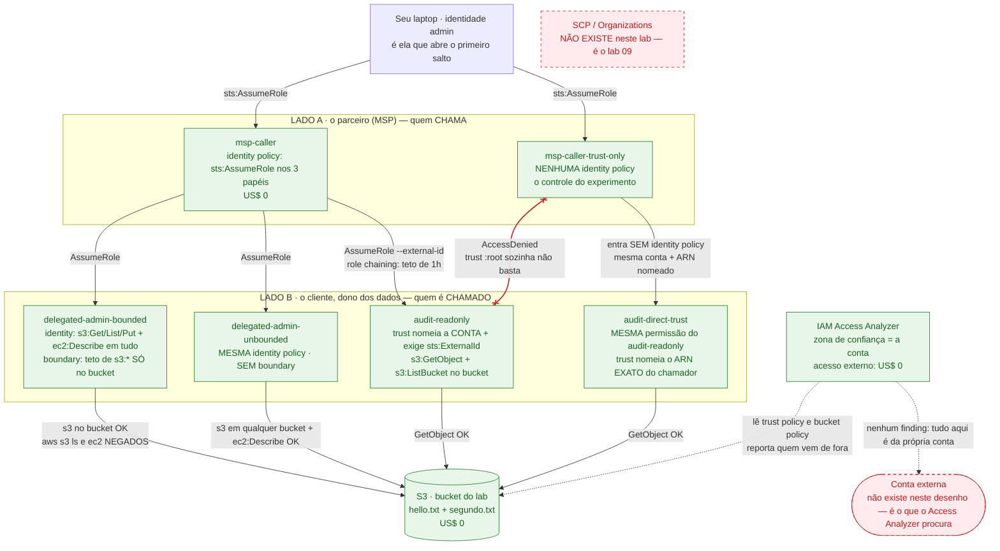

# Lab 04 — Acesso cross-account: AssumeRole, ExternalId e permission boundary

> **Domínio 1.2** — Prescrever controles de segurança
> **Custo estimado** US$ 0,00/dia · **Tempo** ~50 min
> **Pré-requisitos** guardrails aplicados · `jq` instalado ([setup-conta.md](../../../../docs/setup-conta.md#1-ferramentas-locais))

## Por que este lab existe

O SAP-C02 não pergunta "o que é uma role". Ele descreve um cenário com um
fornecedor, uma conta de auditoria e uma equipe que precisa de acesso limitado, e
pede **qual combinação de políticas** resolve. A ordem de avaliação —
identity policy ∩ permission boundary ∩ session policy, mais resource policy,
mais qualquer `Deny` explícito — é questão praticamente garantida, e ela não gruda
lendo diagrama: gruda vendo o mesmo comando dar `AccessDenied` em quatro camadas
diferentes, cada uma pelo seu motivo.

Este lab desmonta três distratores de uma vez: **access key de longa duração para
o parceiro** (a resposta errada mais popular), **"a trust policy já permite, então
está liberado"** (falso quando ela nomeia a conta em vez do principal) e **"a
identity policy diz `ec2:*`, logo a role consegue"** (falso quando existe uma
permission boundary por cima).

> **Uma conta só.** Os dois lados vivem na mesma conta AWS, porque a segunda conta
> só nasce no lab 09. Isso muda **uma** coisa, e o passo 9 mede exatamente essa
> coisa: dentro de uma mesma conta, a trust policy sozinha pode bastar; entre
> contas diferentes, **nunca** basta. Todo o resto — external ID, boundary, session
> policy, Access Analyzer — se comporta igual nos dois casos. A seção
> [O que muda com duas contas de verdade](#o-que-muda-com-duas-contas-de-verdade)
> fecha essa conta.

## A analogia

Pense na sua conta AWS como um **prédio** e em cada role como uma **sala** dentro
dele. Quatro objetos diferentes controlam quem entra e o que faz lá dentro, e o
exame vive de trocar um pelo outro.

A **trust policy** é a **lista da portaria** da sala: quem pode *pedir a chave*.
Ela não diz nada sobre o que a pessoa faz depois de entrar. E ela tem duas formas
que parecem iguais e não são: a portaria pode escrever **"qualquer funcionário da
empresa X, desde que traga autorização do chefe dele"** (é o `:root`, que delega
para a conta inteira) ou **"a Maria, do time de auditoria"**, com nome e sobrenome
(é o ARN exato da role). No primeiro caso a autorização do chefe — a **identity
policy** de quem chama — é obrigatória. No segundo, dentro do mesmo prédio, a lista
da portaria já basta.

O **external ID** existe por causa de um golpe específico. A **transportadora** que
atende 200 condomínios tem cadastro na portaria de todos eles. Um golpista contrata
a transportadora e manda o motorista buscar um pacote **na portaria de outro
condomínio** — e o motorista, que está cadastrado lá, entraria de boa-fé, achando
que faz o serviço do cliente certo. A defesa é a portaria exigir um **código
combinado com aquele morador específico**. O golpista não sabe o código do
condomínio alheio, então não consegue apontar a transportadora para lá. Repare: o
código não protege contra o motorista mal-intencionado, protege contra o motorista
**enganado**. É por isso que ele não precisa ser secreto.

A **permission boundary** é o **crachá com limite de andares**. O chefe do
funcionário pode assinar uma autorização dizendo "acesso ao prédio inteiro" — mas a
catraca só abre até o 3º andar. Vale a **interseção**, e o chefe não consegue
ampliar o crachá, só a segurança do prédio consegue. A **session policy** é a mesma
ideia pelo outro lado: é o próprio visitante escolhendo, na hora de entrar, andar
com um crachá **ainda mais restrito** do que teria direito. Nenhum dos dois
**concede** nada — os dois só cortam.

| Na analogia                                   | Na AWS                                                |
| --------------------------------------------- | ----------------------------------------------------- |
| Sala do prédio                                | Uma IAM role                                          |
| Lista da portaria da sala                     | Trust policy (`assume_role_policy`) — resource policy |
| "Qualquer funcionário da empresa X"           | `Principal: arn:aws:iam::CONTA:root`                  |
| "A Maria, do time de auditoria"               | `Principal: arn:aws:iam::CONTA:role/NOME`             |
| Autorização que o visitante traz do chefe     | Identity policy com `sts:AssumeRole`                  |
| Código combinado com o morador                | Condição `sts:ExternalId` na trust policy             |
| Crachá com limite de andares                  | Permission boundary (policy gerenciada)               |
| Crachá temporário que você mesmo restringe    | Session policy (`aws sts assume-role --policy`)       |
| Cartão de visitante que expira em 1h          | Credencial temporária do STS · role chaining          |
| Ronda que revisa todas as listas de portaria  | IAM Access Analyzer                                   |
| Crachá permanente entregue ao fornecedor      | IAM user com access key — o distrator deste lab       |

**Onde a analogia quebra** — e é onde mora a pegadinha: no prédio, quem tem a chave
da sala usa tudo o que está lá dentro. Na AWS, **entrar e poder são decisões
separadas e avaliadas por objetos diferentes**. Passar na portaria (trust policy)
não te dá permissão nenhuma: o que você pode fazer vem da identity policy da role,
já cortada pela boundary e pela session policy. E há uma regra que nenhuma portaria
do mundo real tem: **um `Deny` explícito em qualquer camada vence todos os `Allow`
das outras**, inclusive o do dono da sala. É por isso que "mas a policy da role
permite" quase nunca é resposta suficiente numa questão do SAP-C02.

## Onde isso aparece no mundo real

- **Cenário**: uma fintech com 18 contas AWS contrata um SaaS de FinOps (o padrão
  de mercado — CloudHealth, Vantage, nCino) que precisa ler Cost Explorer, CUR e
  inventário em todas elas. O contrato é anual, o fornecedor tem outros ~4.000
  clientes na mesma plataforma, e o time de segurança da fintech precisa conseguir
  **cortar o acesso em segundos** no dia em que o contrato terminar ou o
  fornecedor for comprometido.
- **Sem isto**: cria-se um IAM user por conta e manda-se a access key para o
  fornecedor — normalmente por e-mail ou colada num formulário de onboarding. São
  18 credenciais de **duração infinita** fora do seu controle, que não aparecem em
  nenhum inventário de acesso, que continuam válidas se um funcionário do
  fornecedor sair, e cuja rotação depende de alguém lembrar. Revogar exige achar e
  desativar as 18. Foi exatamente esse padrão que produziu os vazamentos de
  terceiro mais caros dos últimos anos.
- **Com isto**: uma role por conta, trust policy nomeando a conta do fornecedor,
  condição `sts:ExternalId` com um valor único **por cliente**, e permissão
  read-only. Zero credencial de longa duração: o fornecedor troca por um token de
  1 hora sempre que precisa. Revogar é `delete-role` — instantâneo e auditável.
  Cada `AssumeRole` vira uma linha no CloudTrail com data, hora e session name.
- **Quem faz assim**: é literalmente o que o documento da AWS
  [How to use an external ID when granting access to your AWS resources to a third
  party](https://docs.aws.amazon.com/IAM/latest/UserGuide/id_roles_create_for-user_externalid.html)
  prescreve, e o fluxo de onboarding de Datadog, Wiz, Snyk, CloudHealth e
  praticamente todo SaaS que toca AWS. Se um fornecedor te pedir access key em
  2026, isso é um achado de auditoria por si só.

## Arquitetura



### Como ler o desenho

**As convenções primeiro.** As duas caixas amarelas são **fronteiras lógicas**, não
recursos: `LADO A` é o parceiro que chama, `LADO B` é o cliente que é chamado. Numa
arquitetura real elas seriam duas contas AWS; aqui são a mesma conta, e essa é a
única simplificação do desenho. As caixas verdes são recursos que **não custam
nada** — o lab inteiro é verde, e isso é conteúdo: IAM, STS e o analyzer de acesso
externo não têm preço. As caixas vermelhas tracejadas são o que **não existe** aqui.
A direção das setas é sempre **quem chama → quem é chamado**.

**Onde começar: no `msp-caller`.** Ele é o personagem. Tudo no desenho existe para
responder a uma pergunta só: *quando esse principal tenta encostar no bucket, quais
camadas de política ele atravessa e onde exatamente ele bate?* Saem dele três setas,
e cada uma bate numa camada diferente.

**1. A seta para `audit-readonly` (a do external ID).** É o único caminho que exige
`--external-id`. Sem esse argumento a chamada morre no STS, **antes** de qualquer
permissão ser avaliada — a condição está na trust policy, ou seja, no controle de
*entrada*. A etiqueta lembra também do teto de 1 hora: como o `msp-caller` já é uma
sessão assumida, este é o **segundo** salto (role chaining), e o STS recusa
`--duration-seconds` acima de 3600 (passo 5).

**2. As setas para os gêmeos `bounded` e `unbounded`.** Os dois recebem a **mesma
identity policy** — a etiqueta dentro das caixas repete isso de propósito. A única
diferença entre eles é uma linha de Terraform
([main.tf:239](main.tf:239)). Compare as duas setas que saem deles para o bucket:
mesma origem de permissão, resultados diferentes. Qualquer divergência de
comportamento é, por construção, efeito da boundary.

**3. O caminho que falha (vermelho).** `msp-caller-trust-only` → `audit-readonly`,
com **x nas duas pontas**. Ele está desenhado porque a ausência de seta não prova
nada. O comando que o produz é o passo 9, e o erro é `AccessDenied` no
`sts:AssumeRole`. A razão está escrita na etiqueta: a trust policy do
`audit-readonly` nomeia `:root`, isto é, **delega para a conta** — e delegação
exige que o chamador também tenha `sts:AssumeRole` na identity policy dele, que
essa role não tem.

**4. A seta preta logo ao lado, do mesmo `msp-caller-trust-only` para
`audit-direct-trust`.** Mesmo chamador, mesma ausência de identity policy, mesma
permissão do outro lado — e essa **funciona**. A diferença inteira é que a trust
policy do `audit-direct-trust` nomeia o **ARN exato** do chamador
([main.tf:171](main.tf:171)) em vez da conta. As setas 3 e 4 lado a lado são o
experimento controlado do lab: uma variável mudou, o resultado inverteu.

**O que está fora das fronteiras.** O bucket e o Access Analyzer ficam fora das duas
caixas porque não pertencem a nenhum dos lados: o bucket é o recurso disputado, e o
analyzer é quem **audita** as políticas dos dois. A seta pontilhada do analyzer é de
leitura, não de acesso — ele lê trust policies e resource policies e responde
"quem, de fora da conta, alcança isto?".

**O que ler pela ausência.** Três coisas não estão aqui e todas as três são
distratores de prova. **Nenhum IAM user e nenhuma access key**: o lab inteiro roda
com credencial temporária, e essa é a resposta certa em toda questão sobre acesso de
terceiro. **Nenhuma SCP** (caixa tracejada, canto superior): SCP é mais uma camada
de corte, mora no Organizations e é o lab 09 — se a questão citar Organizations, a
SCP entra na conta da interseção e pode negar o que todo o resto permite. E
**nenhuma conta externa** (caixa tracejada, embaixo): é justamente por isso que o
Access Analyzer vai reportar **zero findings** no passo 10, e entender esse zero é o
ponto daquele passo.

**A conta.** Todas as caixas dizem `US$ 0`. Este é o lab mais barato do
repositório — o que ele custa é **risco**, não dinheiro. Vale notar o contraste com
os labs 01 a 03: lá o desenho errado te dava uma fatura, aqui o desenho errado te
dá um incidente. É por isso que o "custo" deste lab se mede em quantas camadas de
política você consegue nomear de cabeça, e não em dólares por hora.

## Glossário

Cada termo do diagrama, onde ele está no código e por que existe **neste** lab.

### Papéis e identidades

| Termo                            | Onde está                                          | O que é e para que serve aqui                                                                                                                                                              |
| -------------------------------- | -------------------------------------------------- | -------------------------------------------------------------------------------------------------------------------------------------------------------------------------------------------- |
| **IAM role**                     | `aws_iam_role.*`                                   | Identidade sem credencial permanente: você a **assume** e recebe um token que expira. As seis roles do lab existem para isolar uma variável cada.                                          |
| **`msp-caller`**                 | [main.tf:70](main.tf:70)                           | O principal do parceiro. Tem `sts:AssumeRole` na identity policy — é a metade "lado A" da regra das duas policies. Ponto de partida de quase todo passo do roteiro.                        |
| **`msp-caller-trust-only`**      | [main.tf:99](main.tf:99)                           | O gêmeo **sem nenhuma identity policy**. Só entra onde a trust policy o nomeia pelo ARN. É o controle do experimento do passo 9.                                                           |
| **`audit-readonly`**             | [main.tf:132](main.tf:132)                         | A role do terceiro. Trust nomeia a conta **e** exige `sts:ExternalId`. Permissão: ler o bucket do lab, nada mais.                                                                          |
| **`audit-direct-trust`**         | [main.tf:176](main.tf:176)                         | Mesma permissão do `audit-readonly` (a **mesma** policy gerenciada, anexada às duas). Muda só a trust policy. Passo 9.                                                                     |
| **`delegated-admin-bounded`**    | [main.tf:235](main.tf:235)                         | Identity policy ampla, cortada por permission boundary. Passos 7 e 8.                                                                                                                      |
| **`delegated-admin-unbounded`**  | [main.tf:247](main.tf:247)                         | O gêmeo sem boundary. Mesma identity policy. Existe só para provar de quem é a culpa quando o outro nega.                                                                                  |
| **Principal**                    | bloco `principals` das trust policies              | Quem faz a chamada. Pode ser conta (`:root`), role, user ou serviço — e a forma escolhida muda a regra de avaliação, que é o assunto do passo 9.                                           |
| **`:root` numa trust policy**    | [main.tf:8](main.tf:8)                             | **Não** é o usuário root da conta. Significa "delego para a conta inteira" — e delegação sempre exige identity policy do lado de quem chama.                                               |
| **Sessão assumida**              | `arn:aws:sts::CONTA:assumed-role/NOME/SESSAO`      | O ARN que `aws sts get-caller-identity` devolve depois do `assume`. Repare que é `sts:`, não `iam:`, e traz o **session name** — é ele que aparece no CloudTrail (passo 11).               |
| **Role chaining**                | passo 5                                            | Assumir uma role a partir de outra sessão assumida. Funciona, mas o STS impõe teto de **1 hora**, ignorando o `max_session_duration` da role.                                              |
| **IAM user / access key**        | **não existe neste lab**                           | Credencial de duração infinita. É o distrator nº 1 de toda questão de acesso de terceiro — e o lab inteiro roda sem nenhuma.                                                               |
| **IAM Identity Center**          | **não existe neste lab**                           | Federação de usuários humanos com IdP externo. Resolve *quem é a pessoa*; este lab resolve *o que um sistema pode fazer na sua conta*. A questão costuma misturar os dois.                 |

### Camadas de política

| Termo                       | Onde está                                                 | O que é e para que serve aqui                                                                                                                                              |
| --------------------------- | --------------------------------------------------------- | ---------------------------------------------------------------------------------------------------------------------------------------------------------------------------- |
| **Trust policy**            | `assume_role_policy` em toda `aws_iam_role`               | Resource policy da role: **quem pode assumir**. Não concede permissão nenhuma sobre serviços — só controla a entrada. Confundir isso com identity policy é erro clássico.  |
| **Identity policy**         | `aws_iam_role_policy.msp_caller`, `aws_iam_policy.*`      | O que o principal pode fazer. Aqui aparece dos dois lados: no chamador (`sts:AssumeRole`) e no chamado (`s3:GetObject`).                                                   |
| **Resource policy**         | trust policy · bucket policy do passo 10                  | Policy presa ao **recurso**, não ao principal. Na mesma conta, ela sozinha pode autorizar; entre contas, ela é obrigatória **e** insuficiente.                             |
| **`sts:ExternalId`**        | [main.tf:126](main.tf:126)                                | Condição na trust policy que exige um valor combinado. Defesa contra **confused deputy**, não contra parceiro malicioso. Não é segredo. Passo 4.                           |
| **Permission boundary**     | `aws_iam_policy.boundary` · [main.tf:239](main.tf:239)    | Policy gerenciada que define o **teto** de permissão efetiva de uma role. Não concede nada. O efetivo é a interseção com a identity policy. Passos 7 e 8.                  |
| **Session policy**          | `aws sts assume-role --policy`, passo 6                   | Policy passada **na hora de assumir**, válida só para aquela sessão. Também só corta: pedir uma ação que a role não tem não a concede. É o "menor privilégio just-in-time".|
| **Interseção**              | passos 6 e 7                                              | A permissão efetiva é `identity ∩ boundary ∩ session` (e `∩ SCP`, quando há Organizations). Um `Allow` só vale se **todas** as camadas presentes permitirem.               |
| **`Deny` explícito**        | conceito — não há nenhum no lab                           | Vence qualquer `Allow`, em qualquer camada. Não usei nenhum de propósito: todos os `AccessDenied` do roteiro são **implícitos** (falta de `Allow`), que é o caso mais sutil.|
| **SCP**                     | **não existe neste lab**                                  | Service Control Policy, do Organizations. Mais uma camada de corte, aplicada à conta inteira, que **não concede** nada e não atinge a conta de management. É o lab 09.     |

### Recursos e ferramentas

| Termo                          | Onde está                                    | O que é e para que serve aqui                                                                                                                                                        |
| ------------------------------ | -------------------------------------------- | ---------------------------------------------------------------------------------------------------------------------------------------------------------------------------------- |
| **Bucket do lab**              | [main.tf:19](main.tf:19)                     | O recurso disputado. `force_destroy = true` para o `destroy` fechar limpo. Dois objetos: `hello.txt` (liberado) e `segundo.txt` (o que a session policy do passo 6 corta).           |
| **Public access block**        | [main.tf:28](main.tf:28)                     | Bloqueia policy **pública** (`Principal: "*"`). Não bloqueia grant para uma conta específica — distinção que cai em questão de S3 e de compliance.                                   |
| **IAM Access Analyzer**        | [main.tf:268](main.tf:268)                   | Lê trust policies e resource policies e reporta quem, **de fora da zona de confiança**, tem acesso. Tipo `ACCOUNT` e acesso externo são gratuitos.                                   |
| **Zona de confiança**          | `type = "ACCOUNT"`                           | A fronteira que define o que é "externo". Com `ACCOUNT`, tudo dentro da conta é interno — por isso o passo 10 devolve zero findings, e por isso o zero é a lição.                    |
| **`validate-policy`**          | passo 10                                     | Análise **estática** de um documento de policy, sem criar nada e sem custo. Aponta erro de sintaxe, warning de segurança e sugestão. Roda em policy que você nem aplicou ainda.      |
| **Analyzer de acesso não usado** | **não existe neste lab**                   | O outro tipo de Access Analyzer: acha permissão concedida e nunca exercida. **Esse cobra** por role analisada — por isso o lab não cria nenhum.                                      |
| **CloudTrail Event history**   | passo 11                                     | Os últimos 90 dias de eventos de gerenciamento, grátis e sem trilha configurada. É onde o `AssumeRole` e o `AccessDenied` do roteiro aparecem com nome, hora e session name.         |

## Executar

```bash
./scripts/tf.sh plan certifications/sap-c02/labs/lab-04-cross-account-iam
```

```bash
./scripts/tf.sh apply certifications/sap-c02/labs/lab-04-cross-account-iam
```

Se o apply falhar com `ConflictException` no `aws_accessanalyzer_analyzer`, a conta
já tem um analyzer do tipo `ACCOUNT` nesta região (Security Hub e Control Tower
criam um sozinhos). Rode com `create_access_analyzer = false` e use o analyzer
existente no passo 10 — o nome sai de `aws accessanalyzer list-analyzers`.

Políticas IAM levam alguns segundos para propagar. Se o passo 3 der `AccessDenied`
logo depois do apply, espere ~15 s e repita antes de investigar qualquer coisa.

## O que observar

### Antes de começar: como ler este roteiro

Este lab **não tem EC2 e não usa Session Manager** — tudo roda no seu terminal. Mas
existem dois contextos, e eles não são dois terminais: são duas **identidades no
mesmo terminal**, trocadas por variáveis de ambiente. Confundir os dois é o único
jeito de se perder aqui.

| Marcador                 | Onde é                                              | Como saber que você está lá                                                              |
| ------------------------ | --------------------------------------------------- | ---------------------------------------------------------------------------------------- |
| 💻 **Admin**             | Seu terminal com o SSO/profile de sempre            | `aws sts get-caller-identity --query Arn --output text` traz o seu usuário ou role de SSO |
| 🎭 **Sessão assumida**   | O **mesmo** terminal, com `AWS_SESSION_TOKEN` setado | O mesmo comando traz `arn:aws:sts::...:assumed-role/sap-c02-lab-04-.../SESSAO`            |
| 🌐 **No navegador**      | Console da AWS                                      | —                                                                                        |

Quatro coisas que evitam dor de cabeça:

1. **Um terminal só, e sempre confira quem você é** antes de um comando importante.
   O prompt **não muda** quando você assume uma role — diferente dos labs 01 a 03,
   aqui não existe pista visual. `aws sts get-caller-identity` é a sua `hostname`.
2. **Para trocar de papel, volte para o admin primeiro.** As roles do lado B não
   têm `sts:AssumeRole`, então de dentro delas você não vai para lugar nenhum. O
   padrão é sempre `unassume` → `assume msp-caller` → `assume o alvo`.
3. **As credenciais expiram em 1 hora.** Se um comando que funcionava começar a
   dar `ExpiredToken`, não é o lab quebrando: refaça os dois saltos.
4. **Se o terminal parecer travado com `(END)` no rodapé, ele não travou.** É o
   pager (`less`) do AWS CLI v2 exibindo a saída. `q` sai — e não desfaz nenhum
   salto. O `export AWS_PAGER=""` do passo 2 evita isso o lab inteiro.

As saídas abaixo são exemplos com **IDs e números de conta fictícios** (`000011112222`);
os seus vão ser diferentes. O que importa é o **formato** e o campo destacado em
cada "Como ler". Tudo assume `us-east-1` e o prefixo de nome
`sap-c02-lab-04-cross-account-iam`, que o `tf.sh` deriva de `certification` + `lab`.

### De onde vem cada valor

> ⚠️ **Nenhum ARN, nome de bucket ou external ID deste README funciona na sua conta.**
> Todos eles carregam a conta fictícia `000011112222`. Os valores reais saem do
> output do passo 1, e **todo comando do roteiro que precisa de um deles vem
> precedido de uma linha `📋 Copie do output:`** dizendo exatamente qual chave usar.
> Leia essa linha antes de copiar o comando — em um dos passos ela manda copiar a
> linha do output **incompleta**, de propósito.

| Chave do output       | O que é                                                    | Usada nos passos     |
| --------------------- | ---------------------------------------------------------- | -------------------- |
| `assume_commands`     | as seis linhas `assume ...` já prontas, com a sua conta     | 3, 4, 5, 7, 8, 9     |
| `bucket`              | nome do bucket do lab, com o número da conta no fim         | 4, 6, 7              |
| `external_id`         | o valor exigido pela trust policy da `audit-readonly`       | 4, 5, 6, 9           |
| `role_arns`           | os ARNs soltos, para os comandos que não são `assume`       | 5, 6, 7, 8, 12       |
| `boundary_policy_arn` | ARN da permission boundary, para recolocá-la no lugar       | 8                    |
| `access_analyzer_name` | nome do analyzer criado pelo lab                           | 10                   |

Deixe o output do passo 1 aberto numa aba ao lado. Ele é a única fonte de valores
deste roteiro.

---

- [ ] **1. Pegar os valores que todo o resto usa**

  💻 **Admin**, no diretório do repositório.
  **O que este passo faz:** lê o state e imprime os ARNs criados no apply. Você não
  precisa decorar nenhum: o `assume_commands` já traz cada linha pronta.

  ```bash
  ./scripts/tf.sh output certifications/sap-c02/labs/lab-04-cross-account-iam
  ```

  **Saída esperada:**

  ```text
  access_analyzer_name = "sap-c02-lab-04-cross-account-iam"
  assume_commands = {
    "1_msp_caller" = "assume arn:aws:iam::000011112222:role/sap-c02-lab-04-cross-account-iam-msp-caller msp"
    "2_msp_caller_trust_only" = "assume arn:aws:iam::000011112222:role/sap-c02-lab-04-cross-account-iam-msp-caller-trust-only trustonly"
    "3_audit_readonly" = "assume arn:aws:iam::000011112222:role/sap-c02-lab-04-cross-account-iam-audit-readonly auditoria acme-msp-7f3c1b"
    "4_audit_direct_trust" = "assume arn:aws:iam::000011112222:role/sap-c02-lab-04-cross-account-iam-audit-direct-trust direto"
    "5_delegated_admin_bounded" = "assume arn:aws:iam::000011112222:role/sap-c02-lab-04-cross-account-iam-delegated-admin-bounded bounded"
    "6_delegated_admin_unbounded" = "assume arn:aws:iam::000011112222:role/sap-c02-lab-04-cross-account-iam-delegated-admin-unbounded unbounded"
  }
  boundary_policy_arn = "arn:aws:iam::000011112222:policy/sap-c02-lab-04-cross-account-iam-boundary"
  bucket = "sap-c02-lab-04-cross-account-iam-000011112222"
  estimated_cost = "US$ 0,00/dia. IAM, STS e o analyzer de acesso externo nao cobram; ..."
  external_id = "acme-msp-7f3c1b"
  role_arns = { ... }
  ```

  **Como ler:** guarde `bucket` e `external_id` — aparecem em quase todos os passos.
  As seis linhas de `assume_commands` são literalmente os comandos dos passos 3 a 9,
  já montados com o número da sua conta. **Copie deste output, não do README.**
  **Se falhar** com `No outputs found`: o apply não rodou ou rodou em outro lab.
  Confira com `./scripts/tf.sh list`.

- [ ] **2. Instalar as duas funções que trocam de identidade**

  💻 **Admin.** Cole o bloco inteiro no terminal, uma vez só. Ele não cria nada na
  AWS.
  **O que este passo faz:** define `assume`, que troca uma role por credenciais
  temporárias e as exporta como variáveis de ambiente, e `unassume`, que apaga essas
  variáveis e te devolve ao admin. As variáveis `AWS_ACCESS_KEY_ID`,
  `AWS_SECRET_ACCESS_KEY` e `AWS_SESSION_TOKEN` têm precedência sobre o seu
  `AWS_PROFILE`, e é por isso que o truque funciona sem mexer em `~/.aws/config`.

  ```bash
  assume() {
    local args=(--role-arn "$1" --role-session-name "${2:-lab04}")
    [ -n "${3:-}" ] && args+=(--external-id "$3")
    local out
    out=$(aws sts assume-role "${args[@]}" --output json) || return 1
    export AWS_ACCESS_KEY_ID=$(echo "$out" | jq -r .Credentials.AccessKeyId)
    export AWS_SECRET_ACCESS_KEY=$(echo "$out" | jq -r .Credentials.SecretAccessKey)
    export AWS_SESSION_TOKEN=$(echo "$out" | jq -r .Credentials.SessionToken)
    aws sts get-caller-identity --query Arn --output text
  }

  unassume() {
    unset AWS_ACCESS_KEY_ID AWS_SECRET_ACCESS_KEY AWS_SESSION_TOKEN
    aws sts get-caller-identity --query Arn --output text
  }

  export AWS_PAGER=""
  ```

  **Não pule a última linha.** O AWS CLI v2 manda a saída para um pager (`less`) por
  padrão. Sem `AWS_PAGER=""`, o resultado de vários passos abaixo aparece dentro do
  `less`, com `(END)` no rodapé e o terminal aparentemente travado — e você não
  consegue digitar o comando seguinte enquanto não sair. Se cair nisso, aperte `q`:
  isso fecha só o visualizador e **não desfaz nada** (a sessão assumida vive em
  variável de ambiente, não em um processo).

  Confirme que você está no admin antes de começar:

  ```bash
  unassume
  ```

  **Saída esperada:**

  ```text
  arn:aws:sts::000011112222:assumed-role/AWSReservedSSO_AdministratorAccess_a1b2c3/seu.nome
  ```

  **Como ler:** o ARN é o **seu**, do SSO ou do seu usuário IAM — não tem
  `sap-c02-lab-04` no nome. Esse é o marcador 💻.
  **Se falhar** com `jq: command not found`: `brew install jq`. Com
  `ExpiredToken`: renove o SSO (`aws sso login --profile aws-labs`).
  **O que isso prova:** nada ainda — é o setup. Mas repare que você **nunca vai
  digitar uma access key** neste lab inteiro.

- [ ] **3. Primeiro salto: virar o parceiro**

  💻 **Admin** → 🎭 **sessão assumida.** Use a linha `1_msp_caller` do passo 1 — a
  do **seu** output, com o número da sua conta, não o `000011112222` do exemplo.
  **O que este passo faz:** troca a sua identidade de admin por um token de 1 hora da
  role `msp-caller`. A troca acontece **só nesta aba do terminal** e **só em variáveis
  de ambiente**: nada muda no `~/.aws/config`, no console do navegador ou em outra
  aba. A partir daqui, todo comando desta aba é executado **como o parceiro**, com as
  permissões dele — que são pouquíssimas.

  São dois comandos: o primeiro dá o salto, o segundo mede o tamanho da caixa em que
  você caiu. **Os dois têm saída esperada, e a do segundo é um erro.**

  **3a. Dar o salto**

  > 📋 **Copie do output:** a linha `1_msp_caller` de `assume_commands`, **inteira**.
  > O comando abaixo é a mesma linha com a conta fictícia — ele não vai funcionar.

  ```bash
  assume arn:aws:iam::000011112222:role/sap-c02-lab-04-cross-account-iam-msp-caller msp
  ```

  O comando tem três pedaços: `assume` (a função que você colou no passo 2), o **ARN
  da role** e `msp`, o **session name** — um rótulo livre, escolhido por você, que não
  precisa existir em lugar nenhum antes.

  **Saída esperada** — uma linha só. Ela é o `aws sts get-caller-identity` que a
  função roda no fim, ou seja: é a AWS respondendo quem você virou.

  ```text
  arn:aws:sts::000011112222:assumed-role/sap-c02-lab-04-cross-account-iam-msp-caller/msp
  ```

  **Como ler:** compare com o ARN que o `unassume` do passo 2 imprimiu. Três pedaços
  mudaram, e os três importam:

  | Pedaço do ARN     | Antes (💻 admin)                | Agora (🎭 sessão)                            | Por que importa                                                                          |
  | ----------------- | ------------------------------ | ------------------------------------------- | ---------------------------------------------------------------------------------------- |
  | serviço           | `sts` do seu SSO, ou `iam`     | `sts`                                       | é uma **sessão temporária**, não uma identidade permanente — expira em 1 h sozinha        |
  | caminho           | seu usuário ou role de SSO     | `assumed-role/...-msp-caller`               | quem está agindo agora é a **role do parceiro**, não você                                 |
  | final             | seu nome de login              | `/msp`                                      | é o session name; é ele que identifica a chamada no CloudTrail do passo 11                |

  O session name é o motivo de, em produção, se colocar ali o número do ticket ou o
  e-mail de quem pediu o acesso: no log, é a única pista de **qual pessoa** usou a
  role compartilhada.

  **3b. Confirmar que a permissão encolheu**

  Este comando **precisa falhar** — é esse o ponto do passo. Você não está testando se
  o `assume` funcionou (o ARN do 3a já provou que sim), está medindo o que sobrou de
  poder depois do salto.

  ```bash
  aws s3 ls
  ```

  **Saída esperada** — um **erro**, e nenhuma linha de bucket antes dele:

  ```text
  An error occurred (AccessDenied) when calling the ListBuckets operation: Access Denied
  ```

  **Como ler:** como admin, esse mesmo comando lista todos os buckets da conta,
  inclusive o `bucket` do passo 1. Como `msp-caller`, ele não lista nenhum, porque a
  identity policy do parceiro ([main.tf:78](main.tf:78)) tem **uma única ação** —
  `sts:AssumeRole` — e mais nada. Se você **viu a lista de buckets**, o salto não
  pegou: você ainda é admin, volte ao 3a.

  **Se o terminal parecer travado**, com `(END)` (ou dois-pontos) no rodapé e nada
  acontecendo quando você digita: não travou. É o pager do AWS CLI v2 (`less`)
  segurando a saída. Aperte **`q`** para sair dele — `q` fecha só o visualizador e a
  sessão assumida continua de pé; quem desfaz o salto é `unassume`, e `exit` fecha o
  terminal inteiro. Depois de sair, rode a linha `export AWS_PAGER=""` do passo 2 para
  não cair nisso de novo.

  **Se o `assume` falhar** com `AccessDenied`: espere ~15 s (propagação de IAM) e
  repita. Se persistir, confirme que o `unassume` do passo 2 rodou — você pode estar
  tentando assumir a partir de uma sessão que não tem `sts:AssumeRole`.
  **Se aparecer `ExpiredToken`:** seu login de admin caiu. `aws sso login` e repita.
  **Em qualquer dúvida sobre quem você é**, a qualquer momento:

  ```bash
  aws sts get-caller-identity --query Arn --output text
  ```

  Abrir uma aba nova de terminal te devolve ao 💻 admin, porque as variáveis de
  ambiente não são herdadas — se isso acontecer, refaça o 3a nela.

  **O que isso prova:** o parceiro entrou na sua conta sem nenhuma credencial
  permanente ter sido criada, trocada por e-mail ou guardada em lugar nenhum. E ele
  não consegue fazer **nada** além de assumir os três papéis do lado B.

- [ ] **4. O external ID: a condição que mora na porta, não na permissão**

  🎭 **Sessão do `msp-caller`** — a que você abriu no passo 3. Confira antes de
  começar, porque o passo inteiro só faz sentido a partir dela:

  ```bash
  aws sts get-caller-identity --query Arn --output text
  ```

  Tem que terminar em `.../sap-c02-lab-04-cross-account-iam-msp-caller/msp`. Se
  terminar em outra coisa, refaça o passo 3.

  **O que este passo faz:** dá o **segundo** salto duas vezes — primeiro **sem** o
  external ID, de propósito, para falhar; depois **com** ele. Entre as duas tentativas
  nada muda nas permissões: o que muda é satisfazer, ou não, uma **condição da trust
  policy**.

  **4a. Sem o external ID — este comando precisa falhar**

  > 📋 **Copie do output, mas ampute:** pegue a linha `3_audit_readonly` de
  > `assume_commands` e **apague o último argumento** — o external ID, aquele
  > `acme-msp-7f3c1b` no fim. É exatamente essa omissão que o passo quer testar.
  > Se você colar a linha inteira, o comando **passa** e o 4a perde a graça.
  > A linha certa termina em `... -audit-readonly auditoria`, e nada mais.

  ```bash
  assume arn:aws:iam::000011112222:role/sap-c02-lab-04-cross-account-iam-audit-readonly auditoria
  ```

  **Saída esperada** — um **erro**, e repare que quem falhou foi o próprio
  `AssumeRole`, não algum comando depois dele:

  ```text
  An error occurred (AccessDenied) when calling the AssumeRole operation: User:
  arn:aws:sts::000011112222:assumed-role/sap-c02-lab-04-cross-account-iam-msp-caller/msp
  is not authorized to perform: sts:AssumeRole on resource:
  arn:aws:iam::000011112222:role/sap-c02-lab-04-cross-account-iam-audit-readonly
  ```

  **Como ler:** a mensagem fala de `sts:AssumeRole`, e a identity policy do
  `msp-caller` **tem** `sts:AssumeRole` nessa role exata. Ou seja: a mensagem de
  `AccessDenied` do IAM **não diz qual condição falhou** — ela nunca diz. Guardar
  isso vale uma questão inteira, porque no cenário real o sintoma é "o fornecedor diz
  que configuramos tudo certo e mesmo assim dá negado".

  **Você continua no `msp-caller`.** Quando o `aws sts assume-role` falha, a função
  `assume` para antes de exportar qualquer variável — a sessão anterior fica intacta.
  Não precisa refazer nada antes do 4b.

  **4b. Com o external ID — este precisa passar**

  > 📋 **Copie do output:** agora sim a linha `3_audit_readonly` **inteira**, com o
  > terceiro argumento. Ele é o valor da chave `external_id` do mesmo output.

  ```bash
  assume arn:aws:iam::000011112222:role/sap-c02-lab-04-cross-account-iam-audit-readonly auditoria acme-msp-7f3c1b
  ```

  **Saída esperada** — o ARN da nova sessão, agora com `audit-readonly` no caminho e
  `/auditoria` no fim:

  ```text
  arn:aws:sts::000011112222:assumed-role/sap-c02-lab-04-cross-account-iam-audit-readonly/auditoria
  ```

  **4c. Confirmar a permissão que essa role realmente tem**

  > 📋 **Copie do output:** a chave `bucket`. Ela já vem com o número da sua conta no
  > fim — troque o `sap-c02-lab-04-cross-account-iam-000011112222` do comando abaixo
  > por ele. O mesmo vale para todo `s3://` daqui em diante.

  ```bash
  aws s3 cp s3://sap-c02-lab-04-cross-account-iam-000011112222/hello.txt -
  ```

  **Saída esperada** — o conteúdo do arquivo, impresso no terminal (o `-` final do
  comando quer dizer "escreva na saída padrão em vez de salvar em disco"):

  ```text
  Voce leu isto com credencial temporaria de uma role assumida. Nenhuma access key foi criada neste lab.
  ```

  **Se o `assume` do 4b falhar também:** confira o valor do external ID com
  `./scripts/tf.sh output certifications/sap-c02/labs/lab-04-cross-account-iam | grep external_id`.
  A comparação é `StringEquals`, então **diferencia maiúscula de minúscula** e não
  perdoa espaço sobrando na cópia.
  **Confira o `User:` da mensagem do 4a.** O erro tem que citar
  `.../msp-caller/msp` como chamador. Se citar outra identidade, você não estava na
  sessão certa — o erro apareceria de qualquer jeito (a condição do external ID vale
  para **todo** principal da conta, admin inclusive), mas aí ele não está provando o
  que o passo quer provar. Refaça o passo 3 e repita.
  **O que isso prova:** o external ID é avaliado **na entrada**, junto da trust
  policy, e não tem nada a ver com o que a role pode fazer depois. Repare também que
  você acabou de digitar o valor em texto puro num terminal — e tudo bem: ele não é
  segredo. Ele impede que o parceiro seja **enganado** a apontar para a conta de
  outro cliente, não que ele use mal o acesso que você deu.

- [ ] **5. O teto de 1 hora do role chaining**

  🎭 **Sessão do `msp-caller`.** Você terminou o passo 4 dentro do `audit-readonly`,
  então precisa voltar. E voltar aqui é sempre a mesma dança: **`unassume` para virar
  admin, depois `assume` para o `msp-caller`** — de dentro do `audit-readonly` você
  não vai a lugar nenhum, porque aquela role não tem `sts:AssumeRole`.

  **5a. Voltar ao ponto de partida**

  > 📋 **Copie do output:** a linha `1_msp_caller`, inteira, depois do `unassume &&`.
  > Este par de comandos reaparece nos passos 7, 8 e 9 — é sempre a mesma linha.

  ```bash
  unassume && assume arn:aws:iam::000011112222:role/sap-c02-lab-04-cross-account-iam-msp-caller msp
  ```

  **Saída esperada** — **duas** linhas, uma por comando: o `unassume` imprime o seu
  ARN de admin, o `assume` imprime o do `msp-caller`.

  ```text
  arn:aws:sts::000011112222:assumed-role/AWSReservedSSO_AdministratorAccess_a1b2c3/seu.nome
  arn:aws:sts::000011112222:assumed-role/sap-c02-lab-04-cross-account-iam-msp-caller/msp
  ```

  **5b. Pedir uma sessão de 2 horas**

  **O que este passo faz:** pede 2 horas (`7200` segundos) no segundo salto. O
  `max_session_duration` das roles do lab é o padrão (1 h), mas o ponto aqui é outro:
  mesmo que fosse 12 h, o resultado seria o mesmo.

  Este comando é o `aws sts assume-role` cru, **não** a função `assume` — ele imprime
  o resultado e não troca a sua identidade. Você continua no `msp-caller` depois dele,
  dê certo ou errado.

  > 📋 **Copie do output:** aqui não dá para reaproveitar a linha pronta, porque o
  > comando não é o `assume`. Monte com duas chaves: `--role-arn` recebe
  > `role_arns.audit_readonly` e `--external-id` recebe `external_id`. O
  > `--role-session-name` é livre, escolha o que quiser.

  ```bash
  aws sts assume-role \
    --role-arn arn:aws:iam::000011112222:role/sap-c02-lab-04-cross-account-iam-audit-readonly \
    --role-session-name teste-duracao \
    --external-id acme-msp-7f3c1b \
    --duration-seconds 7200
  ```

  **Saída esperada** — um **erro**, e é ele o conteúdo do passo:

  ```text
  An error occurred (ValidationError) when calling the AssumeRole operation: The
  requested DurationSeconds exceeds the 1 hour session limit for roles assumed by
  role chaining.
  ```

  **Como ler:** o erro é `ValidationError`, **não** `AccessDenied` — não é permissão,
  é um limite duro do STS. "Role chaining" é exatamente o que você está fazendo:
  assumir uma role a partir de uma sessão que já é de role assumida.
  **Se a mensagem falar em `MaxSessionDuration set for this role`** em vez de
  `role chaining`: você rodou a partir do 💻 admin. Os dois são `ValidationError`, mas
  são limites diferentes — e o que este passo quer mostrar é o do chaining, que só
  aparece quando o chamador **já é** uma sessão assumida. Refaça o 5a e repita.
  **O que isso prova:** em cadeias de acesso (usuário federado → role de conta hub →
  role de conta spoke) a sessão **sempre** cai para 1 hora, mesmo com
  `max_session_duration = 12h` configurado. Quando a questão descrever um job longo
  que morre no meio com token expirado, é este o mecanismo — e a correção é encurtar
  a cadeia ou renovar a credencial, não aumentar o `max_session_duration`.

- [ ] **6. Session policy: dá para cortar, não dá para ampliar**

  🎭 **Sessão do `msp-caller`** — você já está nela desde o 5a, e o 5b não mexeu
  nisso.
  **O que este passo faz:** assume a `audit-readonly` passando uma policy **na hora
  da chamada**. Essa policy só vale para esta sessão e libera **um único objeto**.
  Repare que a role continua tendo permissão nos dois objetos — quem corta é a
  sessão.

  **6a. Entrar com uma session policy**

  Aqui a função `assume` não serve, porque ela não sabe passar `--policy`. O bloco
  abaixo faz o mesmo trabalho na unha: chama o STS, recorta as três credenciais e as
  exporta.

  > 📋 **Copie do output — são três valores para trocar, confira os três antes de
  > colar:** `--role-arn` recebe `role_arns.audit_readonly`; `--external-id` recebe
  > `external_id`; e a chave `bucket` entra no `Resource` do primeiro statement do
  > JSON do `--policy` (o do `s3:GetObject` — o segundo statement é `Resource: "*"`
  > de propósito). Um bucket errado no JSON **não dá erro nenhum aqui**: ele só faz
  > o teste 1 do 6b falhar, e aí você vai procurar o problema no lugar errado.

  ```bash
  eval "$(aws sts assume-role \
    --role-arn arn:aws:iam::000011112222:role/sap-c02-lab-04-cross-account-iam-audit-readonly \
    --role-session-name so-hello \
    --external-id acme-msp-7f3c1b \
    --policy '{"Version":"2012-10-17","Statement":[
        {"Effect":"Allow","Action":"s3:GetObject","Resource":"arn:aws:s3:::sap-c02-lab-04-cross-account-iam-000011112222/hello.txt"},
        {"Effect":"Allow","Action":"ec2:DescribeInstances","Resource":"*"}]}' \
    --query 'Credentials.[AccessKeyId,SecretAccessKey,SessionToken]' --output text \
    | awk '{print "export AWS_ACCESS_KEY_ID="$1";export AWS_SECRET_ACCESS_KEY="$2";export AWS_SESSION_TOKEN="$3}')"
  ```

  **Saída esperada: nenhuma.** Este bloco não imprime nada quando dá certo — todo o
  resultado vira variável de ambiente. Silêncio aqui é sucesso; qualquer texto que
  apareça é erro. Confirme onde você caiu:

  ```bash
  aws sts get-caller-identity --query Arn --output text
  ```

  **Saída esperada:**

  ```text
  arn:aws:sts::000011112222:assumed-role/sap-c02-lab-04-cross-account-iam-audit-readonly/so-hello
  ```

  O `/so-hello` no fim é o marcador desta sessão específica — é ele que distingue a
  sessão com session policy da sessão `/auditoria` do passo 4, que tinha a permissão
  cheia da role.

  **6b. Os três testes, nesta ordem**

  Um passa e dois falham. Os dois erros são **diferentes entre si**, e é essa
  diferença que vale o passo.

  > 📋 **Copie do output:** a chave `bucket` nos dois primeiros comandos. Use o
  > **mesmo** nome que você colocou no JSON do 6a — se os dois divergirem, o teste 1
  > falha e o passo inteiro parece quebrado.

  **Teste 1 — o objeto que a session policy libera. Passa.**

  ```bash
  aws s3 cp s3://sap-c02-lab-04-cross-account-iam-000011112222/hello.txt -
  ```

  **Saída esperada** — o conteúdo do arquivo:

  ```text
  Voce leu isto com credencial temporaria de uma role assumida. Nenhuma access key foi criada neste lab.
  ```

  **Teste 2 — o outro objeto do mesmo bucket. Precisa falhar.**

  ```bash
  aws s3 cp s3://sap-c02-lab-04-cross-account-iam-000011112222/segundo.txt -
  ```

  **Saída esperada** — erro, e leia a **última linha** dele:

  ```text
  fatal error: An error occurred (AccessDenied) when calling the GetObject operation:
  User: arn:aws:sts::000011112222:assumed-role/sap-c02-lab-04-cross-account-iam-audit-readonly/so-hello
  is not authorized to perform: s3:GetObject on resource:
  "arn:aws:s3:::sap-c02-lab-04-cross-account-iam-000011112222/segundo.txt"
  because no session policy allows the s3:GetObject action
  ```

  **Teste 3 — a ação que está escrita na session policy, mas não na role. Precisa
  falhar também.**

  ```bash
  aws ec2 describe-instances --max-items 1
  ```

  **Saída esperada** — outro erro, de outro tipo:

  ```text
  An error occurred (UnauthorizedOperation) when calling the DescribeInstances
  operation: You are not authorized to perform this operation.
  ```

  **Como ler:** os três resultados contam a história inteira. O primeiro passa
  porque **as duas** camadas permitem. O segundo é a parte mais valiosa do passo —
  leia a última linha da mensagem: **`because no session policy allows`**. Quando a
  AWS consegue, ela **nomeia a camada** que faltou (`no identity-based policy`, `no
  permissions boundary`, `no session policy`, `with an explicit deny in ...`); quando
  não consegue, você recebe um `Access Denied` seco e tem que deduzir. Vale ler essa
  última linha em todo `AccessDenied` que você encontrar na vida real. O terceiro
  falha mesmo tendo `ec2:DescribeInstances` **explicitamente escrito na session
  policy**: a role não tem essa permissão, e session policy **não concede nada** — só
  corta.
  **Se falhar** o `eval` inteiro com erro de sintaxe: você provavelmente está num
  shell que não é bash/zsh.
  **Se o teste 1 falhar** com `AccessDenied` em vez de imprimir o arquivo: o nome do
  bucket dentro do JSON do `--policy` não bate com o bucket real. Refaça o 6a com o
  valor da chave `bucket` do output.
  **O que isso prova:** a permissão efetiva é uma **interseção**. Essa é a frase que
  responde metade das questões de política do SAP-C02, e ela vale igual para
  boundary, session policy e SCP.

- [ ] **7. Permission boundary: mesma identity policy, resultados diferentes**

  **O que este passo faz:** roda **os mesmos três comandos** em duas roles gêmeas —
  primeiro na que **tem** permission boundary, depois na que **não tem**. As duas
  carregam a **mesma** identity policy anexada (`s3:Get*`, `s3:List*`, `s3:PutObject`
  e `ec2:Describe*`, tudo em `*` — [main.tf:198](main.tf:198)); a boundary permite
  apenas `s3:*` **no bucket do lab** ([main.tf:221](main.tf:221)). Como só uma coisa
  difere entre as duas, toda diferença de resultado é efeito dela.

  **7a. Entrar no gêmeo COM boundary**

  Você está no `audit-readonly` desde o passo 6, então é a dança de sempre: `unassume`
  → `msp-caller` → alvo.

  > 📋 **Copie do output:** linha `1_msp_caller` no primeiro comando, linha
  > `5_delegated_admin_bounded` no segundo. Cuidado com o par
  > `bounded`/`unbounded`: os nomes diferem por três letras e o lab inteiro depende
  > de você entrar no certo. O session name no fim da linha (`bounded`) é o que vai
  > te dizer, no ARN de resposta, qual dos dois você pegou.

  ```bash
  unassume && assume arn:aws:iam::000011112222:role/sap-c02-lab-04-cross-account-iam-msp-caller msp
  ```

  ```bash
  assume arn:aws:iam::000011112222:role/sap-c02-lab-04-cross-account-iam-delegated-admin-bounded bounded
  ```

  **Saída esperada** — o ARN da sessão nova, terminando em `/bounded`:

  ```text
  arn:aws:sts::000011112222:assumed-role/sap-c02-lab-04-cross-account-iam-delegated-admin-bounded/bounded
  ```

  **7b. Os três comandos, na role COM boundary**

  Rode um de cada vez, para não misturar as saídas. **Um passa, dois falham.**

  > 📋 **Copie do output:** a chave `bucket` no primeiro comando. Os outros dois não
  > têm nenhum valor da sua conta — são literais, copie como estão.

  ```bash
  aws s3 ls s3://sap-c02-lab-04-cross-account-iam-000011112222
  ```

  **Saída esperada** — os dois objetos do bucket (as datas e os tamanhos serão os
  seus):

  ```text
  2026-08-14 10:02:11        103 hello.txt
  2026-08-14 10:02:11         78 segundo.txt
  ```

  ```bash
  aws s3 ls
  ```

  **Saída esperada** — erro. É o mesmo comando do passo 3, negado por um motivo
  completamente diferente:

  ```text
  An error occurred (AccessDenied) when calling the ListBuckets operation: Access Denied
  ```

  ```bash
  aws ec2 describe-instances --max-items 1
  ```

  **Saída esperada** — erro:

  ```text
  An error occurred (UnauthorizedOperation) when calling the DescribeInstances
  operation: You are not authorized to perform this operation.
  ```

  **7c. Os mesmos três comandos, na role SEM boundary**

  > 📋 **Copie do output:** linha `1_msp_caller`, depois linha
  > `6_delegated_admin_unbounded` — **a 6, não a 5**. É a única diferença entre 7b e
  > 7c, e é o experimento inteiro.

  ```bash
  unassume && assume arn:aws:iam::000011112222:role/sap-c02-lab-04-cross-account-iam-msp-caller msp
  ```

  ```bash
  assume arn:aws:iam::000011112222:role/sap-c02-lab-04-cross-account-iam-delegated-admin-unbounded unbounded
  ```

  **Saída esperada** — o ARN da sessão nova, terminando em `/unbounded`:

  ```text
  arn:aws:sts::000011112222:assumed-role/sap-c02-lab-04-cross-account-iam-delegated-admin-unbounded/unbounded
  ```

  Agora repita os três comandos do 7b, sem mudar uma letra. **Saída esperada: os três
  passam.**

  - `aws s3 ls s3://BUCKET` → os mesmos dois objetos de antes.
  - `aws s3 ls` → **a lista de todos os buckets da conta**, inclusive o de state do
    `bootstrap`. Essa é a linha que muda tudo.
  - `aws ec2 describe-instances --max-items 1` → um JSON. Se você já destruiu o
    lab 01, vem `{"Reservations": []}` — **lista vazia é sucesso**, é uma resposta
    autorizada dizendo que não há instâncias. Não confunda com o
    `UnauthorizedOperation` do 7b.

  **Como ler:** monte a tabela mentalmente, porque é ela que a questão cobra:

  | Comando                        | Ação IAM                | `bounded` | `unbounded` | Por quê                                        |
  | ------------------------------ | ----------------------- | :-------: | :---------: | ---------------------------------------------- |
  | `aws s3 ls s3://BUCKET`        | `s3:ListBucket`         |     ✅     |      ✅      | boundary permite `s3:*` **neste** bucket       |
  | `aws s3 ls`                    | `s3:ListAllMyBuckets`   |     ❌     |      ✅      | a ação exige `Resource: *`; a boundary não tem |
  | `aws ec2 describe-instances`   | `ec2:DescribeInstances` |     ❌     |      ✅      | a boundary não menciona `ec2` em lugar nenhum  |

  A segunda linha é a mais sutil e a mais cobrada: a boundary **permite `s3:*`**, e
  mesmo assim um comando `s3` foi negado — porque o recurso da boundary é o bucket,
  e `ListAllMyBuckets` é uma ação de nível de conta, que só existe sobre `*`.
  Permissão é o par **ação + recurso**, nunca a ação sozinha.
  **O que isso prova:** a boundary não aparece em `list-attached-role-policies` nem
  na aba Permissions do console. Quem investiga "por que essa role não consegue?"
  olhando só as policies anexadas **não acha o motivo**. Confirme você mesmo — mas
  **volte ao 💻 admin antes**, porque nenhuma role do lab tem permissão de ler IAM:

  ```bash
  unassume
  ```

  > 📋 **Copie do output:** o `--role-name` quer o **nome**, não o ARN. Ele é o
  > pedaço final de `role_arns.delegated_admin_bounded`, depois do `role/`. Como o
  > prefixo do lab não muda entre contas, o nome escrito abaixo já é o seu — é o
  > único tipo de valor deste roteiro que dá para copiar do README sem conferir.

  ```bash
  aws iam get-role --role-name sap-c02-lab-04-cross-account-iam-delegated-admin-bounded \
    --query 'Role.PermissionsBoundary' --output json
  ```

  **Saída esperada** — o único lugar da API onde a boundary aparece:

  ```json
  {
      "PermissionsBoundaryType": "Policy",
      "PermissionsBoundaryArn": "arn:aws:iam::000011112222:policy/sap-c02-lab-04-cross-account-iam-boundary"
  }
  ```

  Rode o mesmo comando trocando `bounded` por `unbounded` no `--role-name`: vem
  `null`. É essa a diferença inteira entre as duas roles.

- [ ] **8. Quebrar de propósito: arrancar a boundary e ver o gêmeo virar o outro**

  💻 **Admin.** Este é o **único passo do lab que muda infraestrutura de verdade** —
  ele apaga uma configuração criada pelo Terraform. São três atos e o terceiro
  (reverter) não é opcional: sem ele, o state fica divergente e o próximo `plan`
  acusa a diferença.
  **O que este passo faz:** tira a permission boundary da role `bounded` e **não
  toca em mais nada** — nem na identity policy, nem na trust policy, nem no bucket. É
  isso que isola a boundary como causa única do que você viu no passo 7.

  **8a. Arrancar a boundary**

  Volte ao admin primeiro: mexer em boundary é ação de administrador de IAM, e
  nenhuma role do lab pode fazer isso.

  ```bash
  unassume
  ```

  > 📋 **Confira o nome antes de rodar:** `--role-name` termina em **`-bounded`**.
  > O nome não muda entre contas (é o prefixo do lab), mas é o mesmo par
  > `bounded`/`unbounded` do passo 7 — e este comando **apaga** configuração. Na
  > dúvida, confira contra o fim de `role_arns.delegated_admin_bounded` no output.

  ```bash
  aws iam delete-role-permissions-boundary \
    --role-name sap-c02-lab-04-cross-account-iam-delegated-admin-bounded
  ```

  **Saída esperada: nenhuma.** Comandos `iam:Delete*` e `iam:Put*` não imprimem nada
  quando dão certo. Silêncio é sucesso.

  **8b. Repetir os dois comandos que antes falhavam**

  > 📋 **Copie do output:** linha `1_msp_caller`, depois linha
  > `5_delegated_admin_bounded` — a **mesma** role do 7b, agora sem boundary. Se você
  > pegar a 6 aqui por engano, o resultado vai ser idêntico e o passo não prova nada.

  ```bash
  assume arn:aws:iam::000011112222:role/sap-c02-lab-04-cross-account-iam-msp-caller msp
  ```

  ```bash
  assume arn:aws:iam::000011112222:role/sap-c02-lab-04-cross-account-iam-delegated-admin-bounded bounded
  ```

  ```bash
  aws s3 ls
  ```

  ```bash
  aws ec2 describe-instances --max-items 1
  ```

  **Saída esperada:** os dois **passam agora** — a listagem de todos os buckets da
  conta e um JSON do EC2 (`{"Reservations": []}` conta como sucesso). É a mesma role,
  com a mesma identity policy, no mesmo bucket: a única coisa que mudou desde o
  passo 7 foi a boundary ter sumido.

  Reassumir não era estritamente necessário — a boundary é avaliada a cada
  requisição, então a sessão antiga já teria mudado de comportamento sozinha. Faça
  assim mesmo: elimina a dúvida de "será que é cache?".

  **8c. Reverter — faça agora, não depois**

  ```bash
  unassume
  ```

  > 📋 **Copie do output:** `--permissions-boundary` recebe a chave
  > `boundary_policy_arn`, e este **é** um ARN com o número da sua conta — o do
  > comando abaixo não funciona. É a única vez no roteiro que essa chave aparece.

  ```bash
  aws iam put-role-permissions-boundary \
    --role-name sap-c02-lab-04-cross-account-iam-delegated-admin-bounded \
    --permissions-boundary arn:aws:iam::000011112222:policy/sap-c02-lab-04-cross-account-iam-boundary
  ```

  Também não imprime nada. Confirme que voltou:

  ```bash
  aws iam get-role --role-name sap-c02-lab-04-cross-account-iam-delegated-admin-bounded \
    --query 'Role.PermissionsBoundary.PermissionsBoundaryArn' --output text
  ```

  **Saída esperada** — o ARN da boundary de volta no lugar:

  ```text
  arn:aws:iam::000011112222:policy/sap-c02-lab-04-cross-account-iam-boundary
  ```

  **Se vier `None`** em vez do ARN: o `put` não pegou. Repita o 8c antes de seguir.
  **Se você fechou o terminal no meio do passo** e não sabe se reverteu: rode o
  `get-role` acima. E, em último caso, `./scripts/tf.sh plan` acusa a boundary
  faltando como diferença a aplicar.

  **O que isso prova:** duas coisas, e a segunda é a que cai na prova. Primeira: toda
  a diferença de comportamento do passo 7 era a boundary, sem nenhuma outra variável.
  Segunda, e mais importante: **quem pode chamar `iam:DeleteRolePermissionsBoundary`
  pode escapar da própria boundary**. É por isso que o padrão de "delegação segura de
  IAM" nunca é só anexar uma boundary — é anexar a boundary **e** negar
  `iam:DeleteRolePermissionsBoundary` e `iam:PutRolePermissionsBoundary` (numa SCP,
  ou na própria boundary do administrador delegado). Se a questão descrever "queremos
  que os times criem suas próprias roles sem escalar privilégio", a resposta completa
  tem esses dois pedaços; a alternativa que traz só a boundary é o distrator.

- [ ] **9. A trust policy sozinha basta? Depende de como ela nomeia o principal**

  💻 **Admin** → 🎭 `msp-caller-trust-only`. Atenção ao nome: este é o **outro**
  chamador, o gêmeo do `msp-caller` que **não tem nenhuma identity policy** — nem uma
  linha. É a linha `2_msp_caller_trust_only` do passo 1.

  **O que este passo faz:** desse chamador sem permissão nenhuma, tenta entrar em duas
  roles que têm **exatamente a mesma permissão** (a mesma policy gerenciada, anexada
  às duas) e diferem **só** na trust policy. Uma tentativa falha, a outra passa.

  **9a. Entrar no chamador sem identity policy**

  > 📋 **Copie do output:** linha `2_msp_caller_trust_only` — **a 2, não a 1**. As
  > duas começam igual (`...-msp-caller`) e só divergem no sufixo `-trust-only`.
  > Pegar a 1 aqui inverte o resultado dos dois subpassos seguintes.

  ```bash
  unassume && assume arn:aws:iam::000011112222:role/sap-c02-lab-04-cross-account-iam-msp-caller-trust-only trustonly
  ```

  **Saída esperada** — duas linhas: o seu ARN de admin e depois o do
  `msp-caller-trust-only`. Confira que o segundo termina em
  `-msp-caller-trust-only/trustonly`, e não em `-msp-caller/msp` — os nomes são
  parecidos e trocar os dois arruína o passo.

  ```text
  arn:aws:sts::000011112222:assumed-role/AWSReservedSSO_AdministratorAccess_a1b2c3/seu.nome
  arn:aws:sts::000011112222:assumed-role/sap-c02-lab-04-cross-account-iam-msp-caller-trust-only/trustonly
  ```

  **9b. A role cuja trust policy nomeia a CONTA — precisa falhar**

  > 📋 **Copie do output:** a linha `3_audit_readonly` **inteira**, external ID e
  > tudo — ao contrário do 4a, aqui você quer que a condição seja satisfeita, para
  > provar que a falha vem de outro lugar. Só o session name muda: troquei
  > `auditoria` por `tentativa` para separar as duas no CloudTrail do passo 11. Esse
  > argumento é livre, use o que quiser.

  ```bash
  assume arn:aws:iam::000011112222:role/sap-c02-lab-04-cross-account-iam-audit-readonly tentativa acme-msp-7f3c1b
  ```

  **Saída esperada** — erro, mesmo tendo passado o external ID certo:

  ```text
  An error occurred (AccessDenied) when calling the AssumeRole operation: User:
  arn:aws:sts::000011112222:assumed-role/sap-c02-lab-04-cross-account-iam-msp-caller-trust-only/trustonly
  is not authorized to perform: sts:AssumeRole on resource:
  arn:aws:iam::000011112222:role/sap-c02-lab-04-cross-account-iam-audit-readonly
  ```

  **9c. A role cuja trust policy nomeia o ARN EXATO deste chamador — precisa passar**

  Sem external ID desta vez: a trust policy desta role não exige nenhum.

  > 📋 **Copie do output:** a linha `4_audit_direct_trust`, inteira. Ela já vem sem
  > external ID — não é omissão do README, é que esta role não pede nenhum.

  ```bash
  assume arn:aws:iam::000011112222:role/sap-c02-lab-04-cross-account-iam-audit-direct-trust direto
  ```

  **Saída esperada** — entrou:

  ```text
  arn:aws:sts::000011112222:assumed-role/sap-c02-lab-04-cross-account-iam-audit-direct-trust/direto
  ```

  **Como ler:** mesmo chamador, mesma ausência de identity policy, mesma permissão do
  outro lado — e resultados opostos. A variável que mudou é uma só, e está em
  [main.tf:111](main.tf:111) contra [main.tf:164](main.tf:164): `Principal` é
  `arn:aws:iam::CONTA:root` na primeira e o ARN da role na segunda. Nomear `:root`
  significa **"delego para aquela conta"**, e delegação exige que a identity policy do
  chamador também permita. Nomear o principal exato é uma **concessão direta** — e
  dentro da mesma conta, uma das duas policies basta.
  **Se o resultado vier invertido** — 9b passando e 9c falhando — você está no
  chamador errado: `msp-caller` (ou o próprio admin) tem identity policy e passa no
  9b, mas nenhum dos dois é nomeado na trust policy do `audit-direct-trust`, então
  leva `AccessDenied` no 9c. Refaça o 9a olhando o nome completo da role.
  **O que isso prova:** e aqui está o pulo do gato do lab — **essa assimetria só
  existe dentro da mesma conta**. Se o `msp-caller-trust-only` estivesse em outra
  conta, a segunda tentativa **também** falharia, por mais específica que fosse a
  trust policy. Entre contas, identity policy e resource policy são as duas
  obrigatórias, sempre. Ver
  [O que muda com duas contas de verdade](#o-que-muda-com-duas-contas-de-verdade).

- [ ] **10. Access Analyzer: ler o zero e validar policy sem aplicar nada**

  💻 **Admin.** Você está no `audit-direct-trust` desde o passo 9 — volte antes de
  qualquer coisa, porque nenhuma role do lab tem permissão de falar com o analyzer.

  ```bash
  unassume
  ```

  **O que este passo faz:** usa as **duas** ferramentas diferentes que se chamam
  Access Analyzer. A primeira pergunta quem, de fora da conta, alcança algum recurso;
  a segunda critica um texto de policy que você nem aplicou.

  > Os comandos deste passo usam `--output table`, que é a saída mais propensa a cair
  > no pager. Se aparecer `(END)`, é o `less`: `q` sai, e o `export AWS_PAGER=""` do
  > passo 2 resolve de vez.

  **10a. Achar o analyzer**

  ```bash
  aws accessanalyzer list-analyzers --type ACCOUNT \
    --query 'analyzers[].[name,arn,status]' --output table --region us-east-1
  ```

  **Saída esperada** — uma linha, com `ACTIVE` no fim. **Copie o ARN**, ele é o
  argumento do 10b:

  ```text
  ------------------------------------------------------------------------------------
  |  sap-c02-lab-04-cross-account-iam |  arn:aws:access-analyzer:us-east-1:000011112222:analyzer/sap-c02-lab-04-cross-account-iam |  ACTIVE  |
  ------------------------------------------------------------------------------------
  ```

  **Se vier vazio:** ou o apply rodou com `create_access_analyzer = false`, ou a conta
  já tinha um analyzer com outro nome (veja a nota da seção **Executar**). Qualquer
  analyzer `ACCOUNT` da lista serve para o 10b.

  **10b. Ler os findings — e o vazio é a resposta**

  > 📋 **Copie da saída do 10a, não do passo 1:** o `--analyzer-arn` quer o ARN que o
  > comando anterior acabou de imprimir. A chave `access_analyzer_name` do output do
  > passo 1 traz só o **nome** do analyzer — serve para você confirmar que achou o
  > certo na lista do 10a, não para colar aqui.

  ```bash
  aws accessanalyzer list-findings \
    --analyzer-arn arn:aws:access-analyzer:us-east-1:000011112222:analyzer/sap-c02-lab-04-cross-account-iam \
    --query 'findings[].[resourceType,principal,status]' --output table --region us-east-1
  ```

  **Saída esperada** — uma tabela **vazia**, só com o cabeçalho. Isto **não** é erro,
  não é falta de permissão e não é o analyzer ainda processando:

  ```text
  ----------------
  |ListFindings  |
  +--------------+
  ```

  **Como ler:** **o resultado vazio é a lição deste passo, não uma falha.** O
  analyzer foi criado com zona de confiança `ACCOUNT`: ele reporta acesso vindo de
  **fora da conta**, e neste lab todas as trust policies nomeiam a própria conta.
  Zero finding aqui não significa "nada está exposto" — significa "nada está exposto
  **para fora desta fronteira**". Trocar a fronteira (um analyzer com zona de
  confiança `ORGANIZATION`, no lab 09) muda completamente a lista, sem mudar uma
  linha de policy. Errar qual é a zona de confiança é o jeito clássico de errar a
  questão de Access Analyzer.

  **10c. Validar uma policy que não existe em lugar nenhum**

  Esta parte funciona sem nenhum recurso na frente — é validação **estática** de um
  texto de policy que você nem aplicou, e que ninguém deveria aplicar.

  ```bash
  aws accessanalyzer validate-policy --policy-type RESOURCE_POLICY \
    --policy-document '{"Version":"2012-10-17","Statement":[{"Effect":"Allow","Principal":{"AWS":"*"},"Action":"sts:AssumeRole"}]}' \
    --query 'findings[].[findingType,issueCode]' --output table --region us-east-1
  ```

  **Saída esperada** — uma tabela com achados. Os `issueCode` que você vai ver podem
  ser outros, e tudo bem (veja o "Como ler" logo abaixo):

  ```text
  ------------------------------------------------------
  |                   ValidatePolicy                   |
  +--------------------+-------------------------------+
  |  SECURITY_WARNING  |  PASS_ROLE_WITH_STAR_IN_RESOURCE |
  |  SECURITY_WARNING  |  MISSING_PRINCIPAL_CONDITION_KEY |
  +--------------------+-------------------------------+
  ```

  **Como ler:** a lista exata de `issueCode` varia conforme a AWS atualiza as regras;
  o que importa é o `findingType` — `ERROR` (a policy não vai funcionar),
  `SECURITY_WARNING` (vai funcionar e é perigosa), `WARNING` e `SUGGESTION`. Este
  documento é a trust policy que confia em **todo mundo** sem nenhuma condição — é
  exatamente o que o external ID do passo 4 evita.
  **Se falhar** com `AccessDeniedException`: `validate-policy` precisa de
  `access-analyzer:ValidatePolicy`; assumindo que você está no admin, refaça o
  `unassume`.
  **O que isso prova:** existem **duas** ferramentas com o nome Access Analyzer, e a
  questão gosta de trocá-las. `list-findings` é análise **de recursos existentes**,
  contínua, ligada a uma zona de confiança. `validate-policy` é análise **estática de
  texto**, roda antes do deploy e cabe num pipeline de CI. As duas são grátis; o
  terceiro modo — **acesso não usado** — é o único que cobra, por role analisada.

- [ ] **11. Achar tudo isso no CloudTrail**

  💻 **Admin** — você já está nele desde o passo 10.
  **O que este passo faz:** procura no Event history (últimos 90 dias, grátis, não
  precisa de trilha configurada) os `AssumeRole` que você acabou de fazer nos passos
  3 a 9. Este é o passo que transforma o lab em evidência de auditoria.

  ```bash
  aws cloudtrail lookup-events \
    --lookup-attributes AttributeKey=EventName,AttributeValue=AssumeRole \
    --max-results 10 --region us-east-1 \
    --query 'Events[].[EventTime,Username,ErrorCode]' --output table
  ```

  **Saída esperada** — uma linha por tentativa, da mais recente para a mais antiga. Os
  seus session names serão os que você digitou (`msp`, `auditoria`, `bounded`,
  `trustonly`, `direto`, `so-hello`, `teste-duracao`):

  ```text
  -------------------------------------------------------------------
  |  2026-08-14T10:41:02-03:00 |  trustonly  |  AccessDenied         |
  |  2026-08-14T10:40:55-03:00 |  msp        |  None                 |
  |  2026-08-14T10:39:12-03:00 |  bounded    |  None                 |
  -------------------------------------------------------------------
  ```

  `None` na terceira coluna quer dizer "sem erro" — ou seja, **a chamada passou**. É
  o contrário do que a palavra sugere à primeira vista.

  **Como ler:** a coluna do meio é o **session name** que você inventou no `assume` —
  é por isso que session name descartável ("teste", "abc") é um problema de
  auditoria, e por isso o padrão em produção é colocar ali o e-mail do solicitante ou
  o número do chamado. A terceira coluna separa o que passou do que foi negado: as
  tentativas **negadas também são registradas**, com `ErrorCode`, e é isso que
  permite alarmar em cima delas. Para ver o pedido inteiro, incluindo o external ID
  enviado, troque o `--query` por `'Events[0].CloudTrailEvent'` e passe por
  `jq -r . | jq .`.
  **Se vier vazio:** o CloudTrail leva **até 15 minutos** para indexar no Event
  history. Não é erro — espere e repita. Se continuar vazio depois disso, confirme a
  região: as chamadas ao endpoint global do STS aparecem em `us-east-1`.
  **O que isso prova:** o modelo de role entrega, de graça, o registro que o modelo de
  access key não tem. Com access key compartilhada, o CloudTrail mostraria sempre o
  mesmo `Username` e você não teria como saber **qual** pessoa ou sistema do
  fornecedor fez a chamada.

- [ ] **12. Conferir a conta**

  Antes de fechar o terminal, dois fechamentos de 💻 admin — o segundo é o que
  importa. O `--role-name` é o mesmo do passo 8, o nome no fim de
  `role_arns.delegated_admin_bounded`.

  ```bash
  unassume
  ```

  ```bash
  aws iam get-role --role-name sap-c02-lab-04-cross-account-iam-delegated-admin-bounded \
    --query 'Role.PermissionsBoundary.PermissionsBoundaryArn' --output text
  ```

  **Saída esperada** — o ARN da boundary. Se vier `None`, o 8c ficou pela metade:
  volte e rode o `put-role-permissions-boundary`. (Fechar o terminal sem isso não
  quebra nada de imediato, mas deixa o state divergente do que existe na AWS.)

  🌐 **No navegador**, D+1. Console → **Billing and Cost Management** → **Cost
  Explorer** → filtro **Tag** → chave `Lab` → valor `lab-04-cross-account-iam`.

  **Como ler:** você deve encontrar **zero**, ou centavos de S3. IAM, STS, trust
  policies, boundaries e o analyzer de acesso externo não têm preço. É o único lab do
  repositório em que não há pressa para destruir.
  **O que isso prova:** o eixo de trade-off deste domínio não é custo, é **raio de
  alcance**. Nos labs 01 a 03 a decisão errada aparecia na fatura no dia seguinte;
  aqui ela não aparece em lugar nenhum até o dia do incidente. Anote mesmo assim no
  [`progresso.md`](../../progresso.md) — inclusive o zero.

## O que muda com duas contas de verdade

Esta é a única simplificação do lab, então vale fechar a conta com precisão. Se as
roles do LADO A estivessem numa conta separada:

| Mecanismo                            | Mesma conta (este lab)                                  | Contas diferentes                                                  |
| ------------------------------------ | -------------------------------------------------------- | -------------------------------------------------------------------- |
| Trust policy nomeando `:root`        | Precisa de identity policy no chamador (passo 9)         | **Igual** — precisa                                                  |
| Trust policy nomeando o ARN exato    | A trust policy **sozinha** basta (passo 9)               | **Não basta.** Identity policy no chamador é obrigatória, sempre     |
| `sts:ExternalId`                     | Funciona igual                                           | Igual — e é aqui que ele **realmente** importa                       |
| Permission boundary                  | Funciona igual                                           | Igual — é sempre local à conta que criou a role                      |
| Session policy                       | Funciona igual                                           | Igual                                                                |
| Role chaining, teto de 1 h           | Funciona igual                                           | Igual                                                                |
| Access Analyzer (`ACCOUNT`)          | Zero findings                                            | **Finding ativo** na trust policy, apontando a conta externa         |
| CloudTrail                           | Um registro                                              | **Dois** — um em cada conta, e você precisa dos dois para investigar |

A regra de uma frase, e é ela que a questão cobra: **entre contas diferentes, as
duas políticas são sempre obrigatórias; dentro da mesma conta, uma das duas pode
bastar.**

## O que o scanner acha disto

```bash
./scripts/tf.sh lint certifications/sap-c02/labs/lab-04-cross-account-iam
```

O `tflint` passa limpo. O `checkov` reprova **três** checks, todos na mesma
policy — `CKV_AWS_108` (data exfiltration), `CKV_AWS_111` (write sem restrição) e
`CKV_AWS_356` (`Resource: "*"` em ação restringível), todos apontando
`aws_iam_policy_document.delegated_admin` ([main.tf:198](main.tf:198)).

**O scanner está certo, e mesmo assim a arquitetura está correta.** Essa é a lição
do bloco: análise estática lê **uma policy por vez** e não tem como saber que existe
uma permission boundary por cima cortando o alcance dela. A role `bounded` tem
exatamente a policy reprovada e, na prática, não consegue nem listar os buckets da
conta — você mediu isso no passo 7.

Duas consequências práticas, e as duas caem em questão de Domínio 3.2:

1. **Achado de scanner não é vulnerabilidade** — é um candidato que precisa da
   avaliação efetiva por cima. A ferramenta que responde de verdade "essa role
   consegue X?" é o `simulate-principal-policy` (variação 2) ou o Access Analyzer,
   porque as duas consideram a boundary.
2. **A `unbounded` recebe os mesmos três achados e é genuinamente perigosa.** Mesmo
   texto de policy, mesmo relatório, risco completamente diferente. Se o seu
   pipeline trata os dois casos igual, ele vai gerar exceções manuais até alguém
   parar de ler o relatório.

## Perguntas que o lab responde

### 1. Um fornecedor de monitoramento precisa de acesso read-only a 18 contas suas. Ele pede uma access key. O que você entrega?

**Resposta:** uma IAM role por conta, com trust policy nomeando a conta do
fornecedor, condição `sts:ExternalId` com um valor único **por cliente**, e a
permissão mínima. Nenhuma credencial de longa duração.
**Por quê:** access key não expira, não aparece em inventário de acesso, não
identifica **quem** do fornecedor a usou e só é revogada manualmente. A role troca
tudo isso por token de 1 h, revogação instantânea (`delete-role`) e um registro por
chamada no CloudTrail. Os distratores costumam ser "IAM user com rotação de 90 dias"
(ainda é credencial permanente entre rotações) e "role sem external ID" (funciona,
mas deixa o confused deputy aberto).
**Onde o lab prova:** passos 3, 4 e 11 — você entrou na conta sem nenhuma access
key, o external ID barrou a entrada sem ele, e o CloudTrail registrou cada salto com
session name.

### 2. Um cliente do seu SaaS te dá o ARN de uma role de outro cliente e pede para você "coletar as métricas". Sem external ID, o que acontece?

**Resposta:** você assume a role da vítima achando que está atendendo o cliente que
pediu — é o **confused deputy**. Com external ID, a chamada falha, porque o atacante
não conhece o valor combinado entre você e a vítima.
**Por quê:** a trust policy da vítima nomeia a **conta** do SaaS, e a conta do SaaS é
mesmo quem está chamando. Do ponto de vista do IAM está tudo correto — o que está
errado é a **intenção**, e nenhuma policy enxerga intenção. O external ID resolve
porque amarra a chamada a um contexto que só as duas partes legítimas conhecem. E
por isso mesmo **ele não precisa ser secreto**: o atacante não é o SaaS, então não
consegue fazer o SaaS enviar um valor que ele não tem cadastrado.
**Onde o lab prova:** passo 4 — sem `--external-id`, `AccessDenied`; com o valor
certo, entrou. E a mensagem de erro não menciona a condição em momento nenhum.

### 3. Uma role tem `ec2:*` na identity policy e mesmo assim recebe `AccessDenied` em `ec2:DescribeInstances`. Onde você olha, em ordem?

**Resposta:** (1) permission boundary da role, (2) session policy usada no
`assume-role`, (3) SCP da conta ou da OU, (4) `Deny` explícito em qualquer policy,
(5) resource policy do recurso, se houver.
**Por quê:** permissão efetiva é a **interseção** de todas as camadas presentes, e
três delas — boundary, session policy e SCP — **não aparecem** na aba Permissions da
role nem em `list-attached-role-policies`. Quem investiga só as policies anexadas não
acha o motivo. Se a mensagem de erro trouxer a razão, ela nomeia a camada
(`because no permissions boundary allows...`) e encurta a busca.
**Onde o lab prova:** passos 6, 7 e 8 — a mesma identity policy produziu resultados
diferentes em dois gêmeos, a session policy negou um `GetObject` que a role tinha, e
arrancar a boundary fez os dois comandos negados voltarem a funcionar sem tocar em
nenhuma policy anexada.

### 4. Você quer que cada time crie as próprias roles sem conseguir escalar privilégio. Boundary resolve?

**Resposta:** boundary é metade da resposta. A outra metade é **impedir que o time
remova ou troque a boundary** — negando `iam:DeleteRolePermissionsBoundary` e
`iam:PutRolePermissionsBoundary` (e normalmente exigindo, via condição
`iam:PermissionsBoundary`, que toda role nova nasça com ela).
**Por quê:** a boundary é um objeto que alguém pode desanexar. Se o próprio time tem
`iam:*`, ele arranca a boundary e vira administrador. O distrator típico é a
alternativa que só anexa a boundary; a certa é a que combina boundary + a condição
`iam:PermissionsBoundary` na policy de criação, normalmente reforçada por SCP.
**Onde o lab prova:** passo 8 — um único comando de admin removeu a boundary e a
role passou a listar todos os buckets da conta e a consultar o EC2.

### 5. Qual a diferença prática entre `Principal: "arn:aws:iam::111122223333:root"` e `Principal: "arn:aws:iam::111122223333:role/App"` numa trust policy?

**Resposta:** o `:root` **delega para a conta** — qualquer principal dela pode
assumir, desde que a identity policy dele permita, e quem controla isso passa a ser o
administrador da outra conta. O ARN da role é uma concessão **direta e específica**.
**Por quê:** com `:root` você está confiando na governança de IAM da outra conta,
não num principal. É uma escolha legítima (menos acoplamento, não quebra quando a
outra conta renomeia a role), mas amplia o alcance. E há uma pegadinha extra: dentro
da **mesma** conta, a forma específica dispensa a identity policy do chamador; entre
contas, nunca dispensa.
**Onde o lab prova:** passo 9 — a mesmíssima role, sem nenhuma identity policy, foi
negada na trust `:root` e aceita na trust que a nomeia.

### 6. O Access Analyzer da conta não mostra nenhum finding. A conta está segura?

**Resposta:** não. Ele mostra que nada está acessível **de fora da zona de
confiança** configurada, que no tipo `ACCOUNT` é a própria conta.
**Por quê:** um bucket aberto para outra conta da mesma organização vira finding num
analyzer `ACCOUNT` e **não** vira num analyzer `ORGANIZATION`. Nenhum dos dois avalia
excesso de permissão interna — para isso é o analyzer de **acesso não usado**, que é o
único pago. E nenhum dos três valida policy antes do deploy: isso é
`validate-policy`, que é estático, grátis e roda em CI.
**Onde o lab prova:** passo 10 — `list-findings` devolveu lista vazia com seis roles
cross-role no ar, e `validate-policy` acusou `SECURITY_WARNING` numa trust policy que
nem existe na conta.

### 7. Um job de ETL federado morre depois de 1 hora com token expirado, mesmo com `max_session_duration = 12h` na role. Por quê?

**Resposta:** role chaining. O job assume uma role a partir de uma sessão que já é de
role assumida, e o STS trava a sessão encadeada em 1 hora, ignorando o
`max_session_duration`.
**Por quê:** o teto é do STS, não da role. Aumentar `max_session_duration` não muda
nada. As saídas reais são encurtar a cadeia (federar direto na role final), renovar
a credencial dentro do job, ou usar um perfil de instância / role de serviço que
renova sozinho.
**Onde o lab prova:** passo 5 — `--duration-seconds 7200` devolveu `ValidationError`
com a mensagem citando "role chaining" em letras claras.

## Variações que valem tentar

**Se você já tem uma segunda conta** (ou depois de fazer o lab 09): adicione o ARN
da outra conta em `data.aws_iam_policy_document.trust_with_external_id`
([main.tf:111](main.tf:111)), reaplique e repita o passo 10. O `list-findings` sai do
zero e mostra um finding ativo apontando a conta externa — que é o comportamento que
importa na vida real.

**Sem segunda conta**, três variações rendem bastante e custam nada. Valem as mesmas
regras do roteiro: 💻 admin, e todo ARN sai do output do passo 1 — aqui, a chave
`role_arns`.

```bash
# 1. Trocar o teto da boundary e ver a interseção mudar de lugar.
#    Adicione ec2:Describe* em data.aws_iam_policy_document.boundary (main.tf:221),
#    reaplique e repita o passo 7: a linha do ec2 na tabela inverte.
./scripts/tf.sh apply certifications/sap-c02/labs/lab-04-cross-account-iam
```

```bash
# 2. Ver a decisão do IAM sem executar nada — simulador de policy.
aws iam simulate-principal-policy \
  --policy-source-arn arn:aws:iam::000011112222:role/sap-c02-lab-04-cross-account-iam-delegated-admin-bounded \
  --action-names ec2:DescribeInstances s3:ListAllMyBuckets s3:GetObject \
  --resource-arns "*" \
  --query 'EvaluationResults[].[EvalActionName,EvalDecision]' --output table
```

```bash
# 3. Decodificar a mensagem cifrada do UnauthorizedOperation do EC2.
#    Rode o describe-instances com --output json na role bounded, copie o valor de
#    "Encoded authorization failure message" e passe para cá (💻 admin):
aws sts decode-authorization-message --encoded-message COLE_AQUI --query DecodedMessage --output text | jq .
```

A variação 2 merece atenção: o `simulate-principal-policy` **considera a permission
boundary** e é a ferramenta certa para responder "essa role consegue X?" sem assumir
nada. A 3 mostra que o `UnauthorizedOperation` do EC2 carrega a explicação completa
da decisão — cifrada, porque ela revela nomes de policy — e que só o admin consegue
decifrar.

## Destruir

```bash
./scripts/tf.sh destroy certifications/sap-c02/labs/lab-04-cross-account-iam
```

Antes de destruir, confirme que o passo 8 foi revertido: se a boundary ainda estiver
removida, o `destroy` funciona, mas o próximo `apply` vai recriar um estado
diferente do que você mediu. O bucket tem `force_destroy = true` e some com os dois
objetos.

O que **não** some sozinho: se você criou uma bucket policy manualmente durante os
testes, ela vai junto com o bucket — mas um finding do Access Analyzer pode
permanecer alguns minutos com status `RESOLVED` antes de sumir da lista. Isso é
normal e não custa nada.

```bash
./scripts/tf.sh orphans
```

Custo real observado: **\_\_\_\_** (preencha depois)

## Anotações

<!-- O que te surpreendeu, o que quebrou, o que você erraria numa questão. -->
